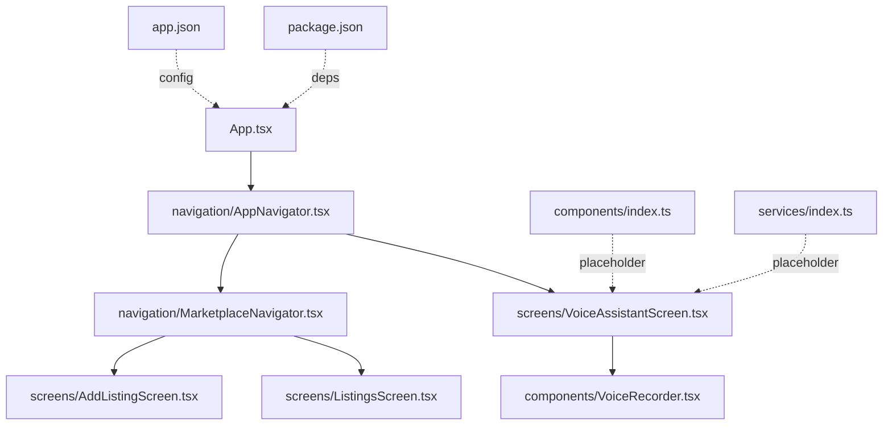
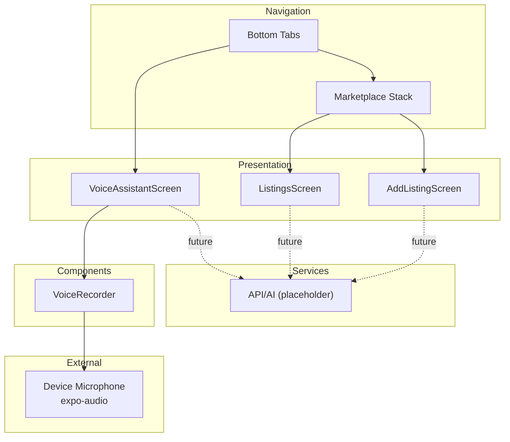
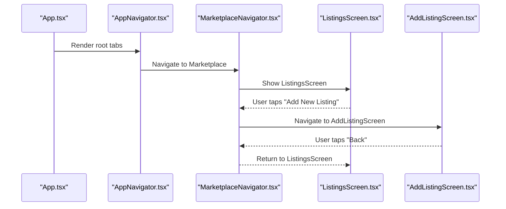
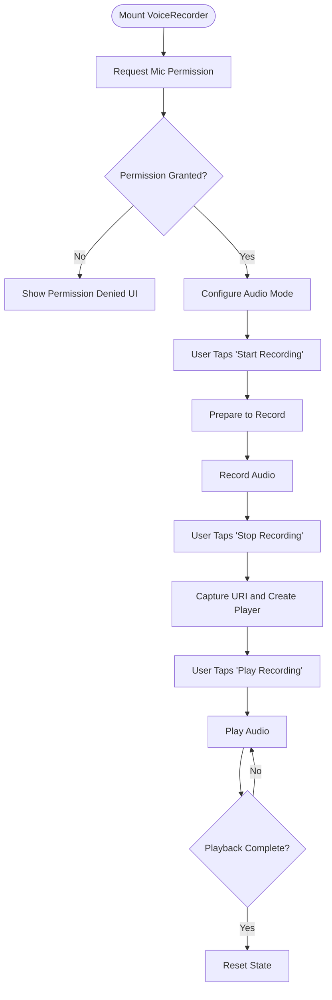
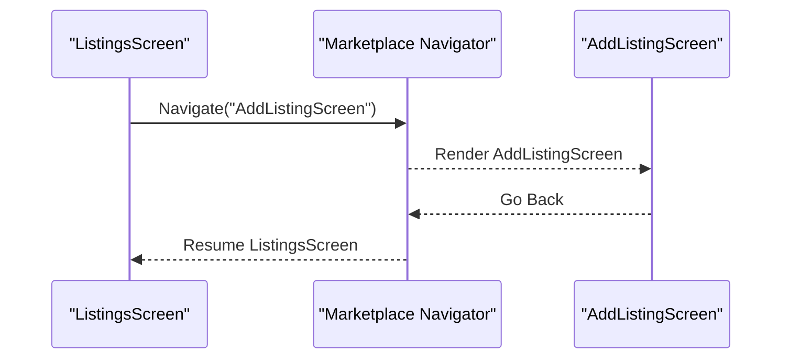
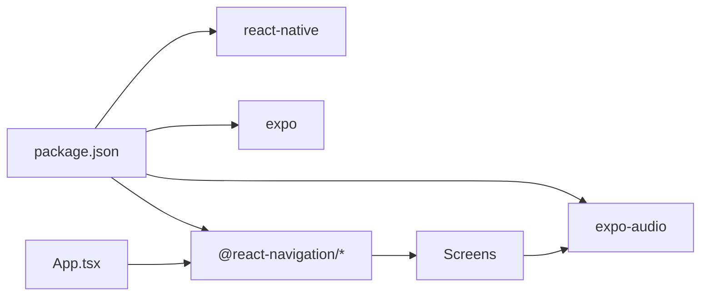

# Architecture Overview

<cite>
**Referenced Files in This Document**
- [App.tsx](file://frontend/App.tsx)
- [AppNavigator.tsx](file://frontend/navigation/AppNavigator.tsx)
- [MarketplaceNavigator.tsx](file://frontend/navigation/MarketplaceNavigator.tsx)
- [VoiceAssistantScreen.tsx](file://frontend/screens/VoiceAssistantScreen.tsx)
- [ListingsScreen.tsx](file://frontend/screens/ListingsScreen.tsx)
- [AddListingScreen.tsx](file://frontend/screens/AddListingScreen.tsx)
- [VoiceRecorder.tsx](file://frontend/components/VoiceRecorder.tsx)
- [index.ts](file://frontend/components/index.ts)
- [services/index.ts](file://frontend/services/index.ts)
- [package.json](file://frontend/package.json)
- [app.json](file://frontend/app.json)
</cite>

## Table of Contents
1. Introduction
2. Project Structure
3. Core Components
4. Architecture Overview
5. Detailed Component Analysis
6. Dependency Analysis
7. Performance Considerations
8. Troubleshooting Guide
9. Conclusion
10. Appendices

## Introduction
This document describes the architecture of the KisaanDost AI mobile application built with React Native and Expo. It explains the high-level design, component-based structure, navigation layers (bottom tabs with nested stack), modular organization, system boundaries, data flow patterns, integration points, and future expansion areas. The app currently provides:
- A Voice Assistant screen with local voice recording and playback
- A Marketplace section with placeholder screens for browsing and adding listings
- A clear separation between screens, reusable components, and navigation configuration

## Project Structure
The frontend is organized into feature-oriented directories that separate concerns:
- App entry and root navigation
- Screens for user-facing features
- Reusable components
- Services placeholder for API/AI integrations
- Configuration files for Expo and dependencies

**Diagram sources**
- [App.tsx:1-14](file://frontend/App.tsx#L1-L14)
- [AppNavigator.tsx:1-67](file://frontend/navigation/AppNavigator.tsx#L1-L67)
- [MarketplaceNavigator.tsx:1-31](file://frontend/navigation/MarketplaceNavigator.tsx#L1-L31)
- [VoiceAssistantScreen.tsx:1-52](file://frontend/screens/VoiceAssistantScreen.tsx#L1-L52)
- [ListingsScreen.tsx:1-64](file://frontend/screens/ListingsScreen.tsx#L1-L64)
- [AddListingScreen.tsx:1-44](file://frontend/screens/AddListingScreen.tsx#L1-L44)
- [VoiceRecorder.tsx:1-270](file://frontend/components/VoiceRecorder.tsx#L1-L270)
- [index.ts:1-3](file://frontend/components/index.ts#L1-L3)
- [services/index.ts:1-3](file://frontend/services/index.ts#L1-L3)
- [package.json:1-29](file://frontend/package.json#L1-L29)
- [app.json:1-34](file://frontend/app.json#L1-L34)

**Section sources**
- [App.tsx:1-14](file://frontend/App.tsx#L1-L14)
- [package.json:1-29](file://frontend/package.json#L1-L29)
- [app.json:1-34](file://frontend/app.json#L1-L34)

## Core Components
- Root app shell: Wraps the app with NavigationContainer and mounts the root navigator.
- Bottom tab navigator: Defines two primary tabs:
  - Voice Assistant
  - Marketplace (nested stack)
- Nested stack navigator: Manages marketplace sub-screens (Listings and Add Listing).
- Voice Recorder component: Handles microphone permissions, audio recording, and local playback using expo-audio.
- Placeholder services and shared components: Prepared for future API/AI integrations and reusable UI elements.

Key responsibilities:
- Navigation orchestration at the root and within Marketplace
- Local audio capture and playback without backend calls
- Clear separation of screens from reusable logic

**Section sources**
- [AppNavigator.tsx:1-67](file://frontend/navigation/AppNavigator.tsx#L1-L67)
- [MarketplaceNavigator.tsx:1-31](file://frontend/navigation/MarketplaceNavigator.tsx#L1-L31)
- [VoiceRecorder.tsx:1-270](file://frontend/components/VoiceRecorder.tsx#L1-L270)
- [index.ts:1-3](file://frontend/components/index.ts#L1-L3)
- [services/index.ts:1-3](file://frontend/services/index.ts#L1-L3)

## Architecture Overview
The app follows a layered, component-based architecture:
- Presentation layer: Screens render UI and handle user interactions
- Navigation layer: Bottom tabs host top-level features; nested stacks manage feature-specific flows
- Domain/logic layer: Currently minimal; VoiceRecorder encapsulates audio logic
- Integration layer: Placeholder services directory prepared for API/AI calls

System boundaries:
- External: Device microphone and OS audio APIs via expo-audio
- Internal: React Native UI, Expo runtime, and navigation libraries

Data flow patterns:
- User actions trigger state changes in components (e.g., start/stop recording)
- Audio state is managed locally within VoiceRecorder
- No network calls yet; services directory reserved for future integrations

Integration points:
- expo-audio for recording and playback
- @react-navigation for bottom tabs and native stack
- Expo config for permissions and platform settings

**Diagram sources**
- [AppNavigator.tsx:1-67](file://frontend/navigation/AppNavigator.tsx#L1-L67)
- [MarketplaceNavigator.tsx:1-31](file://frontend/navigation/MarketplaceNavigator.tsx#L1-L31)
- [VoiceAssistantScreen.tsx:1-52](file://frontend/screens/VoiceAssistantScreen.tsx#L1-L52)
- [ListingsScreen.tsx:1-64](file://frontend/screens/ListingsScreen.tsx#L1-L64)
- [AddListingScreen.tsx:1-44](file://frontend/screens/AddListingScreen.tsx#L1-L44)
- [VoiceRecorder.tsx:1-270](file://frontend/components/VoiceRecorder.tsx#L1-L270)
- [services/index.ts:1-3](file://frontend/services/index.ts#L1-L3)

## Detailed Component Analysis

### Root Application and Navigation
- App.tsx initializes NavigationContainer and renders the root navigator.
- AppNavigator defines bottom tabs for Voice Assistant and Marketplace.
- MarketplaceNavigator creates a native stack for Listings and Add Listing screens.

**Diagram sources**
- [App.tsx:1-14](file://frontend/App.tsx#L1-L14)
- [AppNavigator.tsx:1-67](file://frontend/navigation/AppNavigator.tsx#L1-L67)
- [MarketplaceNavigator.tsx:1-31](file://frontend/navigation/MarketplaceNavigator.tsx#L1-L31)
- [ListingsScreen.tsx:1-64](file://frontend/screens/ListingsScreen.tsx#L1-L64)
- [AddListingScreen.tsx:1-44](file://frontend/screens/AddListingScreen.tsx#L1-L44)

**Section sources**
- [App.tsx:1-14](file://frontend/App.tsx#L1-L14)
- [AppNavigator.tsx:1-67](file://frontend/navigation/AppNavigator.tsx#L1-L67)
- [MarketplaceNavigator.tsx:1-31](file://frontend/navigation/MarketplaceNavigator.tsx#L1-L31)

### Voice Assistant Screen and Voice Recorder
- VoiceAssistantScreen composes a simple UI and embeds the VoiceRecorder component.
- VoiceRecorder manages:
  - Microphone permission request and audio mode setup
  - Recording lifecycle (prepare, record, stop)
  - Local playback using a dynamically created audio player
  - UI states for recording, playing, and permission denial

**Diagram sources**
- [VoiceAssistantScreen.tsx:1-52](file://frontend/screens/VoiceAssistantScreen.tsx#L1-L52)
- [VoiceRecorder.tsx:1-270](file://frontend/components/VoiceRecorder.tsx#L1-L270)

**Section sources**
- [VoiceAssistantScreen.tsx:1-52](file://frontend/screens/VoiceAssistantScreen.tsx#L1-L52)
- [VoiceRecorder.tsx:1-270](file://frontend/components/VoiceRecorder.tsx#L1-L270)

### Marketplace Screens
- ListingsScreen displays a placeholder message and navigates to AddListingScreen.
- AddListingScreen provides a back navigation button to return to ListingsScreen.
- Both are part of the Marketplace native stack.

**Diagram sources**
- [ListingsScreen.tsx:1-64](file://frontend/screens/ListingsScreen.tsx#L1-L64)
- [AddListingScreen.tsx:1-44](file://frontend/screens/AddListingScreen.tsx#L1-L44)
- [MarketplaceNavigator.tsx:1-31](file://frontend/navigation/MarketplaceNavigator.tsx#L1-L31)

**Section sources**
- [ListingsScreen.tsx:1-64](file://frontend/screens/ListingsScreen.tsx#L1-L64)
- [AddListingScreen.tsx:1-44](file://frontend/screens/AddListingScreen.tsx#L1-L44)

### Modular Organization and Placeholders
- components/index.ts: Central export point for shared UI components (currently empty).
- services/index.ts: Central export point for API/AI service functions (currently empty).
- These placeholders establish clear extension points for future functionality such as:
  - Backend API calls for marketplace listings
  - AI voice processing and responses
  - Shared UI primitives (buttons, cards, inputs)

**Section sources**
- [index.ts:1-3](file://frontend/components/index.ts#L1-L3)
- [services/index.ts:1-3](file://frontend/services/index.ts#L1-L3)

## Dependency Analysis
The app relies on Expo and React Navigation to provide cross-platform UI and navigation capabilities, and expo-audio for device microphone access.

**Diagram sources**
- [package.json:1-29](file://frontend/package.json#L1-L29)
- [App.tsx:1-14](file://frontend/App.tsx#L1-L14)
- [VoiceRecorder.tsx:1-270](file://frontend/components/VoiceRecorder.tsx#L1-L270)

**Section sources**
- [package.json:1-29](file://frontend/package.json#L1-L29)

## Performance Considerations
- Audio recording and playback are handled locally; avoid unnecessary re-renders by keeping state scoped within VoiceRecorder.
- Use lazy loading or code splitting if additional screens are added to reduce initial bundle size.
- Keep navigation configurations minimal and centralized to avoid performance overhead.
- For future API integrations, implement caching, pagination, and error retries to maintain responsiveness.

[No sources needed since this section provides general guidance]

## Troubleshooting Guide
Common issues and resolutions:
- Microphone permission denied:
  - The app requests recording permissions on mount and shows a dedicated UI when denied.
  - Users must enable microphone access in device settings and restart the app.
- Recording not starting:
  - Ensure prepare-to-record completes successfully before calling record.
  - Check for console warnings indicating failures during preparation.
- Playback not stopping:
  - The component polls player state to detect completion; ensure duration and currentTime checks remain accurate.
- Navigation errors:
  - Verify that screen names match those defined in the stack param lists.
  - Confirm that MarketplaceNavigator includes both ListingsScreen and AddListingScreen.

**Section sources**
- [VoiceRecorder.tsx:1-270](file://frontend/components/VoiceRecorder.tsx#L1-L270)
- [ListingsScreen.tsx:1-64](file://frontend/screens/ListingsScreen.tsx#L1-L64)
- [AddListingScreen.tsx:1-44](file://frontend/screens/AddListingScreen.tsx#L1-L44)

## Conclusion
KisaanDost’s current architecture establishes a solid foundation for an AI-powered farming assistant:
- Clear separation of concerns across screens, components, and navigation
- Local voice recording and playback ready for future AI integration
- Placeholder services and shared components prepared for scalable growth
- Well-defined navigation structure supporting marketplace features

Future work should focus on integrating AI voice processing, implementing marketplace data flows, and expanding shared UI components to support richer interactions.

[No sources needed since this section summarizes without analyzing specific files]

## Appendices

### Platform and Configuration Notes
- Expo configuration sets app metadata, icons, and enables the audio plugin with a custom microphone permission message.
- Dependencies include React Navigation packages and expo-audio for core functionality.

**Section sources**
- [app.json:1-34](file://frontend/app.json#L1-L34)
- [package.json:1-29](file://frontend/package.json#L1-L29)