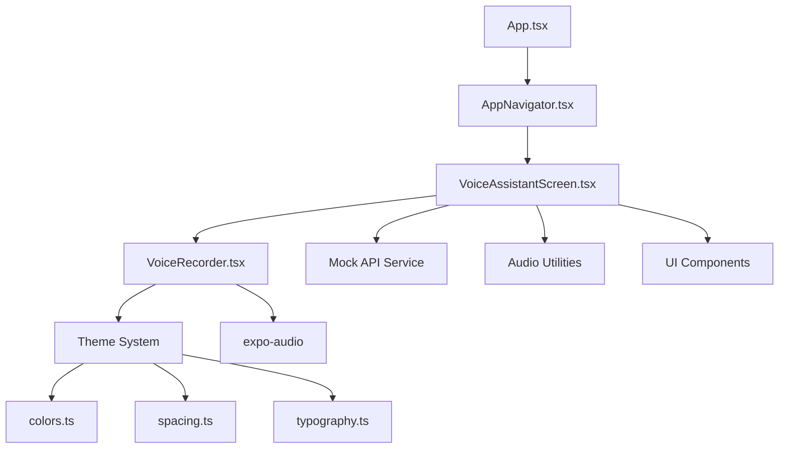
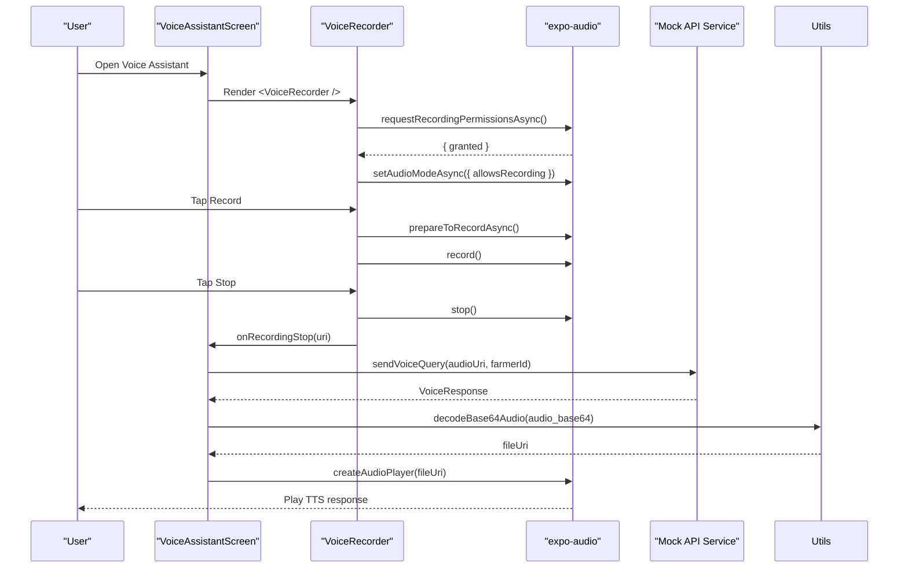

# Component Reference

<cite>
**Referenced Files in This Document**
- [VoiceRecorder.tsx](file://frontend/components/VoiceRecorder.tsx)
- [VoiceAssistantScreen.tsx](file://frontend/screens/VoiceAssistantScreen.tsx)
- [AppNavigator.tsx](file://frontend/navigation/AppNavigator.tsx)
- [api.ts](file://frontend/services/api.ts)
- [audio.ts](file://frontend/utils/audio.ts)
- [colors.ts](file://frontend/theme/colors.ts)
- [spacing.ts](file://frontend/theme/spacing.ts)
- [typography.ts](file://frontend/theme/typography.ts)
- [PrimaryButton.tsx](file://frontend/components/ui/PrimaryButton.tsx)
- [StateCard.tsx](file://frontend/components/ui/StateCard.tsx)
- [package.json](file://frontend/package.json)
</cite>

## Update Summary
**Changes Made**
- Updated VoiceRecorder component documentation to reflect new TypeScript interfaces and props
- Added comprehensive theme system documentation with color, spacing, and typography tokens
- Documented mock API service layer with TypeScript interfaces for voice queries and marketplace operations
- Added audio utility functions documentation for base64 audio handling
- Enhanced UI components documentation with PrimaryButton and StateCard specifications
- Updated integration patterns to reflect current implementation

## Table of Contents
1. [Introduction](#introduction)
2. [Project Structure](#project-structure)
3. [Core Components](#core-components)
4. [Architecture Overview](#architecture-overview)
5. [Detailed Component Analysis](#detailed-component-analysis)
6. [Theme System](#theme-system)
7. [API Service Layer](#api-service-layer)
8. [Audio Utilities](#audio-utilities)
9. [UI Components](#ui-components)
10. [Integration Patterns](#integration-patterns)
11. [Performance Considerations](#performance-considerations)
12. [Troubleshooting Guide](#troubleshooting-guide)
13. [Conclusion](#conclusion)

## Introduction
This document provides a comprehensive component reference for the KisaanDost AI application with a focus on the VoiceRecorder component as the main reusable UI component. It explains how the component records audio locally, manages playback, handles microphone permissions, integrates with the mock API service layer, and connects into the app's navigation flow. The goal is to help developers understand its complete API surface, internal logic, styling customization through the theme system, and best practices for using audio components in React Native applications.

## Project Structure
The VoiceRecorder component lives under frontend/components and is consumed by the VoiceAssistantScreen, which is registered in the root tab navigator. The app uses Expo Audio for recording and playback, with a comprehensive theme system and mock API service layer providing type-safe interfaces.

**Diagram sources**
- [AppNavigator.tsx:1-67](file://frontend/navigation/AppNavigator.tsx#L1-L67)
- [VoiceAssistantScreen.tsx:1-301](file://frontend/screens/VoiceAssistantScreen.tsx#L1-L301)
- [VoiceRecorder.tsx:1-304](file://frontend/components/VoiceRecorder.tsx#L1-L304)

**Section sources**
- [AppNavigator.tsx:1-67](file://frontend/navigation/AppNavigator.tsx#L1-L67)
- [VoiceAssistantScreen.tsx:1-301](file://frontend/screens/VoiceAssistantScreen.tsx#L1-L301)
- [VoiceRecorder.tsx:1-304](file://frontend/components/VoiceRecorder.tsx#L1-L304)

## Core Components
- **VoiceRecorder**: A fully-typed, self-contained UI that records audio as .m4a using expo-audio, plays it back locally, handles permission prompts and errors, and integrates with the API service layer through callbacks.

Key responsibilities:
- Request microphone permission and configure audio mode on mount
- Start/stop recording with preparation steps and elapsed time tracking
- Create and manage audio player instances for playback
- Render UI states: idle, preparing, recording, playing, and permission denied
- Emit callbacks for recording completion and cancellation
- Support disabled state for integration with parent screen state

Usage example (integration):
- Import and render the component inside VoiceAssistantScreen with callback handlers for recording completion and cancellation.

**Section sources**
- [VoiceRecorder.tsx:21-37](file://frontend/components/VoiceRecorder.tsx#L21-L37)
- [VoiceAssistantScreen.tsx:108-112](file://frontend/screens/VoiceAssistantScreen.tsx#L108-L112)

## Architecture Overview
The VoiceRecorder component encapsulates all audio-related logic and UI while integrating with the broader application architecture through well-defined interfaces. It relies on expo-audio hooks and modules for recording and playback, with a theme system for consistent styling and a mock API service layer for backend communication.

**Diagram sources**
- [VoiceRecorder.tsx:49-58](file://frontend/components/VoiceRecorder.tsx#L49-L58)
- [VoiceRecorder.tsx:69-95](file://frontend/components/VoiceRecorder.tsx#L69-L95)
- [VoiceAssistantScreen.tsx:60-93](file://frontend/screens/VoiceAssistantScreen.tsx#L60-L93)
- [api.ts:164-200](file://frontend/services/api.ts#L164-L200)

## Detailed Component Analysis

### VoiceRecorder Component
- **Purpose**: Provide a simple, reusable interface for local audio recording and playback within KisaanDost, with full TypeScript support and callback integration.
- **Props**: 
  - `onRecordingStop?: (uri: string) => void` - Callback when recording stops with the recorded audio URI
  - `onCancel?: () => void` - Callback when user cancels recording
  - `disabled?: boolean` - Disables recording functionality and shows appropriate UI state
- **Events**: Emits events through callback props rather than custom events
- **State management**:
  - Internal React state tracks recording URI, playing state, permission status, preparation state, and elapsed time
  - Hooks from expo-audio provide recorder instances and state via `useAudioRecorder` and `useAudioRecorderState`
  - Refs hold the dynamically created audio player to avoid re-renders and ensure cleanup

Internal logic highlights:
- **Permission handling**: Requests recording permission on mount and configures audio mode if granted
- **Recording lifecycle**: Prepares then starts recording; stops and captures the resulting URI; tracks elapsed time during recording
- **Playback lifecycle**: Creates a new player per recording, seeks to start, plays, and polls until completion to update UI
- **Callback integration**: Emits `onRecordingStop` with the recorded URI and `onCancel` when user cancels
- **Cleanup**: Removes the player on unmount to prevent leaks

Styling:
- Uses StyleSheet.create with the centralized theme system for consistent look-and-feel
- Visual states include recording indicator with red dot and timer, active/inactive buttons, and error messaging
- Responsive design with proper spacing and typography tokens

Integration:
- Renders directly in VoiceAssistantScreen with callback handlers for recording completion and cancellation
- Integrates with the mock API service layer through the parent screen
- Uses theme system for consistent visual appearance

Customization:
- Configurable via props for disabled state and callback handlers
- Styling can be extended by modifying the component or wrapping with higher-level controls
- Theme system allows for consistent customization across the application

Accessibility considerations:
- Buttons are TouchableOpacity with visible text labels
- Recording indicator provides clear visual feedback
- Consider adding accessibility hints for screen readers when extending

Error handling:
- Catches and logs errors during start/stop recording
- Displays a user-friendly message when microphone permission is denied
- Handles preparation state to prevent rapid repeated taps

Performance notes:
- Uses a polling interval (200ms) to detect playback end; optimized for smooth updates
- Creates a new player per recording; ensures proper cleanup to avoid memory pressure
- Tracks elapsed time efficiently with setInterval during recording only

API summary (as implemented):
- **Props**: `onRecordingStop`, `onCancel`, `disabled`
- **Side effects**: requests permissions, sets audio mode, records, plays
- **Callbacks**: emits recording completion and cancellation events

**Section sources**
- [VoiceRecorder.tsx:21-37](file://frontend/components/VoiceRecorder.tsx#L21-L37)
- [VoiceRecorder.tsx:49-120](file://frontend/components/VoiceRecorder.tsx#L49-L120)
- [VoiceRecorder.tsx:137-189](file://frontend/components/VoiceRecorder.tsx#L137-L189)

### Usage in VoiceAssistantScreen
- Renders the VoiceRecorder component within a scrollable container with full integration
- Provides contextual title, subtitle, and hint text
- Handles recording completion through `handleRecordingStop` callback
- Manages API calls, response processing, and TTS audio playback
- Provides comprehensive state management for different UI states (idle, sending, error, response)

Best practice:
- Keep the screen focused on layout and business logic; delegate audio recording to the VoiceRecorder component
- Handle all API communication and response processing in the screen layer
- Manage TTS audio playback separately from the recording functionality

**Section sources**
- [VoiceAssistantScreen.tsx:19-93](file://frontend/screens/VoiceAssistantScreen.tsx#L19-L93)
- [VoiceAssistantScreen.tsx:108-112](file://frontend/screens/VoiceAssistantScreen.tsx#L108-L112)

### Navigation Integration
- The VoiceAssistantScreen is part of the root tab navigator under the "Voice Assistant" tab
- Header and tab styles are configured at the navigator level with consistent branding
- Tab icon uses emoji placeholder for simplicity

**Section sources**
- [AppNavigator.tsx:14-67](file://frontend/navigation/AppNavigator.tsx#L14-L67)

## Theme System
KisaanDost uses a comprehensive theme system that provides consistent visual design across all components through centralized tokens.

### Color System
- **Brand colors**: Primary green (#2e7d32) for headers and primary actions
- **Accent colors**: Warm orange (#f57c00) for thinking/sending states
- **Semantic colors**: Success, error, info with light/dark variants
- **Text colors**: Primary, secondary, muted, and on-color variants
- **Surface colors**: Background, surface, border, and divider colors

### Spacing System
- Consistent spacing scale based on 4px base unit: xs (4), sm (8), md (12), base (16), lg (24), xl (32), xxl (48)
- Border radius scale matching spacing for consistency: sm (8), md (10), base (12), lg (16), xl (20), full (999)

### Typography System
- Legibility-first sizing designed for low-literacy users with minimum 16sp for body text
- Font sizes: sm (14), body (16), bodyLg (17), heading (20), title (24), hero (28)
- Font weights: regular (400), medium (500), semibold (600), bold (700)
- Line heights: tight (20), normal (24), relaxed (28)

**Section sources**
- [colors.ts:8-52](file://frontend/theme/colors.ts#L8-L52)
- [spacing.ts:7-32](file://frontend/theme/spacing.ts#L7-L32)
- [typography.ts:7-37](file://frontend/theme/typography.ts#L7-L37)

## API Service Layer
The mock API service layer provides type-safe interfaces for all backend communication, currently simulating responses but designed to easily switch to real backend implementation.

### Voice Query Interface
- **Function**: `sendVoiceQuery(audioUri: string, farmerId?: string): Promise<VoiceResponse>`
- **Input**: Recorded audio URI and optional farmer ID
- **Output**: VoiceResponse object containing transcription, language detection, answer, and TTS audio
- **Behavior**: Simulates ~70% happy path and ~30% unrecognized language scenarios

### Marketplace Interfaces
- **Listing**: Complete marketplace listing with crop, quantity, price, location, and contact information
- **ListingInput**: Input interface for creating new listings with validation
- **CRUD Operations**: createListing, getListings, getListingById, deleteListing

### Response Types
- **SuccessResponse<T>**: Generic success wrapper with typed data
- **ErrorResponse**: Standardized error response with success flag and error message
- **ApiResponse<T>**: Union type covering both success and error responses

**Section sources**
- [api.ts:23-78](file://frontend/services/api.ts#L23-L78)
- [api.ts:164-200](file://frontend/services/api.ts#L164-L200)
- [api.ts:209-338](file://frontend/services/api.ts#L209-L338)

## Audio Utilities
Provides reusable functions for working with base64-encoded audio data, enabling seamless integration between the API service layer and audio playback.

### Base64 Audio Decoding
- **Function**: `decodeBase64Audio(base64: string, extension?: string): Promise<string>`
- **Purpose**: Converts base64-encoded audio strings to temporary local files playable by expo-audio
- **Features**: Unique file naming to prevent collisions, configurable file extensions
- **Output**: Local file URI suitable for createAudioPlayer()

### Temporary File Management
- **Function**: `deleteTempAudio(fileUri: string): Promise<void>`
- **Purpose**: Safely deletes temporary audio files created by decodeBase64Audio
- **Safety**: Handles missing files gracefully without throwing errors

**Section sources**
- [audio.ts:21-32](file://frontend/utils/audio.ts#L21-L32)
- [audio.ts:40-49](file://frontend/utils/audio.ts#L40-L49)

## UI Components
Reusable UI components that provide consistent styling and behavior across the application.

### PrimaryButton
- **Purpose**: Large, high-contrast action button with loading state support
- **Props**: label, onPress, loading, disabled, variant, icon, style
- **Variants**: primary, secondary, accent, danger, outline with distinct visual styles
- **Features**: Loading spinner support, disabled state handling, icon integration

### StateCard
- **Purpose**: Shared state card for error, info, empty, and not-found states
- **Props**: variant, icon, title, description, actionLabel, onAction
- **Variants**: success, error, info, neutral with appropriate color schemes
- **Features**: Optional action button, consistent styling across states

**Section sources**
- [PrimaryButton.tsx:7-94](file://frontend/components/ui/PrimaryButton.tsx#L7-L94)
- [StateCard.tsx:7-120](file://frontend/components/ui/StateCard.tsx#L7-L120)

## Integration Patterns
- **Embed the component** in any screen where voice input is needed with proper callback handlers
- **For multi-screen usage**, consider lifting state to a parent context if you need to share recordings across screens
- **If you need to trigger actions after recording**, use the provided callback props (`onRecordingStop`, `onCancel`)
- **Integrate with API services** through the parent screen to handle business logic and response processing
- **Use theme system** for consistent styling across all components

**Section sources**
- [VoiceAssistantScreen.tsx:108-112](file://frontend/screens/VoiceAssistantScreen.tsx#L108-L112)
- [VoiceAssistantScreen.tsx:60-93](file://frontend/screens/VoiceAssistantScreen.tsx#L60-L93)

## Performance Considerations
- **Avoid creating multiple players simultaneously**; the component creates one player per recording and removes it on unmount
- **Polling interval for playback detection** runs every 200ms; this is lightweight but can be tuned or replaced with event-based completion if available
- **Prepare-to-record step** ensures resources are allocated before starting; keep this pattern to avoid runtime errors
- **Memory management**: Always remove players when no longer needed to prevent leaks
- **Theme system optimization**: Centralized tokens reduce style recalculation and improve rendering performance
- **API service layer**: Mock delays simulate realistic network conditions for development testing

## Troubleshooting Guide
Common issues and resolutions:
- **Microphone permission denied**:
  - Symptom: Permission denied UI shown immediately after mount
  - Resolution: Direct users to device settings to enable microphone access and restart the app
- **Recording fails to start**:
  - Symptom: Errors logged during start; button remains disabled briefly due to preparation state
  - Resolution: Ensure device supports recording and permissions are granted; retry after granting
- **Playback does not stop**:
  - Symptom: Playing state persists even after audio ends
  - Resolution: Verify polling logic detects end-of-file; consider adding explicit completion handlers if available
- **TTS audio not playing**:
  - Symptom: Base64 audio from API doesn't play
  - Resolution: Check decodeBase64Audio function and ensure proper file cleanup

Operational tips:
- Use the debug URI text to verify the recorded file path during development
- Check console warnings for detailed error messages when recording or playback fails
- Monitor memory usage when handling multiple audio files in quick succession

**Section sources**
- [VoiceRecorder.tsx:122-133](file://frontend/components/VoiceRecorder.tsx#L122-L133)
- [VoiceRecorder.tsx:69-95](file://frontend/components/VoiceRecorder.tsx#L69-L95)
- [VoiceAssistantScreen.tsx:75-86](file://frontend/screens/VoiceAssistantScreen.tsx#L75-L86)

## Conclusion
The VoiceRecorder component offers a robust, type-safe solution for local audio recording and playback in KisaanDost, integrated with a comprehensive theme system, mock API service layer, and reusable UI components. It abstracts permission handling, audio mode configuration, and player lifecycle management behind a simple yet powerful API. With proper TypeScript interfaces, callback integration, and theme system support, it serves as an excellent foundation for future enhancements such as advanced controls, analytics, and real backend integration.