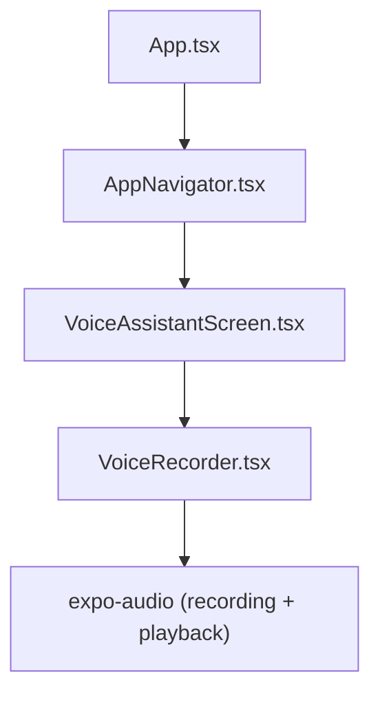
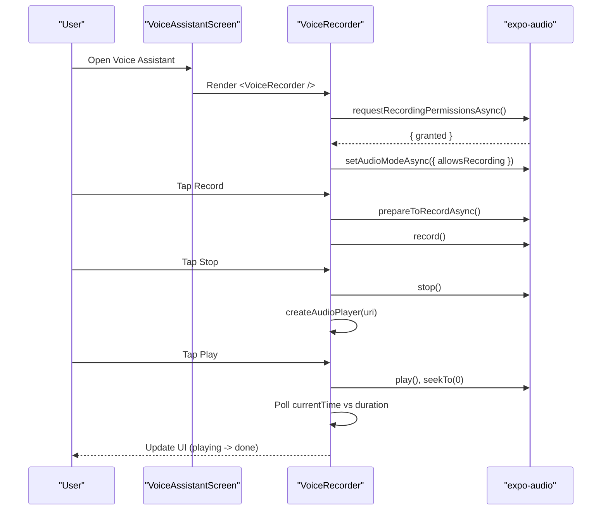
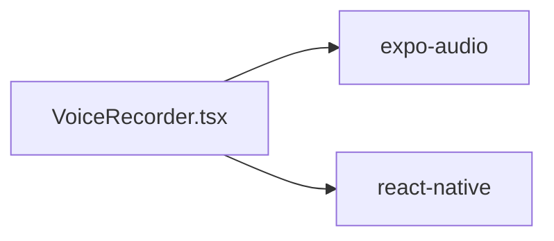

# Component Reference

<cite>
**Referenced Files in This Document**
- [VoiceRecorder.tsx](file://frontend/components/VoiceRecorder.tsx)
- [VoiceAssistantScreen.tsx](file://frontend/screens/VoiceAssistantScreen.tsx)
- [AppNavigator.tsx](file://frontend/navigation/AppNavigator.tsx)
- [package.json](file://frontend/package.json)
</cite>

## Table of Contents
1. [Introduction](#introduction)
2. [Project Structure](#project-structure)
3. [Core Components](#core-components)
4. [Architecture Overview](#architecture-overview)
5. [Detailed Component Analysis](#detailed-component-analysis)
6. [Dependency Analysis](#dependency-analysis)
7. [Performance Considerations](#performance-considerations)
8. [Troubleshooting Guide](#troubleshooting-guide)
9. [Conclusion](#conclusion)
10. [Appendices](#appendices)

## Introduction
This document provides a comprehensive component reference for the KisaanDost AI application with a focus on the VoiceRecorder component. It explains how the component records audio locally, manages playback, handles microphone permissions, and integrates into the app’s navigation flow. The goal is to help developers understand its API surface, internal logic, styling customization, and best practices for using audio components in React Native applications.

## Project Structure
The VoiceRecorder component lives under frontend/components and is consumed by the VoiceAssistantScreen, which is registered in the root tab navigator. The app uses Expo Audio for recording and playback.

**Diagram sources**
- [AppNavigator.tsx:1-67](file://frontend/navigation/AppNavigator.tsx#L1-L67)
- [VoiceAssistantScreen.tsx:1-52](file://frontend/screens/VoiceAssistantScreen.tsx#L1-L52)
- [VoiceRecorder.tsx:1-270](file://frontend/components/VoiceRecorder.tsx#L1-L270)

**Section sources**
- [AppNavigator.tsx:1-67](file://frontend/navigation/AppNavigator.tsx#L1-L67)
- [VoiceAssistantScreen.tsx:1-52](file://frontend/screens/VoiceAssistantScreen.tsx#L1-L52)
- [VoiceRecorder.tsx:1-270](file://frontend/components/VoiceRecorder.tsx#L1-L270)

## Core Components
- VoiceRecorder: A self-contained UI that records audio as .m4a using expo-audio, plays it back locally, and handles permission prompts and errors. It currently has no props and exposes no callbacks; state is managed internally.

Key responsibilities:
- Request microphone permission and configure audio mode on mount.
- Start/stop recording with preparation steps.
- Create and manage an audio player instance for playback.
- Render UI states: idle, preparing, recording, playing, and permission denied.

Usage example (integration):
- Import and render the component inside a screen container. See usage in the voice assistant screen.

**Section sources**
- [VoiceRecorder.tsx:18-22](file://frontend/components/VoiceRecorder.tsx#L18-L22)
- [VoiceAssistantScreen.tsx:1-20](file://frontend/screens/VoiceAssistantScreen.tsx#L1-L20)

## Architecture Overview
The VoiceRecorder component encapsulates all audio-related logic and UI. It relies on expo-audio hooks and modules for recording and playback. The component lifecycle includes:
- Mount-time permission request and audio mode configuration.
- Recording lifecycle via prepare-to-record and record/stop calls.
- Playback lifecycle via creating a player from the recorded URI and polling until completion.

**Diagram sources**
- [VoiceRecorder.tsx:37-55](file://frontend/components/VoiceRecorder.tsx#L37-L55)
- [VoiceRecorder.tsx:57-85](file://frontend/components/VoiceRecorder.tsx#L57-L85)
- [VoiceRecorder.tsx:87-108](file://frontend/components/VoiceRecorder.tsx#L87-L108)

## Detailed Component Analysis

### VoiceRecorder Component
- Purpose: Provide a simple, reusable interface for local audio recording and playback within KisaanDost.
- Props: None (stateless prop interface). All behavior is controlled internally.
- Events: None exposed to parents. Parent screens cannot subscribe to events directly.
- State management:
  - Internal React state tracks recording URI, playing state, permission status, and preparation state.
  - Hooks from expo-audio provide recorder instances and state.
  - Refs hold the dynamically created audio player to avoid re-renders and ensure cleanup.

Internal logic highlights:
- Permission handling: Requests recording permission on mount and configures audio mode if granted.
- Recording: Prepares then starts recording; stops and captures the resulting URI.
- Playback: Creates a new player per recording, seeks to start, plays, and polls until completion to update UI.
- Cleanup: Removes the player on unmount to prevent leaks.

Styling:
- Uses StyleSheet.create for consistent look-and-feel.
- Visual states include recording indicator, active/inactive buttons, and error messaging.

Integration:
- Rendered directly in VoiceAssistantScreen without additional configuration.

Customization:
- Currently not configurable via props. To customize appearance or behavior, extend the component or wrap it with higher-level controls.

Accessibility considerations:
- Buttons are TouchableOpacity with visible text labels.
- Consider adding accessibility hints for screen readers when extending.

Error handling:
- Catches and logs errors during start/stop recording.
- Displays a user-friendly message when microphone permission is denied.

Performance notes:
- Uses a polling interval to detect playback end; consider optimizing frequency or switching to event-driven completion if available.
- Creates a new player per recording; ensure proper cleanup to avoid memory pressure.

API summary (as implemented):
- No public props or methods.
- Side effects: requests permissions, sets audio mode, records, plays.
- Output: renders UI and updates internal state.

**Section sources**
- [VoiceRecorder.tsx:1-270](file://frontend/components/VoiceRecorder.tsx#L1-L270)

### Usage in VoiceAssistantScreen
- Renders the VoiceRecorder component within a scrollable container.
- Provides contextual title, subtitle, and hint text.
- No programmatic interaction with the recorder beyond rendering.

Best practice:
- Keep the screen focused on layout and context; delegate audio logic to the component.

**Section sources**
- [VoiceAssistantScreen.tsx:1-52](file://frontend/screens/VoiceAssistantScreen.tsx#L1-L52)

### Navigation Integration
- The VoiceAssistantScreen is part of the root tab navigator under the “Voice Assistant” tab.
- Header and tab styles are configured at the navigator level.

**Section sources**
- [AppNavigator.tsx:1-67](file://frontend/navigation/AppNavigator.tsx#L1-L67)

## Dependency Analysis
External dependencies relevant to VoiceRecorder:
- expo-audio: Provides hooks and modules for recording and playback.
- react-native: Standard UI primitives used by the component.

Versioning:
- expo-audio version is specified in package.json.

**Diagram sources**
- [VoiceRecorder.tsx:1-16](file://frontend/components/VoiceRecorder.tsx#L1-L16)
- [package.json:5-16](file://frontend/package.json#L5-L16)

**Section sources**
- [package.json:5-16](file://frontend/package.json#L5-L16)
- [VoiceRecorder.tsx:1-16](file://frontend/components/VoiceRecorder.tsx#L1-L16)

## Performance Considerations
- Avoid creating multiple players simultaneously; the component creates one player per recording and removes it on unmount.
- Polling interval for playback detection runs every 200ms; this is lightweight but can be tuned or replaced with event-based completion if supported by the audio library.
- Prepare-to-record step ensures resources are allocated before starting; keep this pattern to avoid runtime errors.
- Memory management: Always remove players when no longer needed to prevent leaks.

[No sources needed since this section provides general guidance]

## Troubleshooting Guide
Common issues and resolutions:
- Microphone permission denied:
  - Symptom: Permission denied UI shown immediately after mount.
  - Resolution: Direct users to device settings to enable microphone access and restart the app.
- Recording fails to start:
  - Symptom: Errors logged during start; button remains disabled briefly due to preparation state.
  - Resolution: Ensure device supports recording and permissions are granted; retry after granting.
- Playback does not stop:
  - Symptom: Playing state persists even after audio ends.
  - Resolution: Verify polling logic detects end-of-file; consider adding explicit completion handlers if available.

Operational tips:
- Use the debug URI text to verify the recorded file path during development.
- Check console warnings for detailed error messages when recording or playback fails.

**Section sources**
- [VoiceRecorder.tsx:110-122](file://frontend/components/VoiceRecorder.tsx#L110-L122)
- [VoiceRecorder.tsx:57-85](file://frontend/components/VoiceRecorder.tsx#L57-L85)
- [VoiceRecorder.tsx:87-108](file://frontend/components/VoiceRecorder.tsx#L87-L108)

## Conclusion
The VoiceRecorder component offers a compact, self-contained solution for local audio recording and playback in KisaanDost. It abstracts permission handling, audio mode configuration, and player lifecycle management behind a simple UI. While it currently exposes no props or events, it serves as a solid foundation for future enhancements such as callback integration, advanced controls, and analytics.

[No sources needed since this section summarizes without analyzing specific files]

## Appendices

### Styling Options and Customization
- The component uses StyleSheet.create for consistent styling.
- To customize appearance, you can:
  - Extend the component to accept style props.
  - Wrap the component with a themed provider.
  - Fork and adjust colors, spacing, and typography to match your design system.

Current visual elements:
- Recording indicator with red dot and text.
- Record/Stop button with active state changes.
- Play button with active state changes.
- Error view for permission denial.

**Section sources**
- [VoiceRecorder.tsx:176-270](file://frontend/components/VoiceRecorder.tsx#L176-L270)

### Integration Patterns
- Embed the component in any screen where voice input is needed.
- For multi-screen usage, consider lifting state to a parent context if you need to share recordings across screens.
- If you need to trigger actions after recording, extend the component to emit callbacks or use a shared store.

**Section sources**
- [VoiceAssistantScreen.tsx:1-20](file://frontend/screens/VoiceAssistantScreen.tsx#L1-L20)

### Best Practices for Audio Components in React Native
- Always request and handle permissions gracefully.
- Configure audio mode appropriately for recording and playback.
- Manage player lifecycles carefully to avoid memory leaks.
- Provide clear feedback for user actions (preparing, recording, playing).
- Test on real devices for accurate audio behavior.

[No sources needed since this section provides general guidance]