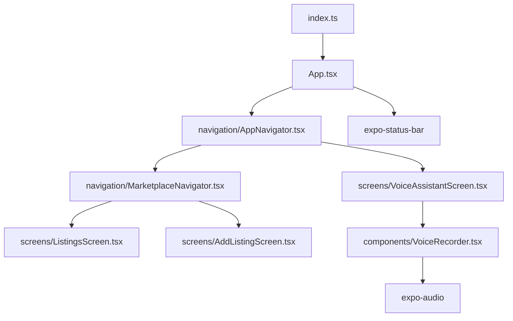
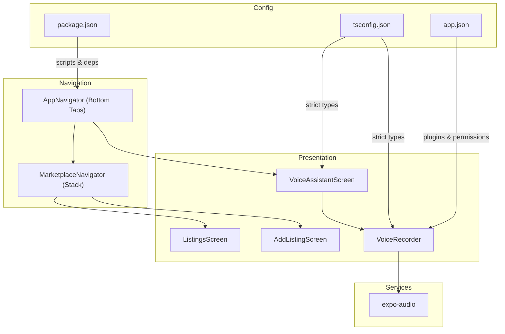
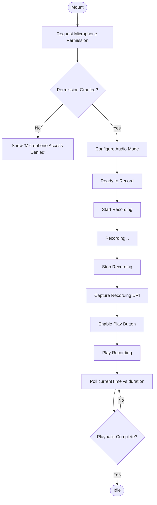
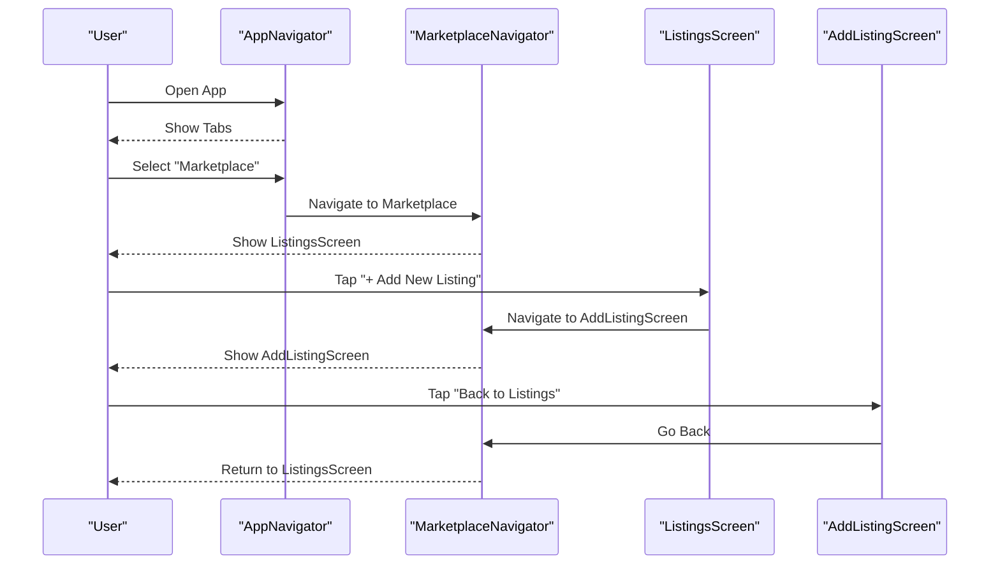
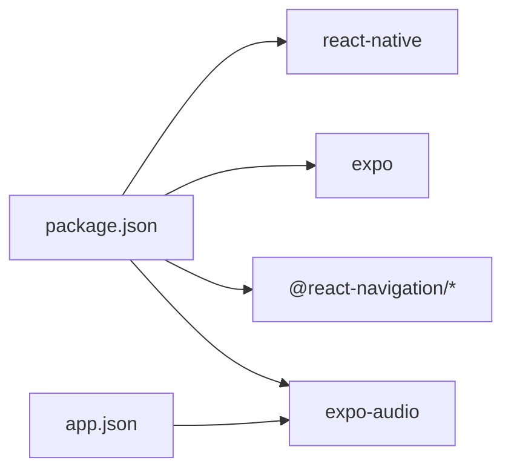

# Development Guide

<cite>
**Referenced Files in This Document**
- [README.md](file://README.md)
- [frontend/package.json](file://frontend/package.json)
- [frontend/tsconfig.json](file://frontend/tsconfig.json)
- [frontend/app.json](file://frontend/app.json)
- [frontend/index.ts](file://frontend/index.ts)
- [frontend/App.tsx](file://frontend/App.tsx)
- [frontend/navigation/AppNavigator.tsx](file://frontend/navigation/AppNavigator.tsx)
- [frontend/navigation/MarketplaceNavigator.tsx](file://frontend/navigation/MarketplaceNavigator.tsx)
- [frontend/screens/ListingsScreen.tsx](file://frontend/screens/ListingsScreen.tsx)
- [frontend/screens/AddListingScreen.tsx](file://frontend/screens/AddListingScreen.tsx)
- [frontend/screens/VoiceAssistantScreen.tsx](file://frontend/screens/VoiceAssistantScreen.tsx)
- [frontend/components/VoiceRecorder.tsx](file://frontend/components/VoiceRecorder.tsx)
- [frontend/components/index.ts](file://frontend/components/index.ts)
- [frontend/services/index.ts](file://frontend/services/index.ts)
</cite>

## Table of Contents
1. Introduction
2. Project Structure
3. Core Components
4. Architecture Overview
5. Detailed Component Analysis
6. Dependency Analysis
7. Performance Considerations
8. Troubleshooting Guide
9. Conclusion
10. Appendices

## Introduction
This guide provides comprehensive development guidelines for contributing to the KisaanDost AI project, a React Native (Expo) application with TypeScript. It covers project structure conventions, file organization principles, naming standards, TypeScript configuration and type safety practices, coding standards, component composition patterns, state management approaches, development workflow (testing strategies, debugging techniques, performance optimization), and best practices for adding features and maintaining code quality. It also includes version control practices, commit message conventions, code review processes, and common pitfalls with solutions grounded in the current implementation.

The project is built with Expo and React Navigation, featuring a bottom tab navigator with a voice assistant screen and a marketplace stack. The voice recorder uses expo-audio for local recording and playback without backend calls at this stage.

**Section sources**
- [README.md:1-3](file://README.md#L1-L3)

## Project Structure
The frontend follows a feature-oriented layout with clear separation of concerns:
- Entry points: index.ts registers the root component; App.tsx sets up navigation and status bar.
- Navigation: AppNavigator defines bottom tabs; MarketplaceNavigator defines nested stack screens.
- Screens: VoiceAssistantScreen, ListingsScreen, AddListingScreen.
- Components: VoiceRecorder encapsulates audio recording and playback logic.
- Services: Placeholder for API/AI integrations.
- Configuration: package.json (dependencies and scripts), tsconfig.json (TypeScript settings), app.json (Expo metadata and plugins).

**Diagram sources**
- [frontend/index.ts:1-9](file://frontend/index.ts#L1-L9)
- [frontend/App.tsx:1-14](file://frontend/App.tsx#L1-L14)
- [frontend/navigation/AppNavigator.tsx:1-67](file://frontend/navigation/AppNavigator.tsx#L1-L67)
- [frontend/navigation/MarketplaceNavigator.tsx:1-31](file://frontend/navigation/MarketplaceNavigator.tsx#L1-L31)
- [frontend/screens/VoiceAssistantScreen.tsx:1-52](file://frontend/screens/VoiceAssistantScreen.tsx#L1-L52)
- [frontend/screens/ListingsScreen.tsx:1-64](file://frontend/screens/ListingsScreen.tsx#L1-L64)
- [frontend/screens/AddListingScreen.tsx:1-44](file://frontend/screens/AddListingScreen.tsx#L1-L44)
- [frontend/components/VoiceRecorder.tsx:1-270](file://frontend/components/VoiceRecorder.tsx#L1-L270)

**Section sources**
- [frontend/index.ts:1-9](file://frontend/index.ts#L1-L9)
- [frontend/App.tsx:1-14](file://frontend/App.tsx#L1-L14)
- [frontend/navigation/AppNavigator.tsx:1-67](file://frontend/navigation/AppNavigator.tsx#L1-L67)
- [frontend/navigation/MarketplaceNavigator.tsx:1-31](file://frontend/navigation/MarketplaceNavigator.tsx#L1-L31)
- [frontend/screens/VoiceAssistantScreen.tsx:1-52](file://frontend/screens/VoiceAssistantScreen.tsx#L1-L52)
- [frontend/screens/ListingsScreen.tsx:1-64](file://frontend/screens/ListingsScreen.tsx#L1-L64)
- [frontend/screens/AddListingScreen.tsx:1-44](file://frontend/screens/AddListingScreen.tsx#L1-L44)
- [frontend/components/VoiceRecorder.tsx:1-270](file://frontend/components/VoiceRecorder.tsx#L1-L270)
- [frontend/package.json:1-29](file://frontend/package.json#L1-L29)
- [frontend/tsconfig.json:1-7](file://frontend/tsconfig.json#L1-L7)
- [frontend/app.json:1-34](file://frontend/app.json#L1-L34)

## Core Components
- Root entry and navigation container: index.ts registers the root component; App.tsx wraps the app with NavigationContainer and StatusBar.
- Tab navigation: AppNavigator creates a bottom tab navigator with two tabs: Voice Assistant and Marketplace.
- Stack navigation: MarketplaceNavigator nests ListingsScreen and AddListingScreen under a native stack.
- Voice Recorder: VoiceRecorder encapsulates microphone permission handling, recording lifecycle, and local playback using expo-audio.
- Placeholders: components/index.ts and services/index.ts are reserved for shared UI and API/AI integration modules.

Key responsibilities:
- Navigation files define typed param lists and configure headers/tab styles consistently.
- Screen components focus on presentation and navigation actions.
- VoiceRecorder isolates complex audio state and side effects, exposing simple controls to its parent screen.

**Section sources**
- [frontend/index.ts:1-9](file://frontend/index.ts#L1-L9)
- [frontend/App.tsx:1-14](file://frontend/App.tsx#L1-L14)
- [frontend/navigation/AppNavigator.tsx:1-67](file://frontend/navigation/AppNavigator.tsx#L1-L67)
- [frontend/navigation/MarketplaceNavigator.tsx:1-31](file://frontend/navigation/MarketplaceNavigator.tsx#L1-L31)
- [frontend/screens/VoiceAssistantScreen.tsx:1-52](file://frontend/screens/VoiceAssistantScreen.tsx#L1-L52)
- [frontend/components/VoiceRecorder.tsx:1-270](file://frontend/components/VoiceRecorder.tsx#L1-L270)
- [frontend/components/index.ts:1-3](file://frontend/components/index.ts#L1-L3)
- [frontend/services/index.ts:1-3](file://frontend/services/index.ts#L1-L3)

## Architecture Overview
The app uses a layered architecture:
- Presentation layer: Screens and reusable components.
- Navigation layer: React Navigation manages routing and transitions.
- Audio service layer: expo-audio handles recording and playback within VoiceRecorder.
- Configuration layer: Expo config and TypeScript settings ensure consistent environment and strict typing.

**Diagram sources**
- [frontend/screens/VoiceAssistantScreen.tsx:1-52](file://frontend/screens/VoiceAssistantScreen.tsx#L1-L52)
- [frontend/components/VoiceRecorder.tsx:1-270](file://frontend/components/VoiceRecorder.tsx#L1-L270)
- [frontend/navigation/AppNavigator.tsx:1-67](file://frontend/navigation/AppNavigator.tsx#L1-L67)
- [frontend/navigation/MarketplaceNavigator.tsx:1-31](file://frontend/navigation/MarketplaceNavigator.tsx#L1-L31)
- [frontend/tsconfig.json:1-7](file://frontend/tsconfig.json#L1-L7)
- [frontend/app.json:1-34](file://frontend/app.json#L1-L34)
- [frontend/package.json:1-29](file://frontend/package.json#L1-L29)

## Detailed Component Analysis

### VoiceRecorder Component
Encapsulates audio recording and playback:
- Permissions: Requests microphone permission and configures audio mode on mount.
- Recording lifecycle: Prepares, starts, stops recording; captures URI upon completion.
- Playback: Creates an audio player instance per recording; polls playback progress to update UI state.
- Error handling: Logs errors during start/stop; shows user-friendly message when permission denied.
- Cleanup: Removes player on unmount to prevent leaks.

**Diagram sources**
- [frontend/components/VoiceRecorder.tsx:37-55](file://frontend/components/VoiceRecorder.tsx#L37-L55)
- [frontend/components/VoiceRecorder.tsx:57-85](file://frontend/components/VoiceRecorder.tsx#L57-L85)
- [frontend/components/VoiceRecorder.tsx:87-108](file://frontend/components/VoiceRecorder.tsx#L87-L108)
- [frontend/components/VoiceRecorder.tsx:110-122](file://frontend/components/VoiceRecorder.tsx#L110-L122)

**Section sources**
- [frontend/components/VoiceRecorder.tsx:1-270](file://frontend/components/VoiceRecorder.tsx#L1-L270)

### Navigation Flow
- Bottom tabs: Voice Assistant and Marketplace.
- Marketplace stack: ListingsScreen navigates to AddListingScreen; back navigation supported.

**Diagram sources**
- [frontend/navigation/AppNavigator.tsx:14-60](file://frontend/navigation/AppNavigator.tsx#L14-L60)
- [frontend/navigation/MarketplaceNavigator.tsx:9-29](file://frontend/navigation/MarketplaceNavigator.tsx#L9-L29)
- [frontend/screens/ListingsScreen.tsx:12-28](file://frontend/screens/ListingsScreen.tsx#L12-L28)
- [frontend/screens/AddListingScreen.tsx:8-19](file://frontend/screens/AddListingScreen.tsx#L8-L19)

**Section sources**
- [frontend/navigation/AppNavigator.tsx:1-67](file://frontend/navigation/AppNavigator.tsx#L1-L67)
- [frontend/navigation/MarketplaceNavigator.tsx:1-31](file://frontend/navigation/MarketplaceNavigator.tsx#L1-L31)
- [frontend/screens/ListingsScreen.tsx:1-64](file://frontend/screens/ListingsScreen.tsx#L1-L64)
- [frontend/screens/AddListingScreen.tsx:1-44](file://frontend/screens/AddListingScreen.tsx#L1-L44)

### Type Safety and TypeScript Practices
- Strict mode enabled via tsconfig extends Expo base config with strict compiler options.
- Typed navigation: Param lists defined for tabs and stacks; screen props use NativeStackScreenProps for type-safe navigation.
- Consistent prop typing across screens ensures compile-time checks for route parameters and navigation methods.

Recommendations:
- Keep param lists co-located with their respective navigators or screens where they are consumed.
- Prefer explicit prop types over any; leverage utility types from React Navigation.
- Use interfaces for complex props and enums for constrained values.

**Section sources**
- [frontend/tsconfig.json:1-7](file://frontend/tsconfig.json#L1-L7)
- [frontend/navigation/AppNavigator.tsx:7-12](file://frontend/navigation/AppNavigator.tsx#L7-L12)
- [frontend/navigation/MarketplaceNavigator.tsx:5-8](file://frontend/navigation/MarketplaceNavigator.tsx#L5-L8)
- [frontend/screens/ListingsScreen.tsx:5-10](file://frontend/screens/ListingsScreen.tsx#L5-L10)
- [frontend/screens/AddListingScreen.tsx:4-6](file://frontend/screens/AddListingScreen.tsx#L4-L6)

### State Management Approaches
- Local component state: VoiceRecorder uses useState and useRef to manage recording state, playback flags, and player instances.
- Side effects: useEffect handles permission requests and audio mode setup; cleanup removes players on unmount.
- Future scalability: For global state (e.g., user session, marketplace listings), consider context or a lightweight state library once data needs to be shared across screens.

Guidelines:
- Keep state close to where it is used; lift state only when multiple components need shared access.
- Avoid storing large media URIs in global state unless necessary; prefer local references.
- Centralize async operations (API calls) in services to keep components focused on UI.

**Section sources**
- [frontend/components/VoiceRecorder.tsx:23-55](file://frontend/components/VoiceRecorder.tsx#L23-L55)
- [frontend/components/VoiceRecorder.tsx:57-108](file://frontend/components/VoiceRecorder.tsx#L57-L108)

## Dependency Analysis
External dependencies and scripts:
- Expo SDK and React Native runtime.
- React Navigation packages for tabs and stacks.
- expo-audio for recording and playback.
- Scripts: start, android, ios, web.

**Diagram sources**
- [frontend/package.json:5-19](file://frontend/package.json#L5-L19)
- [frontend/app.json:24-31](file://frontend/app.json#L24-L31)

**Section sources**
- [frontend/package.json:1-29](file://frontend/package.json#L1-L29)
- [frontend/app.json:1-34](file://frontend/app.json#L1-L34)

## Performance Considerations
- Minimize re-renders: Keep VoiceRecorder’s UI minimal; avoid unnecessary state updates during playback polling.
- Efficient audio handling: Reuse player instances carefully; remove old players before creating new ones to free resources.
- Navigation efficiency: Use lazy loading for heavy screens if needed; keep tab configurations lightweight.
- Asset optimization: Ensure icons and images are appropriately sized; leverage Expo asset handling.

Practical tips:
- Debounce or throttle frequent state updates (e.g., playback progress) if UI becomes sluggish.
- Profile with React DevTools and Flipper to identify bottlenecks.
- Use memoization (React.memo, useMemo) sparingly where it demonstrably improves performance.

[No sources needed since this section provides general guidance]

## Troubleshooting Guide
Common issues and resolutions based on current implementation:
- Microphone permission denied:
  - Symptom: Permission denied UI appears; recording unavailable.
  - Resolution: Direct users to device settings to enable microphone access; restart the app after enabling.
- Recording preparation failures:
  - Symptom: Errors logged when starting recording; button remains active.
  - Resolution: Ensure proper audio mode configuration; verify platform support and permissions; handle errors gracefully.
- Playback not stopping:
  - Symptom: UI indicates playing but audio continues.
  - Resolution: Verify polling logic and player removal; ensure duration > 0 check; clean up intervals on unmount.
- Navigation issues:
  - Symptom: Navigating to AddListingScreen fails or back navigation does not work.
  - Resolution: Confirm param list types match; ensure correct screen names in navigator definitions.

**Section sources**
- [frontend/components/VoiceRecorder.tsx:110-122](file://frontend/components/VoiceRecorder.tsx#L110-L122)
- [frontend/components/VoiceRecorder.tsx:57-85](file://frontend/components/VoiceRecorder.tsx#L57-L85)
- [frontend/components/VoiceRecorder.tsx:87-108](file://frontend/components/VoiceRecorder.tsx#L87-L108)
- [frontend/screens/ListingsScreen.tsx:21-26](file://frontend/screens/ListingsScreen.tsx#L21-L26)
- [frontend/screens/AddListingScreen.tsx:17-18](file://frontend/screens/AddListingScreen.tsx#L17-L18)

## Conclusion
KisaanDost AI’s frontend is structured for clarity and extensibility using Expo, React Native, and React Navigation with strict TypeScript settings. The VoiceRecorder component demonstrates robust local audio handling, while navigation is cleanly separated into tabs and stacks. Following the guidelines in this document will help contributors maintain consistency, improve type safety, and scale the app effectively as features grow.

[No sources needed since this section summarizes without analyzing specific files]

## Appendices

### Coding Standards and Naming Conventions
- File naming:
  - Components and screens: PascalCase (e.g., VoiceRecorder.tsx, ListingsScreen.tsx).
  - Navigation files: PascalCase with descriptive suffixes (AppNavigator.tsx, MarketplaceNavigator.tsx).
  - Config files: lowercase with extensions (package.json, tsconfig.json, app.json).
- Exports:
  - Default exports for primary components/screens; named exports for utilities and types.
- Types:
  - Define param lists near their usage; use NativeStackScreenProps for typed navigation.
- Styles:
  - Use StyleSheet.create for static styles; keep style objects colocated with components.

**Section sources**
- [frontend/screens/VoiceAssistantScreen.tsx:1-52](file://frontend/screens/VoiceAssistantScreen.tsx#L1-L52)
- [frontend/screens/ListingsScreen.tsx:1-64](file://frontend/screens/ListingsScreen.tsx#L1-L64)
- [frontend/screens/AddListingScreen.tsx:1-44](file://frontend/screens/AddListingScreen.tsx#L1-L44)
- [frontend/components/VoiceRecorder.tsx:1-270](file://frontend/components/VoiceRecorder.tsx#L1-L270)
- [frontend/navigation/AppNavigator.tsx:1-67](file://frontend/navigation/AppNavigator.tsx#L1-L67)
- [frontend/navigation/MarketplaceNavigator.tsx:1-31](file://frontend/navigation/MarketplaceNavigator.tsx#L1-L31)

### Development Workflow
- Running the app:
  - Use npm scripts defined in package.json: start, android, ios, web.
- Environment:
  - Expo CLI manages development server and builds; app.json configures platform-specific settings and plugins.
- Testing strategy:
  - Unit tests: Test pure functions and hooks in isolation (e.g., audio state transitions).
  - Integration tests: Validate navigation flows and component interactions.
  - E2E tests: Simulate user journeys like recording and playback.
- Debugging:
  - Enable logging in VoiceRecorder for recording/playback steps.
  - Use React DevTools and Flipper for profiling and network inspection.
- Performance optimization:
  - Monitor memory usage when creating audio players; ensure cleanup on unmount.
  - Optimize assets and reduce bundle size by removing unused dependencies.

**Section sources**
- [frontend/package.json:21-26](file://frontend/package.json#L21-L26)
- [frontend/app.json:1-34](file://frontend/app.json#L1-L34)
- [frontend/components/VoiceRecorder.tsx:57-108](file://frontend/components/VoiceRecorder.tsx#L57-L108)

### Version Control and Code Review
- Branching model:
  - Feature branches per ticket; merge into main via pull requests.
- Commit messages:
  - Use conventional commits (feat:, fix:, refactor:, docs:) with concise descriptions.
- Code review checklist:
  - Type safety: No any types; param lists updated for navigation changes.
  - Accessibility: Proper labels and contrast for buttons and text.
  - Error handling: Graceful fallbacks for permissions and async failures.
  - Performance: Avoid unnecessary re-renders and resource leaks.

[No sources needed since this section provides general guidance]

### Adding New Features
- New screen:
  - Create a new file under screens/ with PascalCase naming; add to appropriate navigator and param list.
- New component:
  - Place reusable UI in components/; export via index.ts for centralized imports.
- New service:
  - Implement API calls in services/; integrate into screens/components via dependency injection or direct imports.
- Configuration:
  - Update app.json for new permissions or platform settings; ensure package.json reflects new dependencies.

**Section sources**
- [frontend/navigation/AppNavigator.tsx:7-12](file://frontend/navigation/AppNavigator.tsx#L7-L12)
- [frontend/navigation/MarketplaceNavigator.tsx:5-8](file://frontend/navigation/MarketplaceNavigator.tsx#L5-L8)
- [frontend/components/index.ts:1-3](file://frontend/components/index.ts#L1-L3)
- [frontend/services/index.ts:1-3](file://frontend/services/index.ts#L1-L3)
- [frontend/app.json:24-31](file://frontend/app.json#L24-L31)