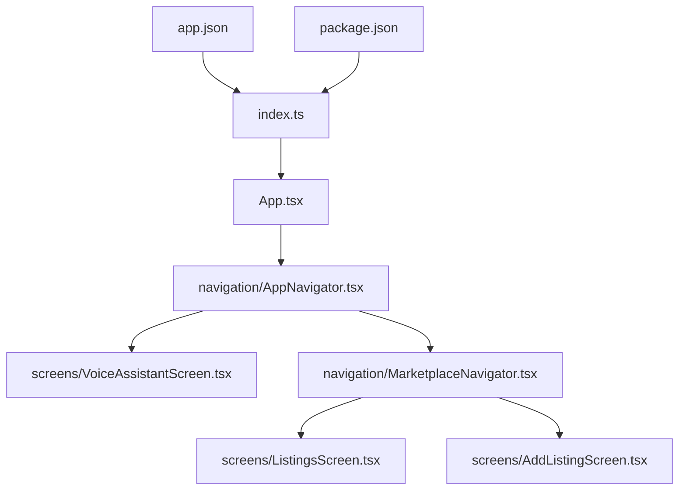
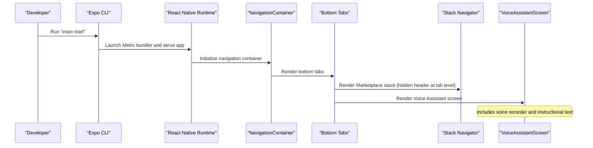
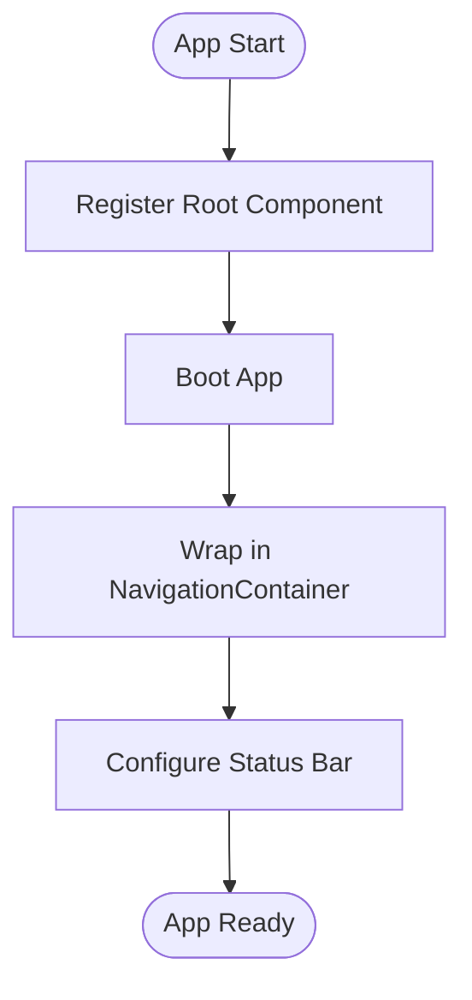
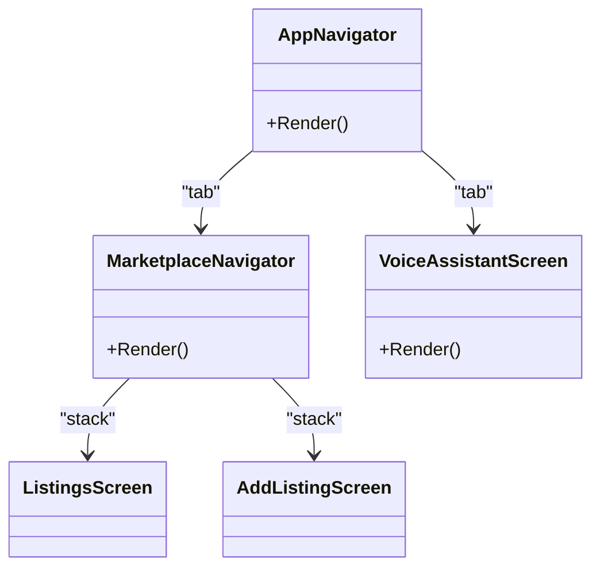
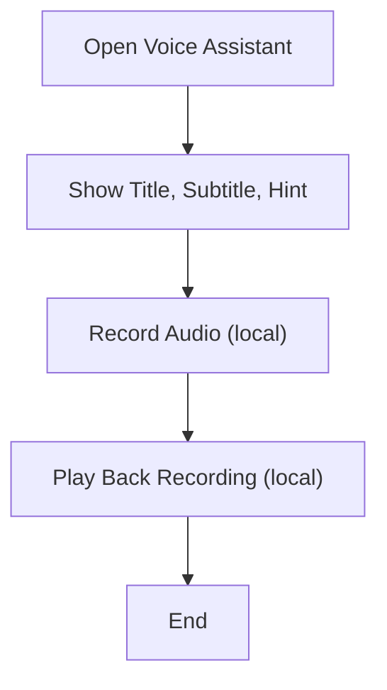
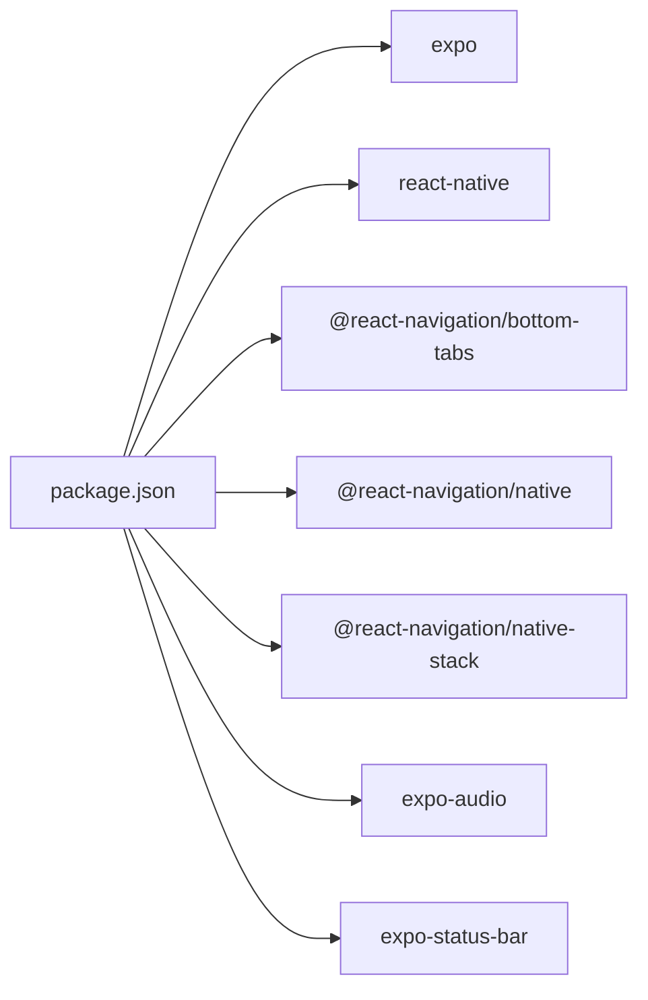

# Getting Started

<cite>
**Referenced Files in This Document**
- [README.md](file://README.md)
- [frontend/package.json](file://frontend/package.json)
- [frontend/app.json](file://frontend/app.json)
- [frontend/App.tsx](file://frontend/App.tsx)
- [frontend/index.ts](file://frontend/index.ts)
- [frontend/tsconfig.json](file://frontend/tsconfig.json)
- [frontend/navigation/AppNavigator.tsx](file://frontend/navigation/AppNavigator.tsx)
- [frontend/navigation/MarketplaceNavigator.tsx](file://frontend/navigation/MarketplaceNavigator.tsx)
- [frontend/screens/VoiceAssistantScreen.tsx](file://frontend/screens/VoiceAssistantScreen.tsx)
</cite>

## Table of Contents
1. [Introduction](#introduction)
2. [Project Structure](#project-structure)
3. [Core Components](#core-components)
4. [Architecture Overview](#architecture-overview)
5. [Detailed Component Analysis](#detailed-component-analysis)
6. [Dependency Analysis](#dependency-analysis)
7. [Performance Considerations](#performance-considerations)
8. [Troubleshooting Guide](#troubleshooting-guide)
9. [Conclusion](#conclusion)
10. [Appendices](#appendices)

## Introduction
This guide helps you set up and run the KisaanDost AI mobile application locally. The app is built with Expo (React Native) and includes a voice assistant screen and a marketplace navigation stack. You will learn how to prepare your development environment, install dependencies, configure the app, and run it on iOS and Android simulators or physical devices.

The project targets Expo SDK 57 and uses TypeScript for type safety.

**Section sources**
- [README.md:1-3](file://README.md#L1-L3)
- [frontend/package.json:1-29](file://frontend/package.json#L1-L29)
- [frontend/tsconfig.json:1-7](file://frontend/tsconfig.json#L1-L7)

## Project Structure
At a high level, the app lives under the frontend directory:
- Entry point registers the root component and bootstraps Expo.
- App.tsx sets up global navigation and status bar.
- Navigation defines bottom tabs and nested stacks for Marketplace screens.
- Screens implement the Voice Assistant and Marketplace features.
- Configuration files define app metadata, permissions, and platform settings.

**Diagram sources**
- [frontend/index.ts:1-9](file://frontend/index.ts#L1-L9)
- [frontend/App.tsx:1-14](file://frontend/App.tsx#L1-L14)
- [frontend/navigation/AppNavigator.tsx:1-67](file://frontend/navigation/AppNavigator.tsx#L1-L67)
- [frontend/navigation/MarketplaceNavigator.tsx:1-31](file://frontend/navigation/MarketplaceNavigator.tsx#L1-L31)
- [frontend/screens/VoiceAssistantScreen.tsx:1-52](file://frontend/screens/VoiceAssistantScreen.tsx#L1-L52)
- [frontend/app.json:1-34](file://frontend/app.json#L1-L34)
- [frontend/package.json:1-29](file://frontend/package.json#L1-L29)

**Section sources**
- [frontend/index.ts:1-9](file://frontend/index.ts#L1-L9)
- [frontend/App.tsx:1-14](file://frontend/App.tsx#L1-L14)
- [frontend/navigation/AppNavigator.tsx:1-67](file://frontend/navigation/AppNavigator.tsx#L1-L67)
- [frontend/navigation/MarketplaceNavigator.tsx:1-31](file://frontend/navigation/MarketplaceNavigator.tsx#L1-L31)
- [frontend/screens/VoiceAssistantScreen.tsx:1-52](file://frontend/screens/VoiceAssistantScreen.tsx#L1-L52)
- [frontend/app.json:1-34](file://frontend/app.json#L1-L34)
- [frontend/package.json:1-29](file://frontend/package.json#L1-L29)

## Core Components
- Root entrypoint: Registers the root component for Expo and ensures proper environment setup across Expo Go and native builds.
- App shell: Wraps the app in a navigation container and configures the status bar style.
- Navigation:
  - Bottom tab navigator with two tabs: Voice Assistant and Marketplace.
  - Marketplace uses a native stack with Listings and Add Listing screens.
- Voice Assistant screen: Displays instructions and integrates a voice recorder component.
- Configuration:
  - app.json defines app name, slug, orientation, icons, and platform-specific settings including microphone permission for audio features.
  - package.json lists dependencies and scripts to start the dev server and run on platforms.

Key configuration highlights:
- App name and slug are defined in app.json.
- Microphone permission is configured via an Expo plugin for audio features.
- Scripts provide commands to start the dev server and launch on Android/iOS/web.

**Section sources**
- [frontend/index.ts:1-9](file://frontend/index.ts#L1-L9)
- [frontend/App.tsx:1-14](file://frontend/App.tsx#L1-L14)
- [frontend/navigation/AppNavigator.tsx:1-67](file://frontend/navigation/AppNavigator.tsx#L1-L67)
- [frontend/navigation/MarketplaceNavigator.tsx:1-31](file://frontend/navigation/MarketplaceNavigator.tsx#L1-L31)
- [frontend/screens/VoiceAssistantScreen.tsx:1-52](file://frontend/screens/VoiceAssistantScreen.tsx#L1-L52)
- [frontend/app.json:1-34](file://frontend/app.json#L1-L34)
- [frontend/package.json:1-29](file://frontend/package.json#L1-L29)

## Architecture Overview
The app follows a standard Expo + React Navigation structure:
- index.ts boots the app by registering the root component.
- App.tsx provides the top-level navigation container and status bar.
- AppNavigator.tsx creates a bottom tab layout with two main sections.
- MarketplaceNavigator.tsx manages a stack of marketplace-related screens.
- VoiceAssistantScreen.tsx hosts the voice recording UI and hints about future API integration.

**Diagram sources**
- [frontend/index.ts:1-9](file://frontend/index.ts#L1-L9)
- [frontend/App.tsx:1-14](file://frontend/App.tsx#L1-L14)
- [frontend/navigation/AppNavigator.tsx:1-67](file://frontend/navigation/AppNavigator.tsx#L1-L67)
- [frontend/navigation/MarketplaceNavigator.tsx:1-31](file://frontend/navigation/MarketplaceNavigator.tsx#L1-L31)
- [frontend/screens/VoiceAssistantScreen.tsx:1-52](file://frontend/screens/VoiceAssistantScreen.tsx#L1-L52)

## Detailed Component Analysis

### App Shell and Entry Point
- index.ts registers the root component using Expo’s registration method, ensuring compatibility with both Expo Go and standalone builds.
- App.tsx wraps the app in a navigation container and configures the system status bar.

**Diagram sources**
- [frontend/index.ts:1-9](file://frontend/index.ts#L1-L9)
- [frontend/App.tsx:1-14](file://frontend/App.tsx#L1-L14)

**Section sources**
- [frontend/index.ts:1-9](file://frontend/index.ts#L1-L9)
- [frontend/App.tsx:1-14](file://frontend/App.tsx#L1-L14)

### Navigation
- Bottom tabs: Two primary destinations — Voice Assistant and Marketplace.
- Marketplace stack: Nested stack containing Listings and Add Listing screens.
- Styling: Consistent header colors and tab styling applied globally within navigators.

**Diagram sources**
- [frontend/navigation/AppNavigator.tsx:1-67](file://frontend/navigation/AppNavigator.tsx#L1-L67)
- [frontend/navigation/MarketplaceNavigator.tsx:1-31](file://frontend/navigation/MarketplaceNavigator.tsx#L1-L31)
- [frontend/screens/VoiceAssistantScreen.tsx:1-52](file://frontend/screens/VoiceAssistantScreen.tsx#L1-L52)

**Section sources**
- [frontend/navigation/AppNavigator.tsx:1-67](file://frontend/navigation/AppNavigator.tsx#L1-L67)
- [frontend/navigation/MarketplaceNavigator.tsx:1-31](file://frontend/navigation/MarketplaceNavigator.tsx#L1-L31)
- [frontend/screens/VoiceAssistantScreen.tsx:1-52](file://frontend/screens/VoiceAssistantScreen.tsx#L1-L52)

### Voice Assistant Screen
- Presents a title, subtitle, and hint text explaining local voice recording functionality.
- Integrates a voice recorder component for capturing and playing back audio locally.
- Indicates that API integration is planned for future updates.

**Diagram sources**
- [frontend/screens/VoiceAssistantScreen.tsx:1-52](file://frontend/screens/VoiceAssistantScreen.tsx#L1-L52)

**Section sources**
- [frontend/screens/VoiceAssistantScreen.tsx:1-52](file://frontend/screens/VoiceAssistantScreen.tsx#L1-L52)

## Dependency Analysis
The app relies on Expo SDK 57 and React Navigation for routing. Key runtime dependencies include:
- Expo and React Native core libraries
- React Navigation packages for bottom tabs and native stack navigation
- Expo status bar and safe area context
- Expo audio plugin for microphone access

Scripts in package.json enable starting the development server and launching on Android, iOS, and web.

**Diagram sources**
- [frontend/package.json:1-29](file://frontend/package.json#L1-L29)

**Section sources**
- [frontend/package.json:1-29](file://frontend/package.json#L1-L29)

## Performance Considerations
- Keep the number of heavy components in initial render minimal; lazy-load non-critical screens if needed.
- Use Expo’s built-in optimizations and avoid unnecessary re-renders in navigation containers.
- For voice recording, ensure efficient handling of audio buffers and avoid blocking the UI thread.

[No sources needed since this section provides general guidance]

## Troubleshooting Guide

Common setup issues and resolutions:

- Node.js and npm/yarn not installed
  - Ensure Node.js LTS is installed and accessible from your terminal.
  - Verify npm or yarn is available.

- Expo CLI not found
  - Install Expo CLI globally or use npx when running commands.

- Missing dependencies
  - Delete node_modules and lock files, then reinstall dependencies.

- Metro bundler cache issues
  - Clear the Metro cache and restart the dev server.

- Platform-specific requirements
  - iOS: Xcode command line tools must be installed; iOS simulator requires macOS.
  - Android: Android Studio and emulator required; ensure ANDROID_HOME is set correctly.

- Permissions for microphone
  - The app configures microphone permission via an Expo plugin. On first run, grant the permission when prompted. If denied, reset app permissions in device settings.

- Running on simulators vs physical devices
  - Simulators: Use Expo CLI commands to launch on iOS or Android emulators.
  - Physical devices: Connect via USB or Wi-Fi debugging and scan the QR code with Expo Go.

- TypeScript strict mode
  - The project enables strict TypeScript checks. Fix type errors reported by the compiler to proceed.

- Web build
  - The web script is available; ensure browser compatibility and consider polyfills if needed.

**Section sources**
- [frontend/package.json:21-26](file://frontend/package.json#L21-L26)
- [frontend/app.json:24-31](file://frontend/app.json#L24-L31)
- [frontend/tsconfig.json:1-7](file://frontend/tsconfig.json#L1-L7)

## Conclusion
You now have the essentials to set up, configure, and run the KisaanDost AI app locally. With Expo CLI and the correct platform toolchains installed, you can start the development server and test on iOS and Android. Explore the navigation structure and extend the Voice Assistant and Marketplace features as needed. Refer to the troubleshooting section if you encounter common setup issues.

[No sources needed since this section summarizes without analyzing specific files]

## Appendices

### Prerequisites
- Node.js (LTS recommended)
- npm or yarn
- Expo CLI (install globally or use npx)
- iOS development: macOS with Xcode and command line tools
- Android development: Android Studio with an emulator or a connected device

### Installation Steps
1. Clone the repository to your local machine.
2. Navigate to the frontend directory.
3. Install dependencies using your preferred package manager.
4. Start the development server.
5. Choose a target platform:
   - Android: Run the Android script to launch on emulator or device.
   - iOS: Run the iOS script to launch on simulator or device.
   - Web: Run the web script to open in a browser.

### Initial Configuration
- Review app.json for app name, slug, orientation, icons, and platform-specific settings.
- Confirm microphone permission configuration for audio features.
- Ensure TypeScript strict mode aligns with your team’s standards.

### Running on Devices
- iOS Simulator: Use the iOS script to launch on the default or selected simulator.
- Android Emulator: Use the Android script to launch on the default or selected emulator.
- Physical Device: Connect via USB or Wi-Fi and scan the QR code shown by the dev server with Expo Go.

**Section sources**
- [frontend/package.json:21-26](file://frontend/package.json#L21-L26)
- [frontend/app.json:1-34](file://frontend/app.json#L1-L34)