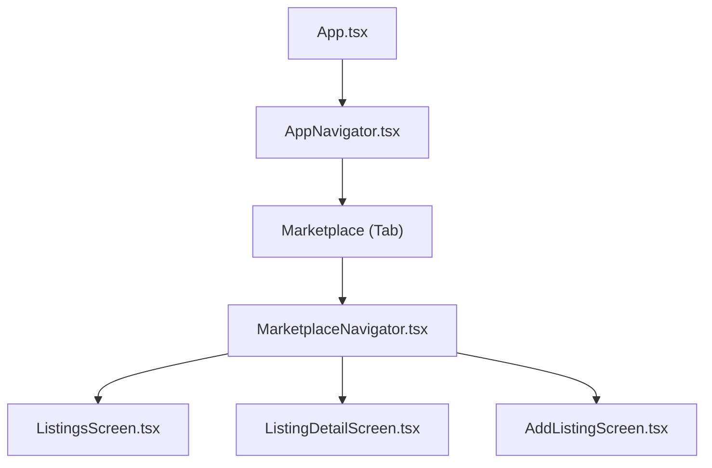
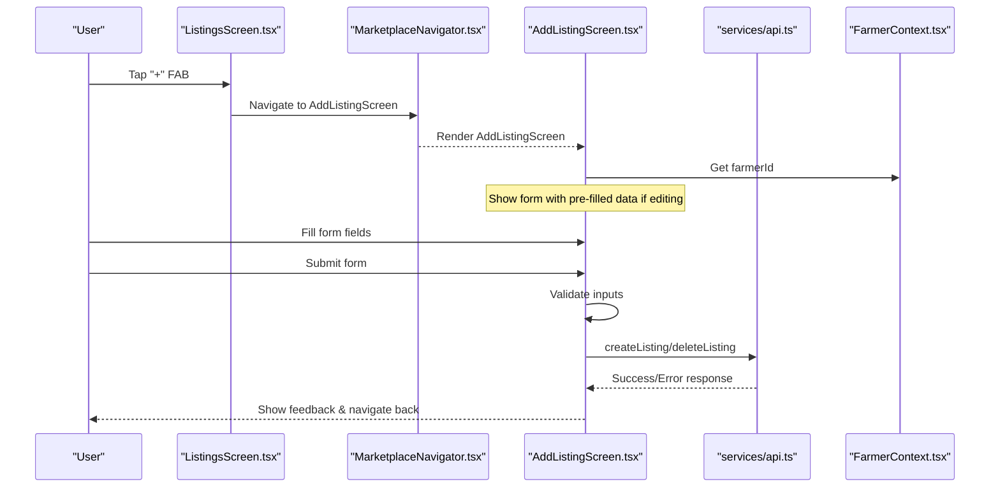
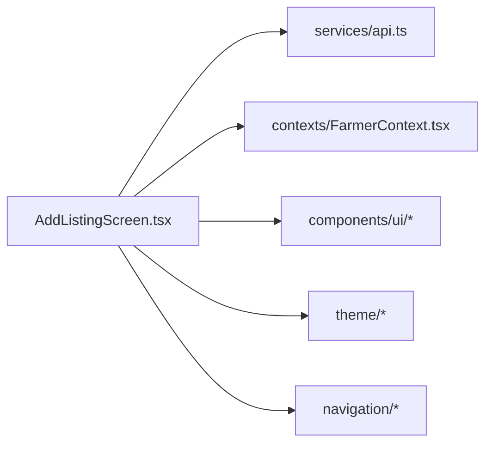

# Add Listing Screen

<cite>
**Referenced Files in This Document**
- [AddListingScreen.tsx](file://frontend/screens/AddListingScreen.tsx)
- [ListingsScreen.tsx](file://frontend/screens/ListingsScreen.tsx)
- [MarketplaceNavigator.tsx](file://frontend/navigation/MarketplaceNavigator.tsx)
- [AppNavigator.tsx](file://frontend/navigation/AppNavigator.tsx)
- [api.ts](file://frontend/services/api.ts)
- [FarmerContext.tsx](file://frontend/contexts/FarmerContext.tsx)
- [crops.ts](file://frontend/theme/crops.ts)
- [StateCard.tsx](file://frontend/components/ui/StateCard.tsx)
- [PrimaryButton.tsx](file://frontend/components/ui/PrimaryButton.tsx)
</cite>

## Update Summary
**Changes Made**
- Updated AddListingScreen implementation from placeholder to fully functional form
- Added comprehensive validation and error handling
- Implemented form submission with API integration
- Added editing functionality for existing listings
- Enhanced user experience with loading states and feedback mechanisms
- Integrated with farmer context for identity management

## Table of Contents
1. [Introduction](#introduction)
2. [Project Structure](#project-structure)
3. [Core Components](#core-components)
4. [Architecture Overview](#architecture-overview)
5. [Detailed Component Analysis](#detailed-component-analysis)
6. [Form Implementation](#form-implementation)
7. [Validation and Error Handling](#validation-and-error-handling)
8. [API Integration](#api-integration)
9. [User Experience Features](#user-experience-features)
10. [Dependency Analysis](#dependency-analysis)
11. [Performance Considerations](#performance-considerations)
12. [Troubleshooting Guide](#troubleshooting-guide)
13. [Conclusion](#conclusion)
14. [Appendices](#appendices)

## Introduction
The AddListingScreen component provides a comprehensive form interface for farmers to create new crop listings in the marketplace. Unlike its initial placeholder state, it now includes full form functionality with validation, submission handling, editing capabilities, and seamless integration with the backend API. The screen supports both new listing creation and editing existing listings, with appropriate UI feedback and error handling throughout the process.

## Project Structure
The AddListingScreen is part of a React Native application using Expo and React Navigation. It resides under screens and is navigated via a stack navigator within the Marketplace tab. The navigation hierarchy remains consistent:
- App root wraps everything in a NavigationContainer
- Bottom tabs include Voice Assistant and Marketplace
- Marketplace uses a native stack with ListingsScreen, ListingDetailScreen, and AddListingScreen

**Diagram sources**
- [AppNavigator.tsx:14-59](file://frontend/navigation/AppNavigator.tsx#L14-L59)
- [MarketplaceNavigator.tsx:12-34](file://frontend/navigation/MarketplaceNavigator.tsx#L12-L34)
- [ListingsScreen.tsx:26-39](file://frontend/screens/ListingsScreen.tsx#L26-L39)

**Section sources**
- [AppNavigator.tsx:14-59](file://frontend/navigation/AppNavigator.tsx#L14-L59)
- [MarketplaceNavigator.tsx:12-34](file://frontend/navigation/MarketplaceNavigator.tsx#L12-L34)
- [ListingsScreen.tsx:26-39](file://frontend/screens/ListingsScreen.tsx#L26-L39)

## Core Components
- **AddListingScreen**: Full-featured form with validation, submission, and editing capabilities
- **ListingsScreen**: Entry point with floating action button to navigate to AddListingScreen
- **MarketplaceNavigator**: Defines the stack containing all marketplace screens with consistent styling
- **API Service Layer**: Mock API layer providing createListing, getListings, deleteListing functions
- **FarmerContext**: Provides persistent farmer identity for listing attribution
- **UI Components**: StateCard for error/info messages, PrimaryButton for actions with loading states

Key responsibilities:
- Form input handling with real-time validation
- Data submission to backend API with proper error handling
- Editing mode support for modifying existing listings
- User feedback through loading states and success/error messages
- Integration with farmer identity system

**Section sources**
- [AddListingScreen.tsx:35-129](file://frontend/screens/AddListingScreen.tsx#L35-L129)
- [ListingsScreen.tsx:234-241](file://frontend/screens/ListingsScreen.tsx#L234-L241)
- [MarketplaceNavigator.tsx:12-34](file://frontend/navigation/MarketplaceNavigator.tsx#L12-L34)
- [api.ts:209-255](file://frontend/services/api.ts#L209-L255)
- [FarmerContext.tsx:23-43](file://frontend/contexts/FarmerContext.tsx#L23-L43)

## Architecture Overview
The AddListingScreen follows a modern React Native architecture with clear separation of concerns:

**Diagram sources**
- [ListingsScreen.tsx:234-241](file://frontend/screens/ListingsScreen.tsx#L234-L241)
- [MarketplaceNavigator.tsx:29-33](file://frontend/navigation/MarketplaceNavigator.tsx#L29-L33)
- [AddListingScreen.tsx:79-129](file://frontend/screens/AddListingScreen.tsx#L79-L129)
- [api.ts:209-255](file://frontend/services/api.ts#L209-L255)

## Detailed Component Analysis

### AddListingScreen
The AddListingScreen is now a fully functional form component with comprehensive features:

**Current Implementation:**
- **Form Fields**: Crop selection (picker), quantity (numeric), price (numeric), location (text), phone (11 digits)
- **Validation**: Real-time field validation with specific error messages
- **Submission**: Async form submission with loading states
- **Editing Mode**: Support for editing existing listings with pre-populated data
- **Error Handling**: Comprehensive error display with field-specific and general errors
- **User Feedback**: Loading indicators, success/error messages, and navigation feedback

**Key Features:**
- Uses `useState` hooks for form state management
- Implements custom validation function with regex patterns
- Integrates with FarmerContext for automatic farmer ID assignment
- Supports both create and edit operations
- Uses KeyboardAvoidingView for mobile-friendly keyboard handling
- Leverages reusable UI components (StateCard, PrimaryButton)

**Section sources**
- [AddListingScreen.tsx:35-129](file://frontend/screens/AddListingScreen.tsx#L35-L129)
- [AddListingScreen.tsx:131-244](file://frontend/screens/AddListingScreen.tsx#L131-L244)

### ListingsScreen
Enhanced with floating action button for easy access to listing creation:

**Navigation Role:**
- Acts as the main marketplace view with listing display
- Provides floating action button (+) for creating new listings
- Handles filtering by crop type and location
- Manages listing deletion with confirmation dialogs

**Section sources**
- [ListingsScreen.tsx:52-243](file://frontend/screens/ListingsScreen.tsx#L52-L243)
- [ListingsScreen.tsx:234-241](file://frontend/screens/ListingsScreen.tsx#L234-L241)

### MarketplaceNavigator
Consistent navigation configuration with proper header styling:

**Responsibilities:**
- Creates native stack for Marketplace-related screens
- Configures green header theme matching app branding
- Registers all marketplace screens with typed parameters
- Maintains consistent navigation behavior across screens

**Section sources**
- [MarketplaceNavigator.tsx:12-34](file://frontend/navigation/MarketplaceNavigator.tsx#L12-L34)

## Form Implementation

### Form Fields and Input Types
The form includes five primary fields with specific input types and validation:

1. **Crop Selection**: Dropdown picker with emoji icons and bilingual labels
2. **Quantity**: Numeric input with kg unit specification
3. **Price**: Numeric input with PKR/kg currency format
4. **Location**: Text input for geographic location
5. **Phone**: Phone keypad input with 11-digit validation

### State Management
Uses React's useState hook for local form state:
- Individual state variables for each field
- Separate state for submission status and errors
- Edit mode detection based on route parameters

### Form Submission Flow
1. **Validation**: Client-side validation before submission
2. **API Call**: Create or delete/create operation based on edit mode
3. **Error Handling**: Map API errors to specific fields
4. **Navigation**: Return to previous screen on success

**Section sources**
- [AddListingScreen.tsx:48-67](file://frontend/screens/AddListingScreen.tsx#L48-L67)
- [AddListingScreen.tsx:79-129](file://frontend/screens/AddListingScreen.tsx#L79-L129)

## Validation and Error Handling

### Client-Side Validation
Comprehensive validation rules ensure data integrity:
- **Quantity**: Must be positive number
- **Price**: Must be positive number  
- **Location**: Required field
- **Phone**: Must be exactly 11 digits using regex pattern `/^\d{11}$/`

### Error Display System
Multi-layered error handling approach:
- **Field-specific errors**: Displayed below individual fields with red borders
- **General errors**: Shown using StateCard component at top of form
- **API errors**: Mapped to appropriate fields based on error messages

### Real-time Validation
- Errors clear automatically when users correct their input
- Visual feedback through border color changes
- Immediate validation feedback during typing

**Section sources**
- [AddListingScreen.tsx:56-77](file://frontend/screens/AddListingScreen.tsx#L56-L77)
- [AddListingScreen.tsx:137-145](file://frontend/screens/AddListingScreen.tsx#L137-L145)

## API Integration

### Backend Communication
The form integrates with a mock API layer that simulates backend functionality:

**API Functions Used:**
- `createListing()`: Creates new listings with validation
- `deleteListing()`: Removes original listing when editing
- `getListings()`: Fetches existing listings with filters

### Response Handling
Standardized API response format:
- **Success**: `{ success: true, listing: newListing }`
- **Error**: `{ success: false, error: errorMessage }`

### Mock vs Production
Configurable between mock and production modes:
- **Mock Mode**: In-memory data storage with simulated delays
- **Production Mode**: Ready for real backend integration via fetch calls

**Section sources**
- [api.ts:209-255](file://frontend/services/api.ts#L209-L255)
- [api.ts:320-337](file://frontend/services/api.ts#L320-L337)

## User Experience Features

### Accessibility Considerations
- **Large Touch Targets**: Minimum 48dp height for buttons and inputs
- **Clear Labels**: Descriptive labels for all form fields
- **Visual Hierarchy**: Proper font sizes and spacing for readability
- **Color Contrast**: High contrast colors for better visibility

### Mobile Optimization
- **Keyboard Avoiding**: Automatic keyboard handling for iOS and Android
- **Responsive Layout**: Adapts to different screen sizes
- **Input Types**: Optimized keyboards for numeric and phone inputs
- **Scroll Behavior**: Proper scroll handling with keyboard avoidance

### Loading States
- **Submit Button**: Shows spinner during API calls
- **Disabled State**: Prevents multiple submissions while processing
- **Visual Feedback**: Clear indication of ongoing operations

### Error Recovery
- **User-Friendly Messages**: Clear error descriptions
- **Field-Level Errors**: Specific guidance for fixing issues
- **Retry Options**: Ability to retry failed operations

**Section sources**
- [AddListingScreen.tsx:132-244](file://frontend/screens/AddListingScreen.tsx#L132-L244)
- [PrimaryButton.tsx:34-68](file://frontend/components/ui/PrimaryButton.tsx#L34-L68)
- [StateCard.tsx:53-77](file://frontend/components/ui/StateCard.tsx#L53-L77)

## Dependency Analysis

### Component Dependencies
The AddListingScreen depends on several key modules:

**Core Dependencies:**
- React Native primitives (TextInput, Picker, ScrollView)
- React Navigation for screen management
- Custom UI components (StateCard, PrimaryButton)
- Theme system for consistent styling

**Service Dependencies:**
- API service layer for data operations
- Farmer context for identity management
- Crop theme data for display options

**Diagram sources**
- [AddListingScreen.tsx:1-23](file://frontend/screens/AddListingScreen.tsx#L1-L23)

**Section sources**
- [AddListingScreen.tsx:1-23](file://frontend/screens/AddListingScreen.tsx#L1-L23)
- [api.ts:209-255](file://frontend/services/api.ts#L209-L255)
- [FarmerContext.tsx:23-43](file://frontend/contexts/FarmerContext.tsx#L23-L43)

## Performance Considerations

### Optimization Strategies
- **Local State**: Uses React state for efficient re-renders
- **Memoization**: Crop options are computed once and reused
- **Conditional Rendering**: Only renders necessary UI elements
- **Efficient Validation**: Real-time validation without excessive re-renders

### Memory Management
- Proper cleanup of event listeners and timers
- Efficient state updates to prevent unnecessary re-renders
- Reusable components reduce memory footprint

### Network Optimization
- Debounced API calls where applicable
- Proper error handling to prevent infinite loops
- Loading states prevent duplicate requests

## Troubleshooting Guide

### Common Issues and Solutions

**Form Not Submitting:**
- Check network connectivity and API availability
- Verify all required fields are properly filled
- Ensure farmer ID is available from context

**Validation Errors Persisting:**
- Clear form state when navigating away
- Reset validation errors on field changes
- Check for typos in validation logic

**Navigation Issues:**
- Verify route parameters are correctly passed
- Ensure proper navigation stack configuration
- Check for circular navigation dependencies

**API Integration Problems:**
- Toggle USE_MOCK flag for testing different scenarios
- Check API endpoint configurations
- Verify data format matches expected schema

### Debugging Tips
- Use console logging for state changes
- Test with various input combinations
- Verify form behavior in both create and edit modes
- Check browser/device console for errors

## Conclusion
The AddListingScreen has evolved from a simple placeholder to a robust, production-ready form component that provides an excellent user experience for farmers creating marketplace listings. With comprehensive validation, error handling, and seamless API integration, it successfully bridges the gap between user input and backend data management. The component demonstrates best practices in React Native development including proper state management, accessibility considerations, and mobile optimization.

## Appendices

### Form Field Specifications

**Crop Selection:**
- Type: Dropdown picker with emoji icons
- Options: Wheat, Rice, Cotton, Maize with bilingual labels
- Validation: Required field selection

**Quantity Field:**
- Type: Numeric input with kg unit
- Validation: Positive numbers only
- Format: Integer values representing kilograms

**Price Field:**
- Type: Numeric input with PKR/kg currency
- Validation: Positive numbers only
- Format: Currency values per kilogram

**Location Field:**
- Type: Text input
- Validation: Required field
- Purpose: Geographic location of the listing

**Phone Field:**
- Type: Phone keypad input
- Validation: Exactly 11 digits using regex
- Format: Pakistani phone number format

### API Endpoints Reference

**Create Listing:**
- Method: POST
- Endpoint: `/api/listings`
- Request: `{ farmerId, crop, quantity, price, location, phone }`
- Response: `{ success: true, listing: newListing }`

**Delete Listing:**
- Method: DELETE
- Endpoint: `/api/listings/:id`
- Response: `{ success: true, message: 'Listing deleted' }`

**Get Listings:**
- Method: GET
- Endpoint: `/api/listings?crop=&location=`
- Response: `{ success: true, listings: [...] }`

### State Management Patterns

**Local State Variables:**
- Form field values (crop, quantity, price, location, phone)
- Submission status (submitting)
- Error tracking (errors object)
- Edit mode detection (isEditing)

**Context Integration:**
- Farmer identity from FarmerContext
- Persistent user session management
- Cross-screen data sharing

**Component Composition:**
- Reusable UI components (StateCard, PrimaryButton)
- Theme-based styling system
- Consistent design patterns across the application