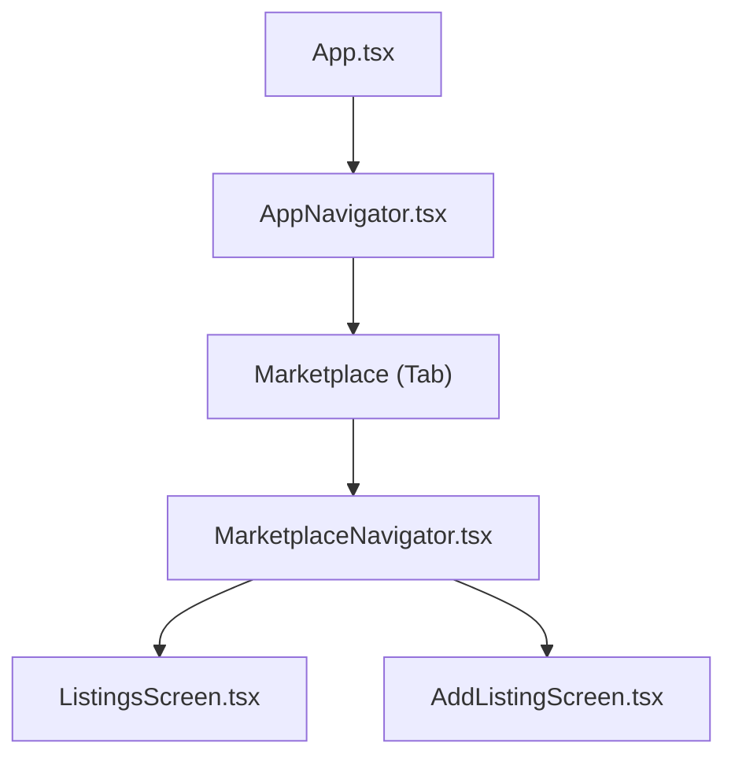
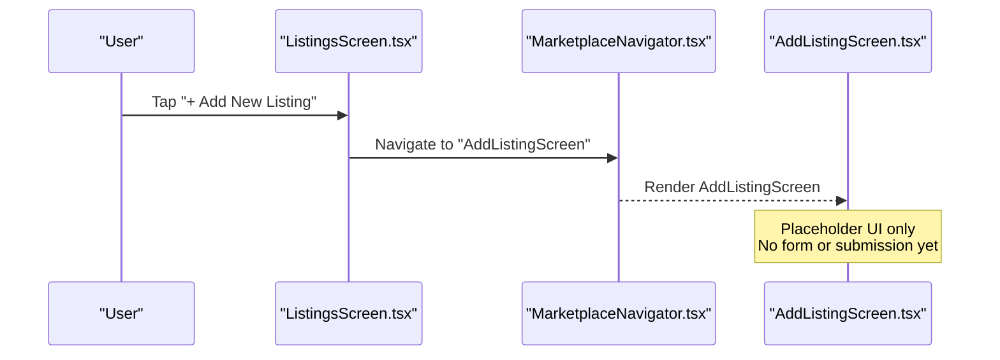
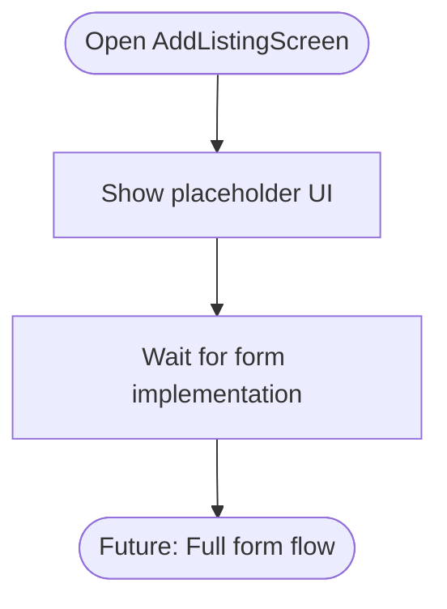
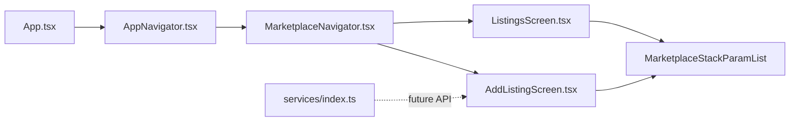

# Add Listing Screen

<cite>
**Referenced Files in This Document**
- [AddListingScreen.tsx](file://frontend/screens/AddListingScreen.tsx)
- [ListingsScreen.tsx](file://frontend/screens/ListingsScreen.tsx)
- [MarketplaceNavigator.tsx](file://frontend/navigation/MarketplaceNavigator.tsx)
- [AppNavigator.tsx](file://frontend/navigation/AppNavigator.tsx)
- [App.tsx](file://frontend/App.tsx)
- [index.ts](file://frontend/services/index.ts)
</cite>

## Table of Contents
1. [Introduction](#introduction)
2. [Project Structure](#project-structure)
3. [Core Components](#core-components)
4. [Architecture Overview](#architecture-overview)
5. [Detailed Component Analysis](#detailed-component-analysis)
6. [Dependency Analysis](#dependency-analysis)
7. [Performance Considerations](#performance-considerations)
8. [Troubleshooting Guide](#troubleshooting-guide)
9. [Conclusion](#conclusion)
10. [Appendices](#appendices)

## Introduction
This document provides comprehensive documentation for the AddListingScreen component, which currently serves as a placeholder UI for creating new marketplace listings. The intended functionality is to allow farmers to add listings for crops, livestock details, and farming supplies. At present, the screen displays a simple title, an explanatory subtitle indicating that the form is coming soon, and a button to return to the Listings screen. Future development will implement input fields, validation, state management, submission handling, and integration with backend APIs.

## Project Structure
The AddListingScreen is part of a React Native application using Expo and React Navigation. It resides under screens and is navigated via a stack navigator within the Marketplace tab. The navigation hierarchy is:
- App root wraps everything in a NavigationContainer
- Bottom tabs include Voice Assistant and Marketplace
- Marketplace uses a native stack with ListingsScreen and AddListingScreen

**Diagram sources**
- [App.tsx:6-13](file://frontend/App.tsx#L6-L13)
- [AppNavigator.tsx:14-59](file://frontend/navigation/AppNavigator.tsx#L14-L59)
- [MarketplaceNavigator.tsx:9-30](file://frontend/navigation/MarketplaceNavigator.tsx#L9-L30)
- [ListingsScreen.tsx:12-28](file://frontend/screens/ListingsScreen.tsx#L12-L28)
- [AddListingScreen.tsx:8-19](file://frontend/screens/AddListingScreen.tsx#L8-L19)

**Section sources**
- [App.tsx:6-13](file://frontend/App.tsx#L6-L13)
- [AppNavigator.tsx:14-59](file://frontend/navigation/AppNavigator.tsx#L14-L59)
- [MarketplaceNavigator.tsx:9-30](file://frontend/navigation/MarketplaceNavigator.tsx#L9-L30)
- [ListingsScreen.tsx:12-28](file://frontend/screens/ListingsScreen.tsx#L12-L28)
- [AddListingScreen.tsx:8-19](file://frontend/screens/AddListingScreen.tsx#L8-L19)

## Core Components
- AddListingScreen: Placeholder UI with title, subtitle, and back button. No form inputs or logic yet.
- ListingsScreen: Entry point to navigate to AddListingScreen; also a placeholder listing view.
- MarketplaceNavigator: Defines the stack containing ListingsScreen and AddListingScreen with consistent header styling.
- AppNavigator: Bottom tab structure placing Marketplace alongside Voice Assistant.
- Services index: Placeholder module reserved for API calls and integrations.

Key responsibilities:
- Navigation wiring between screens
- Presenting a clear, accessible placeholder message
- Preparing the foundation for future form implementation

**Section sources**
- [AddListingScreen.tsx:8-19](file://frontend/screens/AddListingScreen.tsx#L8-L19)
- [ListingsScreen.tsx:12-28](file://frontend/screens/ListingsScreen.tsx#L12-L28)
- [MarketplaceNavigator.tsx:9-30](file://frontend/navigation/MarketplaceNavigator.tsx#L9-L30)
- [AppNavigator.tsx:14-59](file://frontend/navigation/AppNavigator.tsx#L14-L59)
- [index.ts:1-3](file://frontend/services/index.ts#L1-L3)

## Architecture Overview
The current architecture is minimal and focused on navigation. The AddListingScreen is a leaf node in the Marketplace stack. Future enhancements should introduce:
- Local state or context for form data
- Validation layer
- Service layer for API calls
- Error and loading states
- Success feedback mechanisms

**Diagram sources**
- [ListingsScreen.tsx:21-26](file://frontend/screens/ListingsScreen.tsx#L21-L26)
- [MarketplaceNavigator.tsx:18-27](file://frontend/navigation/MarketplaceNavigator.tsx#L18-L27)
- [AddListingScreen.tsx:8-19](file://frontend/screens/AddListingScreen.tsx#L8-L19)

## Detailed Component Analysis

### AddListingScreen
Current behavior:
- Displays a title and a subtitle informing users that the form is coming soon
- Provides a button to go back to the previous screen
- Uses basic styling with a light background and centered layout

Intended future behavior:
- Input fields for crop listings (e.g., crop type, quantity, price, location)
- Livestock details (e.g., animal type, age, weight, health status)
- Farming supplies (e.g., item name, brand, quantity, condition)
- Form validation patterns (required fields, format checks, range validation)
- State management for listing data (local state or global store)
- Submission handling (POST to backend API)
- Integration with marketplace data models (types/interfaces for listings)
- Loading states during submission
- Error handling for network/validation errors
- Success feedback (confirmation message, navigation after success)

Accessibility considerations:
- Use accessible labels for all inputs
- Ensure sufficient color contrast
- Support screen readers with descriptive hints
- Provide keyboard navigation support

Mobile-optimized design:
- Large touch targets for buttons and inputs
- Clear visual hierarchy
- Responsive layout for various screen sizes
- Minimal cognitive load with progressive disclosure

[No sources needed since this diagram shows conceptual workflow, not actual code structure]

**Section sources**
- [AddListingScreen.tsx:8-19](file://frontend/screens/AddListingScreen.tsx#L8-L19)
- [AddListingScreen.tsx:22-43](file://frontend/screens/AddListingScreen.tsx#L22-L43)

### ListingsScreen
Current behavior:
- Displays a title and subtitle indicating browsing capabilities are coming soon
- Provides a button to navigate to AddListingScreen

Navigation role:
- Acts as the entry point to create new listings
- Uses React Navigation to push AddListingScreen onto the stack

**Section sources**
- [ListingsScreen.tsx:12-28](file://frontend/screens/ListingsScreen.tsx#L12-L28)
- [ListingsScreen.tsx:31-63](file://frontend/screens/ListingsScreen.tsx#L31-L63)

### MarketplaceNavigator
Responsibilities:
- Creates a native stack for Marketplace-related screens
- Configures header styles and titles consistently
- Registers ListingsScreen and AddListingScreen with typed parameters

Consistency benefits:
- Unified header appearance
- Centralized navigation configuration
- Type safety for route parameters

**Section sources**
- [MarketplaceNavigator.tsx:9-30](file://frontend/navigation/MarketplaceNavigator.tsx#L9-L30)

### AppNavigator and App
Responsibilities:
- App: Wraps the app in NavigationContainer and sets status bar style
- AppNavigator: Defines bottom tabs for Voice Assistant and Marketplace
- Ensures Marketplace tab hides its own header so the stack header takes over

**Section sources**
- [App.tsx:6-13](file://frontend/App.tsx#L6-L13)
- [AppNavigator.tsx:14-59](file://frontend/navigation/AppNavigator.tsx#L14-L59)

## Dependency Analysis
Current dependencies:
- AddListingScreen depends on React Native primitives and React Navigation types
- ListingsScreen defines the MarketplaceStackParamList used by AddListingScreen and MarketplaceNavigator
- MarketplaceNavigator imports both screens and configures the stack
- AppNavigator includes MarketplaceNavigator as a tab
- Services index is a placeholder for future API integrations

Potential future dependencies:
- Form libraries (e.g., react-hook-form) for validation
- State management (e.g., Context, Redux, Zustand) for listing data
- API client (e.g., axios, fetch wrapper) for backend communication
- Data models/types for marketplace listings

**Diagram sources**
- [ListingsScreen.tsx:5-8](file://frontend/screens/ListingsScreen.tsx#L5-L8)
- [AddListingScreen.tsx:4-6](file://frontend/screens/AddListingScreen.tsx#L4-L6)
- [MarketplaceNavigator.tsx:3-5](file://frontend/navigation/MarketplaceNavigator.tsx#L3-L5)
- [AppNavigator.tsx:4-5](file://frontend/navigation/AppNavigator.tsx#L4-L5)
- [App.tsx:3-4](file://frontend/App.tsx#L3-L4)
- [index.ts:1-3](file://frontend/services/index.ts#L1-L3)

**Section sources**
- [ListingsScreen.tsx:5-8](file://frontend/screens/ListingsScreen.tsx#L5-L8)
- [AddListingScreen.tsx:4-6](file://frontend/screens/AddListingScreen.tsx#L4-L6)
- [MarketplaceNavigator.tsx:3-5](file://frontend/navigation/MarketplaceNavigator.tsx#L3-L5)
- [AppNavigator.tsx:4-5](file://frontend/navigation/AppNavigator.tsx#L4-L5)
- [App.tsx:3-4](file://frontend/App.tsx#L3-L4)
- [index.ts:1-3](file://frontend/services/index.ts#L1-L3)

## Performance Considerations
- Keep the placeholder screen lightweight; avoid unnecessary re-renders
- Defer heavy computations until form implementation
- Use memoization for derived data when adding complex forms
- Optimize images and assets if added later
- Prefer functional components and hooks for efficient updates

[No sources needed since this section provides general guidance]

## Troubleshooting Guide
Common issues and resolutions:
- Navigation not working: Ensure MarketplaceNavigator registers both screens and that ListingsScreen navigates to the correct route name
- Header inconsistencies: Verify MarketplaceNavigator options and AppNavigator headerShown settings
- TypeScript errors: Confirm MarketplaceStackParamList matches route names across screens and navigator
- Placeholder confusion: Clearly communicate to users that the form is not yet available; consider adding a disabled “Create Listing” button with a tooltip explaining availability

Error handling strategy (future):
- Validate inputs before submission
- Display user-friendly error messages near relevant fields
- Handle network failures with retry options and offline indicators
- Provide success feedback and auto-navigation after successful creation

Loading states (future):
- Show a spinner or disabled submit button during submission
- Prevent multiple submissions while processing

Success feedback (future):
- Show a confirmation banner or modal
- Optionally navigate back to Listings with the new item visible

[No sources needed since this section provides general guidance]

## Conclusion
The AddListingScreen is currently a placeholder that prepares the navigation foundation for a future marketplace listing creation flow. It presents a clear message to users and integrates seamlessly with the existing navigation structure. When implementing the full form, prioritize accessibility, mobile usability, robust validation, and clear feedback to ensure a positive experience for farmers with varying levels of technical literacy.

[No sources needed since this section summarizes without analyzing specific files]

## Appendices

### Intended Form Fields and Validation Patterns
- Crop listings: crop type, quantity, unit, price, location, description
  - Validation: required fields, numeric ranges, valid currency format
- Livestock details: animal type, age, weight, health status, photos
  - Validation: required fields, appropriate units, image constraints
- Farming supplies: item name, brand, quantity, condition, price
  - Validation: required fields, inventory counts, condition enum

### State Management Recommendations
- Use local state for single-screen forms
- Lift state up or use context if sharing data across screens
- Consider a store for persistent marketplace data

### Backend Integration Points
- Define data models for listings
- Implement POST endpoint for creating listings
- Handle authentication and authorization
- Return standardized success/error responses

[No sources needed since this section provides general guidance]