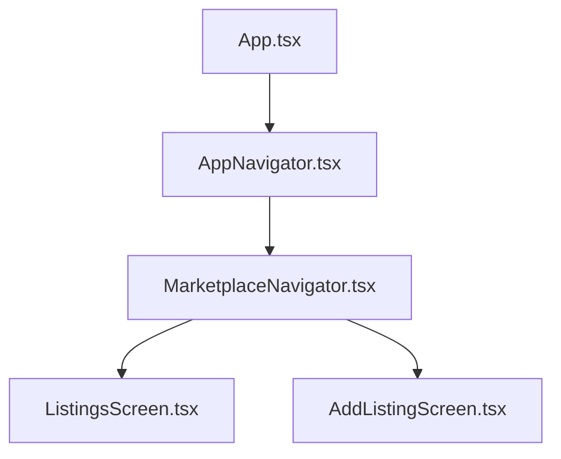
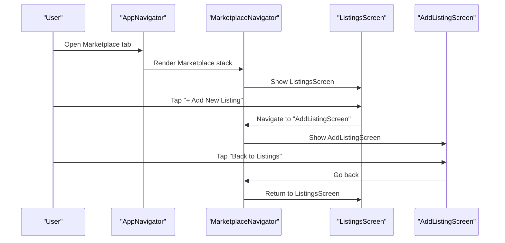
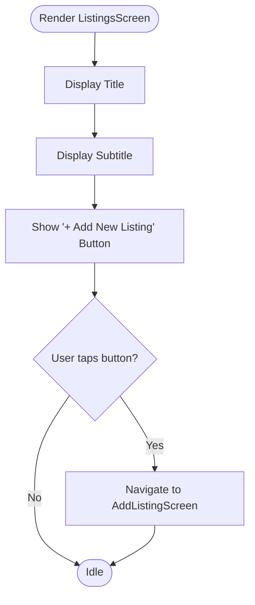
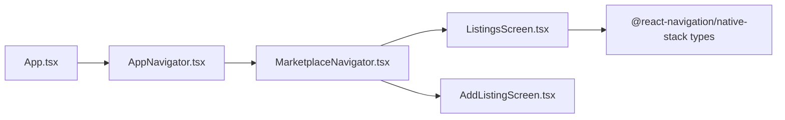

# Listings Screen

<cite>
**Referenced Files in This Document**
- [ListingsScreen.tsx](file://frontend/screens/ListingsScreen.tsx)
- [MarketplaceNavigator.tsx](file://frontend/navigation/MarketplaceNavigator.tsx)
- [AddListingScreen.tsx](file://frontend/screens/AddListingScreen.tsx)
- [AppNavigator.tsx](file://frontend/navigation/AppNavigator.tsx)
- [App.tsx](file://frontend/App.tsx)
</cite>

## Table of Contents
1. [Introduction](#introduction)
2. [Project Structure](#project-structure)
3. [Core Components](#core-components)
4. [Architecture Overview](#architecture-overview)
5. [Detailed Component Analysis](#detailed-component-analysis)
6. [Dependency Analysis](#dependency-analysis)
7. [Performance Considerations](#performance-considerations)
8. [Troubleshooting Guide](#troubleshooting-guide)
9. [Conclusion](#conclusion)
10. [Appendices](#appendices)

## Introduction
This document provides detailed documentation for the ListingsScreen component within the marketplace feature. The screen currently serves as a placeholder that introduces users to marketplace listings for crops, livestock, and farming supplies. It includes a title, subtitle text, and a navigation button to AddListingScreen. The styling uses React Native StyleSheet with an agricultural green theme (#2e7d32). TypeScript interfaces define the navigation parameters using MarketplaceStackParamList and NativeStackScreenProps. This document also explains how the screen integrates into the marketplace navigation flow and outlines future enhancements required to implement actual listing display functionality, data fetching from backend APIs, and interactive listing cards.

## Project Structure
The marketplace feature is organized under screens and navigation modules:
- Screens: ListingsScreen.tsx, AddListingScreen.tsx
- Navigation: MarketplaceNavigator.tsx (stack), AppNavigator.tsx (tabs), App.tsx (root container)

**Diagram sources**
- [App.tsx:1-14](file://frontend/App.tsx#L1-L14)
- [AppNavigator.tsx:1-67](file://frontend/navigation/AppNavigator.tsx#L1-L67)
- [MarketplaceNavigator.tsx:1-31](file://frontend/navigation/MarketplaceNavigator.tsx#L1-L31)
- [ListingsScreen.tsx:1-64](file://frontend/screens/ListingsScreen.tsx#L1-L64)
- [AddListingScreen.tsx:1-44](file://frontend/screens/AddListingScreen.tsx#L1-L44)

**Section sources**
- [App.tsx:1-14](file://frontend/App.tsx#L1-L14)
- [AppNavigator.tsx:1-67](file://frontend/navigation/AppNavigator.tsx#L1-L67)
- [MarketplaceNavigator.tsx:1-31](file://frontend/navigation/MarketplaceNavigator.tsx#L1-L31)

## Core Components
- ListingsScreen: Placeholder screen displaying a title, subtitle, and a button to navigate to AddListingScreen. Uses a green-themed style consistent with agricultural branding.
- MarketplaceNavigator: Defines a native stack navigator containing ListingsScreen and AddListingScreen with a green header theme.
- AddListingScreen: Placeholder screen for adding new listings with a back navigation button.
- AppNavigator: Bottom tab navigator that includes the Marketplace stack as one of the tabs.
- App: Root component wrapping the app with NavigationContainer.

Key responsibilities:
- ListingsScreen renders UI and handles navigation to AddListingScreen.
- MarketplaceNavigator configures stack navigation and shared header styles.
- AppNavigator organizes top-level tabs and hides the tab header for the Marketplace tab so the stack header takes over.
- App sets up the global navigation container.

**Section sources**
- [ListingsScreen.tsx:1-64](file://frontend/screens/ListingsScreen.tsx#L1-L64)
- [MarketplaceNavigator.tsx:1-31](file://frontend/navigation/MarketplaceNavigator.tsx#L1-L31)
- [AddListingScreen.tsx:1-44](file://frontend/screens/AddListingScreen.tsx#L1-L44)
- [AppNavigator.tsx:1-67](file://frontend/navigation/AppNavigator.tsx#L1-L67)
- [App.tsx:1-14](file://frontend/App.tsx#L1-L14)

## Architecture Overview
The marketplace navigation is a nested structure:
- Root: App.tsx wraps everything in NavigationContainer.
- Tabs: AppNavigator creates bottom tabs; Marketplace tab contains a stack navigator.
- Stack: MarketplaceNavigator defines ListingsScreen and AddListingScreen with a green header theme.

**Diagram sources**
- [AppNavigator.tsx:14-59](file://frontend/navigation/AppNavigator.tsx#L14-L59)
- [MarketplaceNavigator.tsx:9-29](file://frontend/navigation/MarketplaceNavigator.tsx#L9-L29)
- [ListingsScreen.tsx:12-28](file://frontend/screens/ListingsScreen.tsx#L12-L28)
- [AddListingScreen.tsx:8-19](file://frontend/screens/AddListingScreen.tsx#L8-L19)

## Detailed Component Analysis

### ListingsScreen
- Purpose: Placeholder screen introducing marketplace listings for crops, livestock, and farming supplies.
- UI elements:
  - Title: “Marketplace Listings”
  - Subtitle: Descriptive text indicating categories and placeholder status
  - Button: “+ Add New Listing” navigates to AddListingScreen
- Styling:
  - Container background: light gray
  - Title color: #2e7d32 (green)
  - Button background: #2e7d32 (green)
  - Button text: white
  - Subtitle: centered with line spacing
- TypeScript:
  - Defines MarketplaceStackParamList with ListingsScreen and AddListingScreen routes
  - Uses NativeStackScreenProps typed to MarketplaceStackParamList and 'ListingsScreen'
- Navigation integration:
  - Uses navigation.navigate('AddListingScreen')
  - Integrated via MarketplaceNavigator which registers both screens

**Diagram sources**
- [ListingsScreen.tsx:12-28](file://frontend/screens/ListingsScreen.tsx#L12-L28)

**Section sources**
- [ListingsScreen.tsx:1-64](file://frontend/screens/ListingsScreen.tsx#L1-L64)

### MarketplaceNavigator
- Purpose: Creates a native stack navigator for marketplace screens with a green header theme.
- Screens:
  - ListingsScreen with title “Marketplace”
  - AddListingScreen with title “Add Listing”
- Styling:
  - Header background: #2e7d32
  - Header text color: white
  - Header title font weight: bold

**Section sources**
- [MarketplaceNavigator.tsx:1-31](file://frontend/navigation/MarketplaceNavigator.tsx#L1-L31)

### AddListingScreen
- Purpose: Placeholder screen for creating new listings.
- UI elements:
  - Title: “Add New Listing”
  - Subtitle: Indicates form coming soon
  - Button: “Back to Listings” navigates back
- Integration:
  - Imported by MarketplaceNavigator
  - Uses navigation.goBack()

**Section sources**
- [AddListingScreen.tsx:1-44](file://frontend/screens/AddListingScreen.tsx#L1-L44)

### AppNavigator and App
- AppNavigator:
  - Bottom tab navigator with VoiceAssistant and Marketplace tabs
  - Marketplace tab hides its own header so the stack header from MarketplaceNavigator is used
  - Active tab color: #2e7d32
- App:
  - Wraps AppNavigator in NavigationContainer
  - Sets status bar style

**Section sources**
- [AppNavigator.tsx:1-67](file://frontend/navigation/AppNavigator.tsx#L1-L67)
- [App.tsx:1-14](file://frontend/App.tsx#L1-L14)

## Dependency Analysis
- ListingsScreen depends on:
  - React Native core components (View, Text, TouchableOpacity)
  - @react-navigation/native-stack types (NativeStackScreenProps)
  - Navigation provided by MarketplaceNavigator
- MarketplaceNavigator depends on:
  - @react-navigation/native-stack
  - ListingsScreen and AddListingScreen components
- AppNavigator depends on:
  - @react-navigation/bottom-tabs
  - MarketplaceNavigator
- App depends on:
  - @react-navigation/native (NavigationContainer)
  - AppNavigator

**Diagram sources**
- [ListingsScreen.tsx:1-10](file://frontend/screens/ListingsScreen.tsx#L1-L10)
- [MarketplaceNavigator.tsx:1-7](file://frontend/navigation/MarketplaceNavigator.tsx#L1-L7)
- [AddListingScreen.tsx:1-6](file://frontend/screens/AddListingScreen.tsx#L1-L6)
- [AppNavigator.tsx:1-12](file://frontend/navigation/AppNavigator.tsx#L1-L12)
- [App.tsx:1-5](file://frontend/App.tsx#L1-L5)

**Section sources**
- [ListingsScreen.tsx:1-10](file://frontend/screens/ListingsScreen.tsx#L1-L10)
- [MarketplaceNavigator.tsx:1-7](file://frontend/navigation/MarketplaceNavigator.tsx#L1-L7)
- [AddListingScreen.tsx:1-6](file://frontend/screens/AddListingScreen.tsx#L1-L6)
- [AppNavigator.tsx:1-12](file://frontend/navigation/AppNavigator.tsx#L1-L12)
- [App.tsx:1-5](file://frontend/App.tsx#L1-L5)

## Performance Considerations
- Current implementation is lightweight with no data fetching or heavy rendering logic.
- Future enhancements should consider:
  - Using FlatList or SectionList for efficient listing rendering
  - Implementing pagination or infinite scroll for large datasets
  - Debouncing search/filter inputs if added
  - Memoizing expensive computations or list items where appropriate
  - Avoiding unnecessary re-renders by keeping state local and minimal

[No sources needed since this section provides general guidance]

## Troubleshooting Guide
- Navigation issues:
  - Ensure MarketplaceNavigator registers both ListingsScreen and AddListingScreen with correct names matching navigation calls.
  - Verify that navigation.navigate('AddListingScreen') matches the registered screen name in MarketplaceNavigator.
- Styling inconsistencies:
  - Confirm that the green theme (#2e7d32) is consistently applied across headers and buttons.
  - Check that headerShown is false at the tab level for Marketplace so the stack header displays correctly.
- TypeScript errors:
  - Ensure MarketplaceStackParamList includes all route names used in navigation.
  - Confirm NativeStackScreenProps types align with the defined param list.

**Section sources**
- [MarketplaceNavigator.tsx:17-27](file://frontend/navigation/MarketplaceNavigator.tsx#L17-L27)
- [ListingsScreen.tsx:21-26](file://frontend/screens/ListingsScreen.tsx#L21-L26)
- [AppNavigator.tsx:46-58](file://frontend/navigation/AppNavigator.tsx#L46-L58)

## Conclusion
ListingsScreen currently acts as a placeholder within the marketplace feature, providing a clear entry point and navigation to AddListingScreen. It follows a consistent green theme aligned with agricultural branding and integrates seamlessly into the nested navigation structure. To evolve into a fully functional marketplace listing view, implement data fetching, dynamic listing cards, filtering/search capabilities, and robust error handling while maintaining performance and accessibility standards.

[No sources needed since this section summarizes without analyzing specific files]

## Appendices

### TypeScript Interfaces and Types
- MarketplaceStackParamList:
  - Defines route names for ListingsScreen and AddListingScreen
- NativeStackScreenProps:
  - Used to type props for both ListingsScreen and AddListingScreen based on MarketplaceStackParamList

**Section sources**
- [ListingsScreen.tsx:5-10](file://frontend/screens/ListingsScreen.tsx#L5-L10)
- [AddListingScreen.tsx:4-6](file://frontend/screens/AddListingScreen.tsx#L4-L6)

### Future Enhancements
- Data layer:
  - Integrate API client to fetch listings from backend endpoints
  - Implement caching strategies (e.g., React Query or SWR) for improved performance
- UI improvements:
  - Replace placeholder text with dynamic content
  - Add interactive listing cards with images, prices, and details
  - Add filters and search for crops, livestock, and supplies
- State management:
  - Manage loading, error, and empty states
  - Handle user interactions like favorites, sharing, and reporting
- Accessibility:
  - Ensure proper labels and keyboard navigation
  - Provide high contrast options and scalable text

[No sources needed since this section provides general guidance]