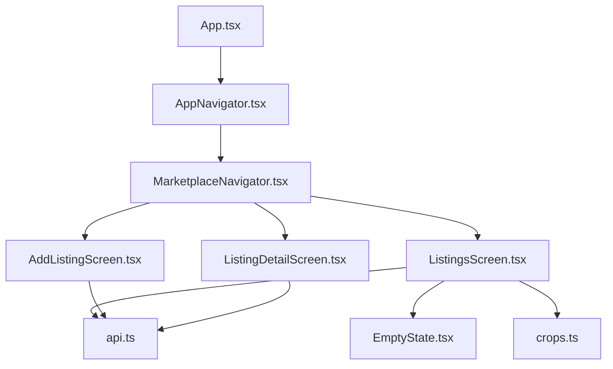
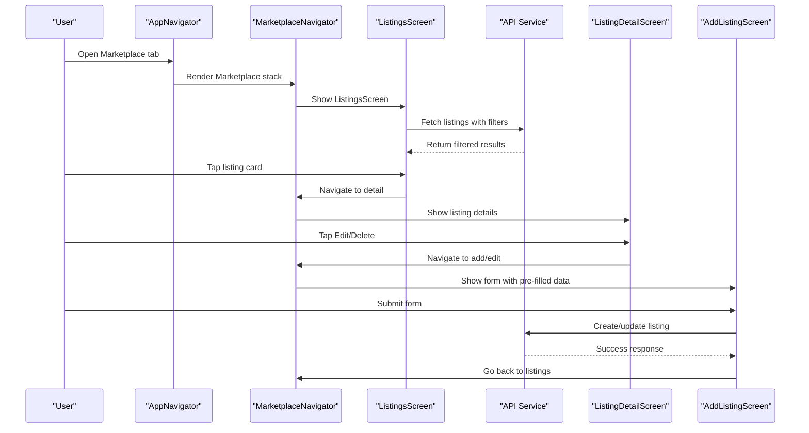
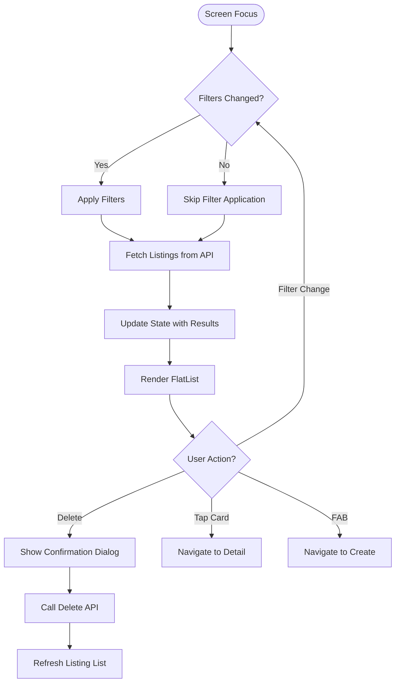
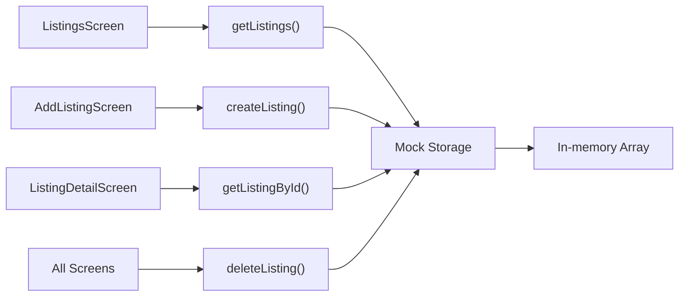

# Listings Screen

<cite>
**Referenced Files in This Document**
- [ListingsScreen.tsx](file://frontend/screens/ListingsScreen.tsx)
- [MarketplaceNavigator.tsx](file://frontend/navigation/MarketplaceNavigator.tsx)
- [AddListingScreen.tsx](file://frontend/screens/AddListingScreen.tsx)
- [ListingDetailScreen.tsx](file://frontend/screens/ListingDetailScreen.tsx)
- [AppNavigator.tsx](file://frontend/navigation/AppNavigator.tsx)
- [api.ts](file://frontend/services/api.ts)
- [crops.ts](file://frontend/theme/crops.ts)
- [EmptyState.tsx](file://frontend/components/ui/EmptyState.tsx)
</cite>

## Update Summary
**Changes Made**
- Updated ListingsScreen implementation from placeholder to comprehensive crop listing system
- Added filtering capabilities by crop type and location with real-time search
- Implemented FlatList with pull-to-refresh functionality for dynamic data loading
- Added delete operations with confirmation dialogs and loading states
- Integrated floating action button (FAB) for creating new listings
- Enhanced navigation flow with detailed listing view and edit capabilities
- Added comprehensive error handling and empty state management
- Integrated mock API layer for data persistence and CRUD operations

## Table of Contents
1. [Introduction](#introduction)
2. [Project Structure](#project-structure)
3. [Core Components](#core-components)
4. [Architecture Overview](#architecture-overview)
5. [Detailed Component Analysis](#detailed-component-analysis)
6. [Data Management and API Integration](#data-management-and-api-integration)
7. [User Interface Features](#user-interface-features)
8. [Navigation Flow](#navigation-flow)
9. [Performance Considerations](#performance-considerations)
10. [Troubleshooting Guide](#troubleshooting-guide)
11. [Conclusion](#conclusion)
12. [Appendices](#appendices)

## Introduction
The ListingsScreen component has evolved from a simple placeholder into a comprehensive marketplace listing system that displays, filters, and manages agricultural product listings. The screen now provides a complete user experience for browsing crops, livestock, and farming supplies with advanced filtering capabilities, interactive listing cards, and full CRUD operations. It features a modern React Native interface with pull-to-refresh functionality, confirmation dialogs for destructive actions, and seamless navigation between listing views and creation forms.

## Project Structure
The marketplace feature is organized within a nested navigation structure:
- **Screens**: ListingsScreen (main listing view), AddListingScreen (create/edit form), ListingDetailScreen (individual listing details)
- **Navigation**: MarketplaceNavigator (stack navigator), AppNavigator (bottom tabs)
- **Services**: Mock API layer with in-memory data storage
- **Theme**: Consistent styling with agricultural green theme (#2e7d32)



**Diagram sources**
- [AppNavigator.tsx:1-67](file://frontend/navigation/AppNavigator.tsx#L1-L67)
- [MarketplaceNavigator.tsx:1-37](file://frontend/navigation/MarketplaceNavigator.tsx#L1-L37)
- [ListingsScreen.tsx:1-375](file://frontend/screens/ListingsScreen.tsx#L1-L375)
- [AddListingScreen.tsx:1-298](file://frontend/screens/AddListingScreen.tsx#L1-L298)
- [ListingDetailScreen.tsx:1-268](file://frontend/screens/ListingDetailScreen.tsx#L1-L268)

**Section sources**
- [AppNavigator.tsx:1-67](file://frontend/navigation/AppNavigator.tsx#L1-L67)
- [MarketplaceNavigator.tsx:1-37](file://frontend/navigation/MarketplaceNavigator.tsx#L1-L37)

## Core Components
- **ListingsScreen**: Main marketplace interface with filtering, listing display, and CRUD operations
- **AddListingScreen**: Comprehensive form for creating and editing listings with validation
- **ListingDetailScreen**: Detailed view of individual listings with action buttons
- **MarketplaceNavigator**: Stack navigator managing screen transitions with consistent header styling
- **API Service Layer**: Mock backend providing data persistence and CRUD operations
- **UI Components**: Reusable components like EmptyState for consistent user feedback

Key responsibilities:
- ListingsScreen handles data fetching, filtering, display, and user interactions
- AddListingScreen manages form state, validation, and submission logic
- ListingDetailScreen provides detailed information and management actions
- Navigation components coordinate screen transitions and parameter passing

**Section sources**
- [ListingsScreen.tsx:52-243](file://frontend/screens/ListingsScreen.tsx#L52-L243)
- [AddListingScreen.tsx:35-244](file://frontend/screens/AddListingScreen.tsx#L35-L244)
- [ListingDetailScreen.tsx:38-196](file://frontend/screens/ListingDetailScreen.tsx#L38-L196)

## Architecture Overview
The marketplace follows a clean separation of concerns with distinct layers:



**Diagram sources**
- [AppNavigator.tsx:14-59](file://frontend/navigation/AppNavigator.tsx#L14-L59)
- [MarketplaceNavigator.tsx:12-34](file://frontend/navigation/MarketplaceNavigator.tsx#L12-L34)
- [ListingsScreen.tsx:62-119](file://frontend/screens/ListingsScreen.tsx#L62-L119)
- [ListingDetailScreen.tsx:72-108](file://frontend/screens/ListingDetailScreen.tsx#L72-L108)

## Detailed Component Analysis

### ListingsScreen - Enhanced Implementation
The ListingsScreen has been completely redesigned to provide a full-featured marketplace experience:

**Core Features:**
- **Dynamic Data Loading**: Uses `useIsFocused` hook to automatically refresh data when screen becomes active
- **Advanced Filtering**: Crop type selector using Picker component and location text input with real-time filtering
- **Interactive List Display**: FlatList with custom renderItem showing detailed listing cards
- **Pull-to-Refresh**: RefreshControl for manual data updates
- **Delete Operations**: Confirmation dialogs with loading states and error handling
- **Floating Action Button**: FAB for quick access to create new listings
- **Empty State Management**: Contextual empty states based on filter criteria

**State Management:**
- `listings`: Array of listing objects from API
- `loading`: Initial loading state for first data fetch
- `refreshing`: Pull-to-refresh indicator state
- `cropFilter`: Selected crop type filter
- `locationFilter`: Text-based location search
- `deletingId`: Currently deleting listing ID for UI feedback

**Data Flow:**


**Section sources**
- [ListingsScreen.tsx:52-243](file://frontend/screens/ListingsScreen.tsx#L52-L243)

### AddListingScreen - Form Management
Enhanced form with comprehensive validation and editing capabilities:

**Features:**
- **Edit Mode Support**: Detects editing vs. creating mode via route parameters
- **Field Validation**: Real-time validation with visual error indicators
- **API Error Mapping**: Converts backend errors to specific field errors
- **Loading States**: Submit button loading indicator during form submission
- **Keyboard Handling**: KeyboardAvoidingView for better mobile UX

**Validation Rules:**
- Quantity: Must be positive number
- Price: Must be positive number  
- Location: Required field
- Phone: Exactly 11 digits format

**Section sources**
- [AddListingScreen.tsx:35-129](file://frontend/screens/AddListingScreen.tsx#L35-L129)

### ListingDetailScreen - Individual Listing View
Comprehensive detail view with management capabilities:

**Features:**
- **Rich Display**: Shows all listing details with formatted dates and currency
- **Action Buttons**: Call farmer, edit, and delete operations
- **Error Handling**: Graceful handling of missing or deleted listings
- **Relative Dates**: Human-readable date formatting (e.g., "2 days ago")

**Section sources**
- [ListingDetailScreen.tsx:38-196](file://frontend/screens/ListingDetailScreen.tsx#L38-L196)

## Data Management and API Integration
The application uses a sophisticated mock API layer that simulates backend behavior:

### API Layer Architecture


**Diagram sources**
- [api.ts:264-289](file://frontend/services/api.ts#L264-L289)
- [api.ts:209-255](file://frontend/services/api.ts#L209-L255)
- [api.ts:297-312](file://frontend/services/api.ts#L297-L312)
- [api.ts:320-337](file://frontend/services/api.ts#L320-L337)

### Data Types and Interfaces
- **Crop**: Enum type ('wheat' | 'rice' | 'cotton' | 'maize')
- **Listing**: Complete listing object with metadata
- **ListingInput**: Partial data for creating/updating listings
- **ApiResponse**: Generic response wrapper for success/error handling

### Mock Data Management
- **Seed Data**: Pre-populated with 3 sample listings
- **CRUD Operations**: Full create, read, update, delete functionality
- **Filtering**: Client-side filtering by crop type and location
- **Persistence**: In-memory storage that resets on app restart

**Section sources**
- [api.ts:23-44](file://frontend/services/api.ts#L23-L44)
- [api.ts:106-137](file://frontend/services/api.ts#L106-L137)

## User Interface Features

### Advanced Filtering System
The screen implements a dual-filtering approach:

**Crop Type Filter:**
- Dropdown picker with emoji icons and bilingual labels
- Options include All Crops, Wheat, Rice, Cotton, Maize
- Instant filtering without page reload

**Location Search:**
- Text input with placeholder guidance
- Case-insensitive substring matching
- Real-time search as user types

### Interactive Listing Cards
Each listing card displays:
- **Crop Badge**: Color-coded badge with crop icon and name
- **Quantity**: Formatted with thousands separator and unit (kg)
- **Price**: PKR currency with per-kg pricing
- **Location**: Geographic information
- **Phone**: Contact information
- **Delete Button**: Quick delete with confirmation

### Responsive Design Elements
- **Pull-to-Refresh**: Native refresh control for data updates
- **Loading States**: Skeleton-like loading indicators
- **Empty States**: Contextual messages based on filter state
- **Floating Action Button**: Persistent create button with elevation shadow

**Section sources**
- [ListingsScreen.tsx:167-243](file://frontend/screens/ListingsScreen.tsx#L167-L243)
- [ListingsScreen.tsx:245-375](file://frontend/screens/ListingsScreen.tsx#L245-L375)

## Navigation Flow
The marketplace implements a three-screen navigation pattern:

### Screen Hierarchy
1. **ListingsScreen** (Root): Main marketplace interface
2. **ListingDetailScreen**: Individual listing details and management
3. **AddListingScreen**: Create new or edit existing listings

### Navigation Patterns
- **Forward Navigation**: Listings → Details → Add/Edit
- **Back Navigation**: Details → Listings, Add/Edit → Listings
- **Parameter Passing**: Listing IDs and initial data passed between screens
- **Stack Management**: Proper use of navigation.goBack() and popToTop()

### Header Configuration
- **Consistent Theme**: Green header (#2e7d32) across all marketplace screens
- **Dynamic Titles**: Screen-specific titles (Marketplace, Listing Details, Add Listing)
- **Tab Integration**: Marketplace tab hides its own header to show stack header

**Section sources**
- [MarketplaceNavigator.tsx:12-34](file://frontend/navigation/MarketplaceNavigator.tsx#L12-L34)
- [AppNavigator.tsx:46-58](file://frontend/navigation/AppNavigator.tsx#L46-L58)

## Performance Considerations
The implementation includes several performance optimizations:

### Data Fetching Optimization
- **Conditional Fetching**: Only fetches data when screen is focused
- **Filter-Based Caching**: Leverages API-level filtering to reduce data transfer
- **Debounced Updates**: Efficient state updates with useCallback hooks

### Rendering Optimization
- **FlatList Usage**: Optimized list rendering for large datasets
- **Key Extraction**: Unique keys using listing IDs for efficient re-renders
- **Memoization**: Callback functions wrapped in useCallback for performance

### Memory Management
- **State Cleanup**: Proper cleanup of loading states and temporary variables
- **Event Listener Management**: useEffect dependencies properly managed
- **Memory Leak Prevention**: Cleanup functions in useEffect hooks

## Troubleshooting Guide

### Common Issues and Solutions

**Data Not Loading:**
- Verify network connectivity if using real backend
- Check console for API error messages
- Ensure proper focus state handling with useIsFocused

**Filtering Not Working:**
- Confirm filter state updates are triggering re-renders
- Check API filter parameter construction
- Verify case sensitivity in location searches

**Navigation Errors:**
- Ensure screen names match exactly in navigation calls
- Verify route parameters are properly typed and passed
- Check for circular navigation patterns

**Form Validation Issues:**
- Review validation rules in AddListingScreen
- Check error mapping from API responses
- Verify field binding and state updates

**Performance Problems:**
- Monitor FlatList performance with large datasets
- Check for unnecessary re-renders in component tree
- Verify proper key usage in list items

**Section sources**
- [ListingsScreen.tsx:81-86](file://frontend/screens/ListingsScreen.tsx#L81-L86)
- [AddListingScreen.tsx:56-77](file://frontend/screens/AddListingScreen.tsx#L56-L77)

## Conclusion
The ListingsScreen has transformed from a simple placeholder into a comprehensive marketplace solution that provides farmers with a complete platform for buying and selling agricultural products. The implementation demonstrates modern React Native development practices including proper state management, error handling, user experience optimization, and scalable architecture. The integration with a mock API layer provides a foundation for easy transition to a real backend while maintaining consistent interfaces throughout the application.

## Appendices

### TypeScript Interfaces and Types

**MarketplaceStackParamList:**
```typescript
type MarketplaceStackParamList = {
  ListingsScreen: undefined;
  ListingDetailScreen: { listingId: string };
  AddListingScreen: {
    editingListingId?: string;
    initialData?: {
      crop: Crop;
      quantity: number;
      price: number;
      location: string;
      phone: string;
    };
  };
};
```

**Core Data Types:**
- **Crop**: Enum defining supported crop types
- **Listing**: Complete listing object with metadata
- **ListingInput**: Partial data for form submissions
- **ApiResponse**: Generic response wrapper for API calls

**Section sources**
- [ListingsScreen.tsx:26-41](file://frontend/screens/ListingsScreen.tsx#L26-L41)
- [api.ts:23-44](file://frontend/services/api.ts#L23-L44)

### Future Enhancements

**Backend Integration:**
- Replace mock API with real backend endpoints
- Implement authentication and authorization
- Add real-time updates with WebSocket connections
- Implement pagination for large datasets

**Advanced Features:**
- Image upload and processing for listings
- Advanced search with multiple criteria
- Favorites and bookmarking system
- Rating and review system for sellers

**Performance Improvements:**
- Implement caching strategies with React Query or SWR
- Add offline support with local database
- Optimize image loading and compression
- Implement virtual scrolling for very large lists

**Accessibility:**
- Screen reader support for all interactive elements
- High contrast mode support
- Keyboard navigation throughout the app
- Voice command support for hands-free operation

**Section sources**
- [api.ts:13-17](file://frontend/services/api.ts#L13-L17)
- [ListingsScreen.tsx:62-79](file://frontend/screens/ListingsScreen.tsx#L62-L79)