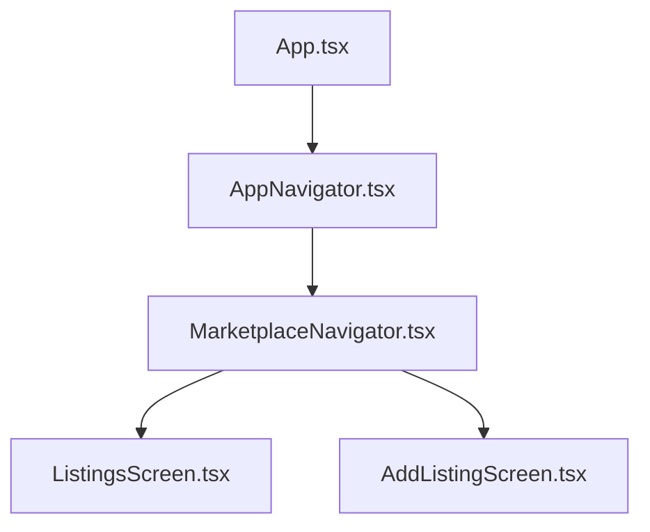
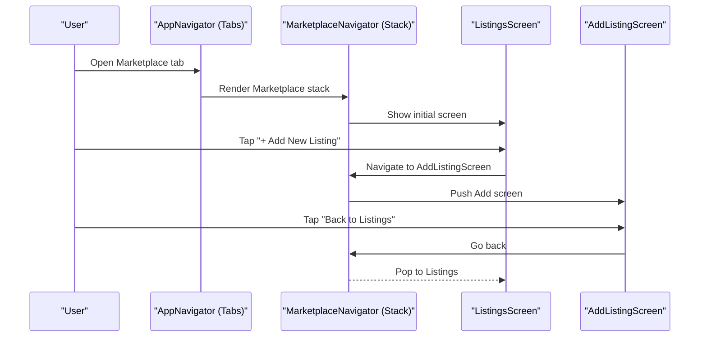
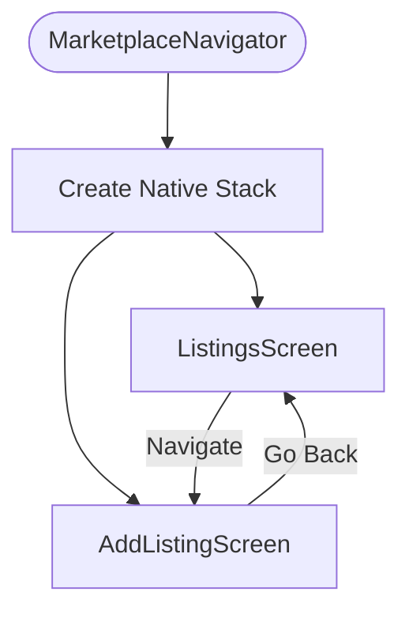
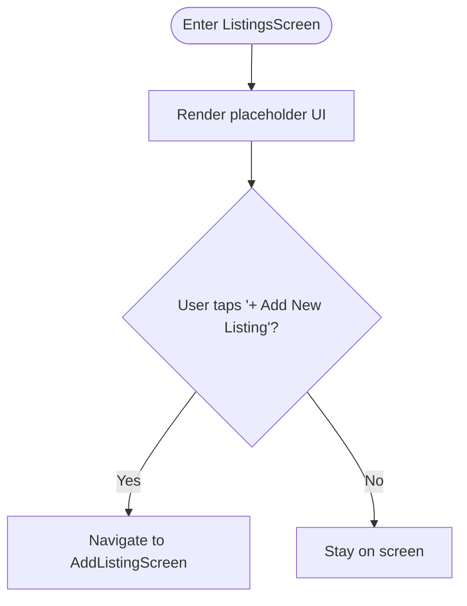
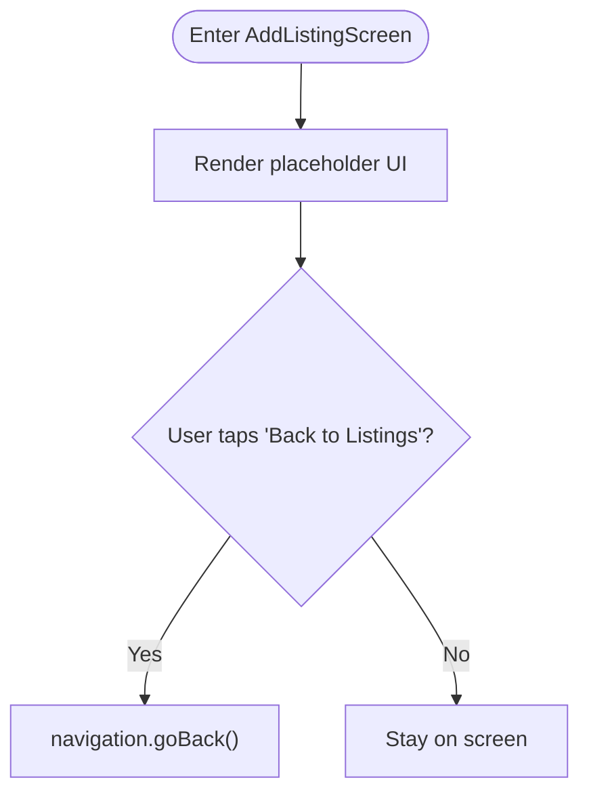
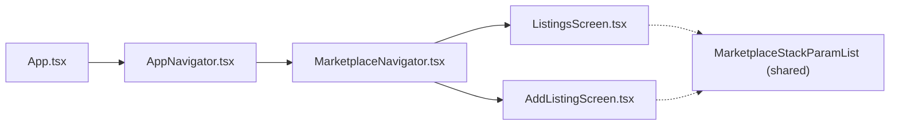

# Marketplace Feature

<cite>
**Referenced Files in This Document**
- [App.tsx](file://frontend/App.tsx)
- [AppNavigator.tsx](file://frontend/navigation/AppNavigator.tsx)
- [MarketplaceNavigator.tsx](file://frontend/navigation/MarketplaceNavigator.tsx)
- [ListingsScreen.tsx](file://frontend/screens/ListingsScreen.tsx)
- [AddListingScreen.tsx](file://frontend/screens/AddListingScreen.tsx)
- [services/index.ts](file://frontend/services/index.ts)
- [components/index.ts](file://frontend/components/index.ts)
- [package.json](file://frontend/package.json)
</cite>

## Table of Contents
1. [Introduction](#introduction)
2. [Project Structure](#project-structure)
3. [Core Components](#core-components)
4. [Architecture Overview](#architecture-overview)
5. [Detailed Component Analysis](#detailed-component-analysis)
6. [Dependency Analysis](#dependency-analysis)
7. [Performance Considerations](#performance-considerations)
8. [Troubleshooting Guide](#troubleshooting-guide)
9. [Conclusion](#conclusion)
10. [Appendices](#appendices)

## Introduction
This document describes the Marketplace feature implementation for the KisaanDost AI hackathon project. It focuses on the current placeholder screens for browsing listings and adding new listings, the nested stack navigation that powers the marketplace flow, and the intended functionality for agricultural marketplace operations (crop listings, livestock trading, farming supplies). It also outlines future integration points for backend APIs, database connectivity, real-time updates, and guidance to extend the placeholders into a fully functional marketplace.

## Project Structure
The Marketplace feature is implemented as a tab within the app’s root navigator and uses a nested native stack to manage its internal screens:
- Root entry wraps the app with NavigationContainer and renders AppNavigator.
- AppNavigator defines a bottom tab with VoiceAssistant and Marketplace tabs.
- MarketplaceNavigator defines a native stack with ListingsScreen and AddListingScreen.
- ListingsScreen and AddListingScreen are currently placeholder UIs with navigation hooks ready for future logic.

**Diagram sources**
- [App.tsx:1-14](file://frontend/App.tsx#L1-L14)
- [AppNavigator.tsx:1-67](file://frontend/navigation/AppNavigator.tsx#L1-L67)
- [MarketplaceNavigator.tsx:1-31](file://frontend/navigation/MarketplaceNavigator.tsx#L1-L31)
- [ListingsScreen.tsx:1-64](file://frontend/screens/ListingsScreen.tsx#L1-L64)
- [AddListingScreen.tsx:1-44](file://frontend/screens/AddListingScreen.tsx#L1-L44)

**Section sources**
- [App.tsx:1-14](file://frontend/App.tsx#L1-L14)
- [AppNavigator.tsx:1-67](file://frontend/navigation/AppNavigator.tsx#L1-L67)
- [MarketplaceNavigator.tsx:1-31](file://frontend/navigation/MarketplaceNavigator.tsx#L1-L31)

## Core Components
- MarketplaceNavigator: Configures a native stack with two screens under the Marketplace tab. It sets header styling and titles for both screens.
- ListingsScreen: Placeholder screen indicating upcoming marketplace content and providing a button to navigate to AddListingScreen.
- AddListingScreen: Placeholder screen indicating an upcoming form to post listings and a back button to return to ListingsScreen.
- AppNavigator: Integrates MarketplaceNavigator into the root tab structure alongside VoiceAssistant.

Key responsibilities:
- Navigation orchestration via React Navigation stacks and tabs.
- Type-safe route definitions using a shared param list type.
- Placeholder UI with clear messaging for “coming soon” features.

**Section sources**
- [MarketplaceNavigator.tsx:1-31](file://frontend/navigation/MarketplaceNavigator.tsx#L1-L31)
- [ListingsScreen.tsx:1-64](file://frontend/screens/ListingsScreen.tsx#L1-L64)
- [AddListingScreen.tsx:1-44](file://frontend/screens/AddListingScreen.tsx#L1-L44)
- [AppNavigator.tsx:1-67](file://frontend/navigation/AppNavigator.tsx#L1-L67)

## Architecture Overview
The Marketplace feature uses a nested navigation pattern:
- Root-level bottom tab navigator hosts Marketplace as one of the tabs.
- Inside the Marketplace tab, a native stack navigator manages ListingsScreen and AddListingScreen.
- The param list type is defined in ListingsScreen and consumed by both the navigator and AddListingScreen for type safety.

**Diagram sources**
- [AppNavigator.tsx:14-59](file://frontend/navigation/AppNavigator.tsx#L14-L59)
- [MarketplaceNavigator.tsx:9-29](file://frontend/navigation/MarketplaceNavigator.tsx#L9-L29)
- [ListingsScreen.tsx:12-28](file://frontend/screens/ListingsScreen.tsx#L12-L28)
- [AddListingScreen.tsx:8-19](file://frontend/screens/AddListingScreen.tsx#L8-L19)

## Detailed Component Analysis

### MarketplaceNavigator
- Purpose: Defines the marketplace’s internal navigation stack and applies consistent header styling.
- Screens:
  - ListingsScreen: Title “Marketplace”.
  - AddListingScreen: Title “Add Listing”.
- Configuration: Uses createNativeStackNavigator with a typed parameter list imported from ListingsScreen.

**Diagram sources**
- [MarketplaceNavigator.tsx:1-31](file://frontend/navigation/MarketplaceNavigator.tsx#L1-L31)

**Section sources**
- [MarketplaceNavigator.tsx:1-31](file://frontend/navigation/MarketplaceNavigator.tsx#L1-L31)

### ListingsScreen
- Purpose: Placeholder listing page for browsing crops, livestock, and farming supplies.
- Behavior: Displays title and subtitle indicating upcoming functionality; provides a button to navigate to AddListingScreen.
- Types: Exports MarketplaceStackParamList used by the navigator and other screens for type safety.

**Diagram sources**
- [ListingsScreen.tsx:1-64](file://frontend/screens/ListingsScreen.tsx#L1-L64)

**Section sources**
- [ListingsScreen.tsx:1-64](file://frontend/screens/ListingsScreen.tsx#L1-L64)

### AddListingScreen
- Purpose: Placeholder add-listing page where users will eventually post crop, livestock, or supply listings.
- Behavior: Shows title and subtitle indicating an upcoming form; includes a back button to return to ListingsScreen.
- Types: Imports MarketplaceStackParamList from ListingsScreen for type safety.

**Diagram sources**
- [AddListingScreen.tsx:1-44](file://frontend/screens/AddListingScreen.tsx#L1-L44)

**Section sources**
- [AddListingScreen.tsx:1-44](file://frontend/screens/AddListingScreen.tsx#L1-L44)

### Integration Points and Future Enhancements
- Backend API integration:
  - Use services/index.ts to implement REST/GraphQL calls for fetching and posting listings.
  - Introduce data models for listings (e.g., category, title, description, price, images, location, seller info).
- Database connectivity:
  - Persist listings and user data via a backend service or local storage during development.
  - Implement caching strategies for improved performance.
- Real-time marketplace updates:
  - Consider WebSocket or server-sent events to push new listings, price changes, or status updates.
- Planned features:
  - Crop listings: Category filters, search, image upload, pricing, harvest dates.
  - Livestock trading: Health records, age, breed, location, negotiation tools.
  - Farming supplies marketplace: Vendor profiles, inventory, shipping options.
- Extending the current placeholders:
  - Replace placeholder text with dynamic lists fetched from services.
  - Add form fields in AddListingScreen to capture listing details and submit via API.
  - Add error handling, loading states, and empty states for robust UX.
  - Integrate authentication to associate listings with sellers.

[No sources needed since this section provides general guidance]

## Dependency Analysis
The Marketplace feature depends on React Navigation primitives and Expo-based dependencies. The following diagram shows the runtime dependency relationships among the core files:

**Diagram sources**
- [App.tsx:1-14](file://frontend/App.tsx#L1-L14)
- [AppNavigator.tsx:1-67](file://frontend/navigation/AppNavigator.tsx#L1-L67)
- [MarketplaceNavigator.tsx:1-31](file://frontend/navigation/MarketplaceNavigator.tsx#L1-L31)
- [ListingsScreen.tsx:1-64](file://frontend/screens/ListingsScreen.tsx#L1-L64)
- [AddListingScreen.tsx:1-44](file://frontend/screens/AddListingScreen.tsx#L1-L44)

**Section sources**
- [package.json:1-29](file://frontend/package.json#L1-L29)

## Performance Considerations
- Keep placeholder screens lightweight; avoid heavy computations until real data is integrated.
- When implementing data fetching, use pagination and lazy loading for large listing sets.
- Cache responses locally to reduce network requests and improve perceived performance.
- Debounce search inputs and filter operations when scaling to larger datasets.
- Optimize images with compression and lazy loading to reduce memory usage.

[No sources needed since this section provides general guidance]

## Troubleshooting Guide
- Navigation issues:
  - Ensure MarketplaceStackParamList is correctly exported and imported across screens and navigators.
  - Verify that route names match exactly between navigator configuration and navigation calls.
- Header and tab behavior:
  - Confirm that the Marketplace tab hides its own header so the stack header can be shown inside the stack.
- Placeholder state:
  - If adding real functionality, handle loading and error states to prevent blank or broken UIs.
- Services and APIs:
  - Validate environment variables and endpoints before integrating backend services.
  - Wrap API calls with try/catch and surface user-friendly errors.

**Section sources**
- [AppNavigator.tsx:46-58](file://frontend/navigation/AppNavigator.tsx#L46-L58)
- [MarketplaceNavigator.tsx:11-27](file://frontend/navigation/MarketplaceNavigator.tsx#L11-L27)
- [ListingsScreen.tsx:21-26](file://frontend/screens/ListingsScreen.tsx#L21-L26)
- [AddListingScreen.tsx:17-18](file://frontend/screens/AddListingScreen.tsx#L17-L18)

## Conclusion
The Marketplace feature currently provides a navigable foundation with placeholder screens for listings and adding new listings. The nested stack navigation is properly configured and type-safe. Future work should focus on implementing data flows, backend integrations, real-time updates, and rich marketplace features such as crop listings, livestock trading, and farming supplies. The existing structure supports these enhancements cleanly and can be extended incrementally without disrupting the navigation experience.

[No sources needed since this section summarizes without analyzing specific files]

## Appendices

### Route Definitions Summary
- Root tab: Marketplace
- Marketplace stack:
  - ListingsScreen
  - AddListingScreen

**Section sources**
- [AppNavigator.tsx:7-10](file://frontend/navigation/AppNavigator.tsx#L7-L10)
- [AppNavigator.tsx:33-58](file://frontend/navigation/AppNavigator.tsx#L33-L58)
- [MarketplaceNavigator.tsx:18-27](file://frontend/navigation/MarketplaceNavigator.tsx#L18-L27)
- [ListingsScreen.tsx:5-8](file://frontend/screens/ListingsScreen.tsx#L5-L8)