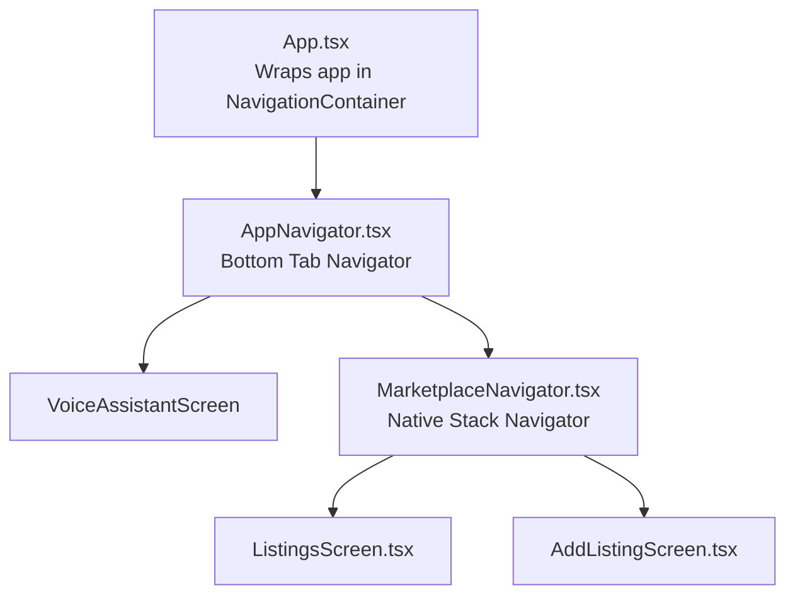
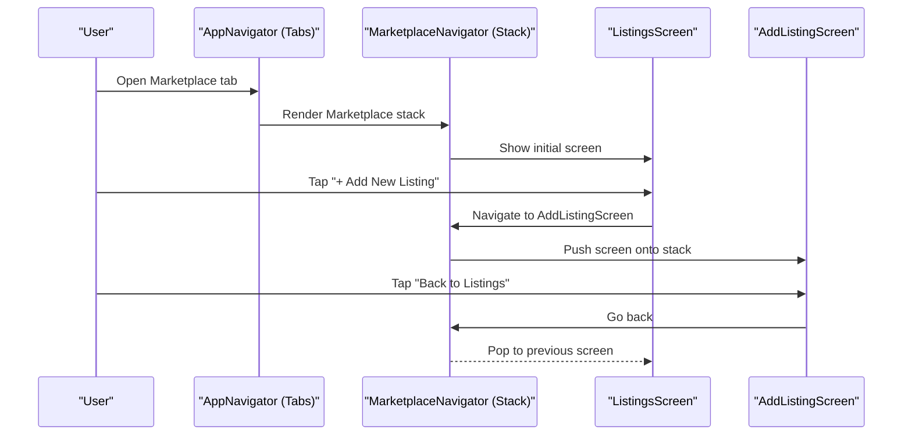
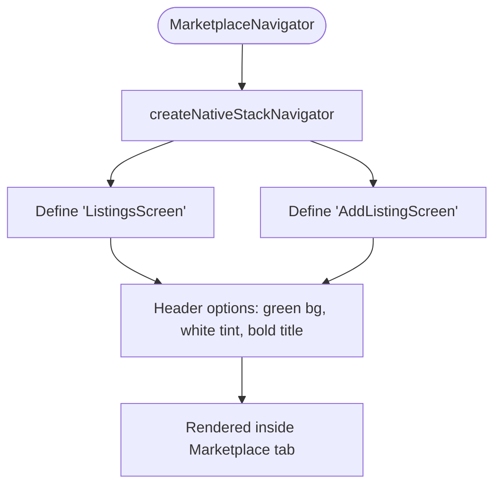
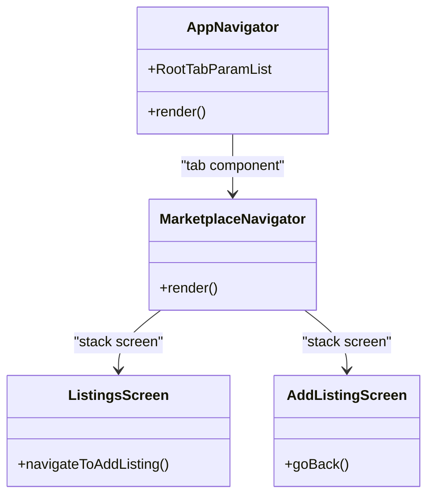
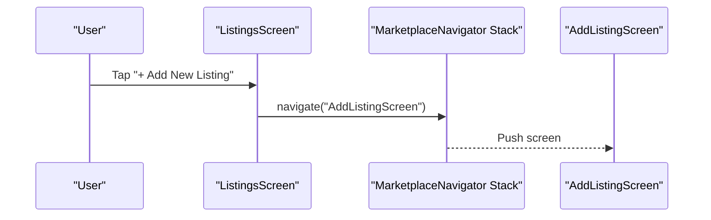
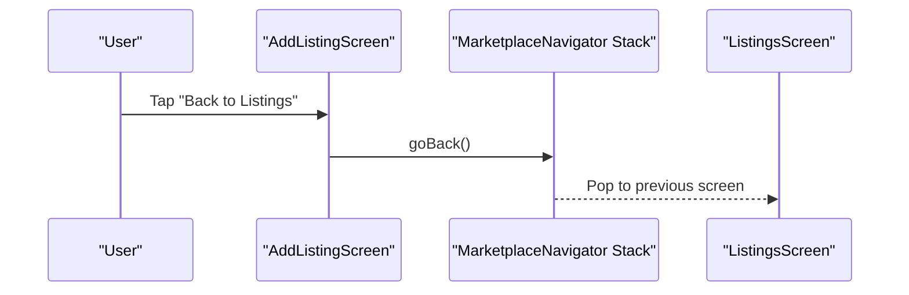
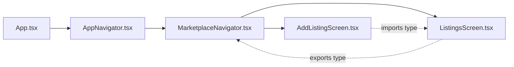

# Marketplace Navigation

<cite>
**Referenced Files in This Document**
- [App.tsx](file://frontend/App.tsx)
- [AppNavigator.tsx](file://frontend/navigation/AppNavigator.tsx)
- [MarketplaceNavigator.tsx](file://frontend/navigation/MarketplaceNavigator.tsx)
- [ListingsScreen.tsx](file://frontend/screens/ListingsScreen.tsx)
- [AddListingScreen.tsx](file://frontend/screens/AddListingScreen.tsx)
</cite>

## Table of Contents
1. [Introduction](#introduction)
2. [Project Structure](#project-structure)
3. [Core Components](#core-components)
4. [Architecture Overview](#architecture-overview)
5. [Detailed Component Analysis](#detailed-component-analysis)
6. [Dependency Analysis](#dependency-analysis)
7. [Performance Considerations](#performance-considerations)
8. [Troubleshooting Guide](#troubleshooting-guide)
9. [Conclusion](#conclusion)
10. [Appendices](#appendices)

## Introduction
This document explains the marketplace navigation setup, focusing on how the nested stack navigator is configured within the marketplace section and how it integrates with the main tab-based app navigator. It covers route definitions for ListingsScreen and AddListingScreen, parameter passing patterns, screen configurations, TypeScript types for navigation parameters, and best practices for deep linking and state management. It also outlines future enhancements such as search results, listing details, and category filtering screens.

## Project Structure
The marketplace navigation is implemented using React Navigation with a bottom tab navigator at the root level and a native stack navigator inside the marketplace tab. The key files are:
- App entrypoint that wraps the app in NavigationContainer
- Root tab navigator defining tabs including Marketplace
- Marketplace stack navigator defining listings and add listing routes
- Screen components for listings and adding a listing

**Diagram sources**
- [App.tsx:6-11](file://frontend/App.tsx#L6-L11)
- [AppNavigator.tsx:14-59](file://frontend/navigation/AppNavigator.tsx#L14-L59)
- [MarketplaceNavigator.tsx:9-29](file://frontend/navigation/MarketplaceNavigator.tsx#L9-L29)
- [ListingsScreen.tsx:12-28](file://frontend/screens/ListingsScreen.tsx#L12-L28)
- [AddListingScreen.tsx:8-19](file://frontend/screens/AddListingScreen.tsx#L8-L19)

**Section sources**
- [App.tsx:6-11](file://frontend/App.tsx#L6-L11)
- [AppNavigator.tsx:14-59](file://frontend/navigation/AppNavigator.tsx#L14-L59)
- [MarketplaceNavigator.tsx:9-29](file://frontend/navigation/MarketplaceNavigator.tsx#L9-L29)

## Core Components
- Root Tab Navigator (AppNavigator): Defines two tabs—Voice Assistant and Marketplace. The Marketplace tab hides its own header to let the stack navigator’s header take over.
- Marketplace Stack Navigator (MarketplaceNavigator): Creates a native stack with two screens: ListingsScreen and AddListingScreen. Configures a consistent green header theme across marketplace screens.
- ListingsScreen: Displays marketplace listings placeholder content and navigates to AddListingScreen via a button press.
- AddListingScreen: Placeholder for creating new listings and provides a back action to return to ListingsScreen.

Key configuration highlights:
- Header styling in both tab and stack navigators uses a green background, white tint color, and bold titles for consistency.
- Tab-level header is hidden for Marketplace so the stack header is visible.

**Section sources**
- [AppNavigator.tsx:14-59](file://frontend/navigation/AppNavigator.tsx#L14-L59)
- [MarketplaceNavigator.tsx:9-29](file://frontend/navigation/MarketplaceNavigator.tsx#L9-L29)
- [ListingsScreen.tsx:12-28](file://frontend/screens/ListingsScreen.tsx#L12-L28)
- [AddListingScreen.tsx:8-19](file://frontend/screens/AddListingScreen.tsx#L8-L19)

## Architecture Overview
The navigation architecture follows a layered approach:
- Application root uses NavigationContainer to enable navigation context.
- Bottom tabs organize top-level features; Marketplace is one tab.
- Inside Marketplace, a native stack manages screen transitions for listings and adding listings.

**Diagram sources**
- [AppNavigator.tsx:14-59](file://frontend/navigation/AppNavigator.tsx#L14-L59)
- [MarketplaceNavigator.tsx:9-29](file://frontend/navigation/MarketplaceNavigator.tsx#L9-L29)
- [ListingsScreen.tsx:21-26](file://frontend/screens/ListingsScreen.tsx#L21-L26)
- [AddListingScreen.tsx:17-18](file://frontend/screens/AddListingScreen.tsx#L17-L18)

## Detailed Component Analysis

### Marketplace Stack Navigator
- Route definitions:
  - ListingsScreen: Initial screen for browsing marketplace items.
  - AddListingScreen: Screen for creating new listings.
- Screen options:
  - Custom header style with green background, white text, and bold title.
  - Titles set per screen for clarity.
- Integration:
  - Mounted under the Marketplace tab in the root tab navigator.

**Diagram sources**
- [MarketplaceNavigator.tsx:7-29](file://frontend/navigation/MarketplaceNavigator.tsx#L7-L29)

**Section sources**
- [MarketplaceNavigator.tsx:7-29](file://frontend/navigation/MarketplaceNavigator.tsx#L7-L29)

### Root Tab Navigator and Marketplace Integration
- Tabs:
  - VoiceAssistant: Renders VoiceAssistantScreen with a visible header.
  - Marketplace: Renders MarketplaceNavigator with header hidden at the tab level so the stack header is used instead.
- Styling:
  - Active/inactive tab colors and label styles defined.
  - Global header style applied for consistency.

**Diagram sources**
- [AppNavigator.tsx:7-59](file://frontend/navigation/AppNavigator.tsx#L7-L59)
- [MarketplaceNavigator.tsx:9-29](file://frontend/navigation/MarketplaceNavigator.tsx#L9-L29)
- [ListingsScreen.tsx:12-28](file://frontend/screens/ListingsScreen.tsx#L12-L28)
- [AddListingScreen.tsx:8-19](file://frontend/screens/AddListingScreen.tsx#L8-L19)

**Section sources**
- [AppNavigator.tsx:7-59](file://frontend/navigation/AppNavigator.tsx#L7-L59)

### ListingsScreen
- Purpose: Entry point for marketplace browsing.
- Navigation: Navigates to AddListingScreen when user taps the “Add New Listing” button.
- Types: Uses NativeStackScreenProps typed against MarketplaceStackParamList.

**Diagram sources**
- [ListingsScreen.tsx:21-26](file://frontend/screens/ListingsScreen.tsx#L21-L26)
- [MarketplaceNavigator.tsx:18-27](file://frontend/navigation/MarketplaceNavigator.tsx#L18-L27)

**Section sources**
- [ListingsScreen.tsx:12-28](file://frontend/screens/ListingsScreen.tsx#L12-L28)

### AddListingScreen
- Purpose: Placeholder for creating new listings.
- Navigation: Provides a back action to return to ListingsScreen.
- Types: Uses NativeStackScreenProps typed against MarketplaceStackParamList.

**Diagram sources**
- [AddListingScreen.tsx:17-18](file://frontend/screens/AddListingScreen.tsx#L17-L18)
- [MarketplaceNavigator.tsx:18-27](file://frontend/navigation/MarketplaceNavigator.tsx#L18-L27)

**Section sources**
- [AddListingScreen.tsx:8-19](file://frontend/screens/AddListingScreen.tsx#L8-L19)

## Dependency Analysis
- App.tsx depends on AppNavigator to render the navigation tree.
- AppNavigator depends on MarketplaceNavigator and VoiceAssistantScreen.
- MarketplaceNavigator depends on ListingsScreen and AddListingScreen.
- ListingsScreen imports MarketplaceStackParamList from itself to type the stack.
- AddListingScreen imports MarketplaceStackParamList from ListingsScreen to maintain type safety.

**Diagram sources**
- [App.tsx:6-11](file://frontend/App.tsx#L6-L11)
- [AppNavigator.tsx:1-12](file://frontend/navigation/AppNavigator.tsx#L1-L12)
- [MarketplaceNavigator.tsx:1-8](file://frontend/navigation/MarketplaceNavigator.tsx#L1-L8)
- [ListingsScreen.tsx:5-10](file://frontend/screens/ListingsScreen.tsx#L5-L10)
- [AddListingScreen.tsx:4-6](file://frontend/screens/AddListingScreen.tsx#L4-L6)

**Section sources**
- [App.tsx:6-11](file://frontend/App.tsx#L6-L11)
- [AppNavigator.tsx:1-12](file://frontend/navigation/AppNavigator.tsx#L1-L12)
- [MarketplaceNavigator.tsx:1-8](file://frontend/navigation/MarketplaceNavigator.tsx#L1-L8)
- [ListingsScreen.tsx:5-10](file://frontend/screens/ListingsScreen.tsx#L5-L10)
- [AddListingScreen.tsx:4-6](file://frontend/screens/AddListingScreen.tsx#L4-L6)

## Performance Considerations
- Use createNativeStackNavigator for better performance on iOS and Android compared to JS-based stacks.
- Keep headers minimal and avoid heavy components in header to reduce re-renders.
- Lazy-load screens if the marketplace grows significantly to improve startup time.
- Avoid unnecessary state updates in screens during navigation transitions.

[No sources needed since this section provides general guidance]

## Troubleshooting Guide
- Header visibility issue: If the Marketplace tab shows a duplicate header, ensure headerShown is false at the tab level so the stack header is used.
- Type errors when navigating: Ensure MarketplaceStackParamList includes all route names used in navigation calls.
- Back navigation not working: Verify that screens use goBack or that the stack has more than one screen before attempting to go back.

**Section sources**
- [AppNavigator.tsx:46-58](file://frontend/navigation/AppNavigator.tsx#L46-L58)
- [MarketplaceNavigator.tsx:18-27](file://frontend/navigation/MarketplaceNavigator.tsx#L18-L27)
- [AddListingScreen.tsx:17-18](file://frontend/screens/AddListingScreen.tsx#L17-L18)

## Conclusion
The marketplace navigation is structured with a root tab navigator and a nested native stack for marketplace-specific flows. ListingsScreen and AddListingScreen are properly typed and integrated into the stack. The current implementation supports basic navigation between these screens. Future enhancements can build upon this foundation by adding additional screens and robust parameter handling.

[No sources needed since this section summarizes without analyzing specific files]

## Appendices

### TypeScript Types for Navigation Parameters and Routes
- Root tab parameters:
  - VoiceAssistant: undefined
  - Marketplace: undefined
- Marketplace stack parameters:
  - ListingsScreen: undefined
  - AddListingScreen: undefined

These types ensure compile-time safety for navigation calls and props.

**Section sources**
- [AppNavigator.tsx:7-10](file://frontend/navigation/AppNavigator.tsx#L7-L10)
- [ListingsScreen.tsx:5-10](file://frontend/screens/ListingsScreen.tsx#L5-L10)

### Best Practices for Marketplace-Specific Navigation Patterns
- Centralize route names and types in a single place to avoid drift.
- Use stack headers for contextual titles and actions within the marketplace.
- Keep tab-level headers hidden for feature tabs that manage their own headers.
- Prefer explicit navigation methods (navigate, goBack) with typed params to prevent runtime errors.

[No sources needed since this section provides general guidance]

### Deep Linking Support
- To enable deep linking for marketplace routes, configure linking in NavigationContainer with prefixes matching your routes.
- Define route names consistently with stack/screen names to map URLs to screens.
- Test deep links for each marketplace route to ensure correct navigation behavior.

[No sources needed since this section provides general guidance]

### Navigation State Management
- For simple flows, rely on React Navigation’s built-in state.
- For complex marketplace state (e.g., filters, search), consider lifting state to a provider or using a state management library.
- Persist critical navigation state (like active tab) if needed using persistence strategies provided by React Navigation.

[No sources needed since this section provides general guidance]

### Future Enhancements
- Search Results Screen: Add a search screen to the marketplace stack with query parameters passed from ListingsScreen.
- Listing Details Screen: Introduce a detail screen with an id parameter to display full listing information.
- Category Filtering: Add a filter screen or modal to refine listings by category, storing filter state in a provider or local storage.
- Deep Links: Map URLs like /marketplace/listings/:id to corresponding screens for seamless sharing and retrieval.

[No sources needed since this section provides general guidance]