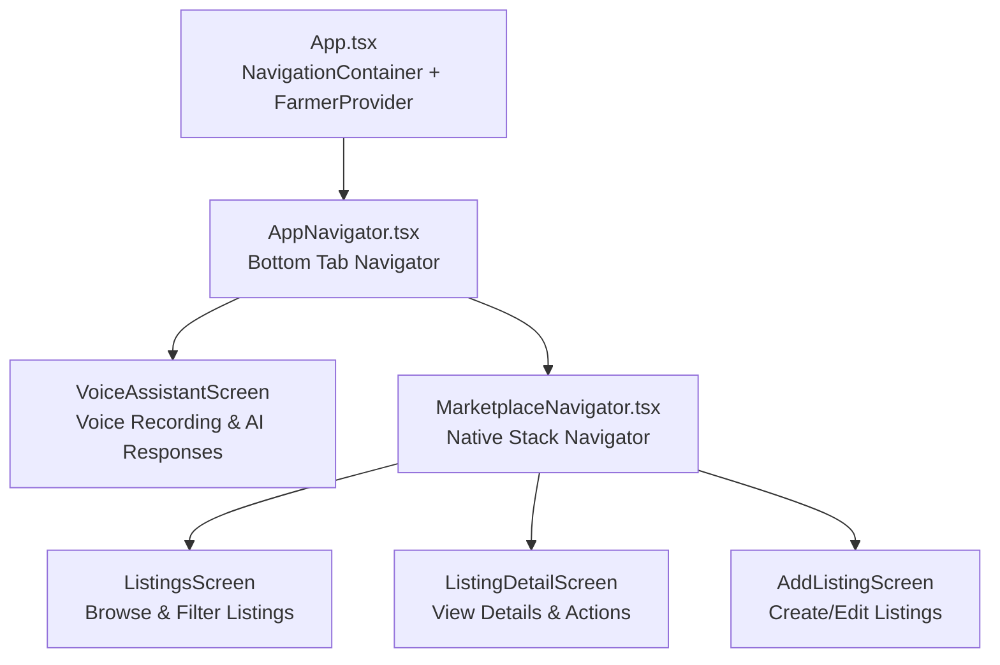
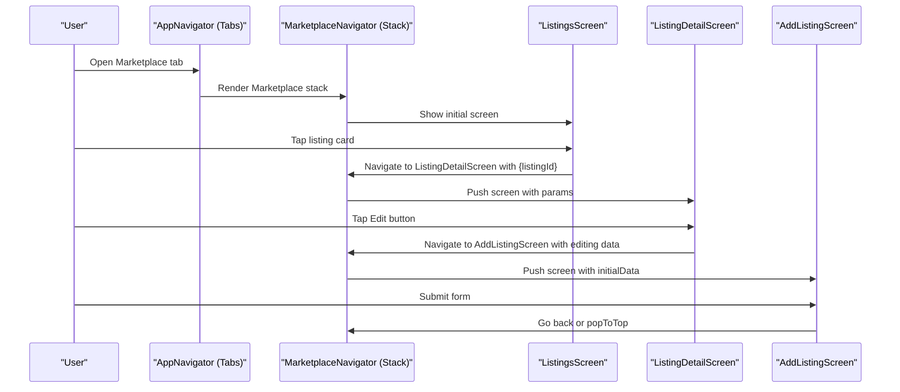
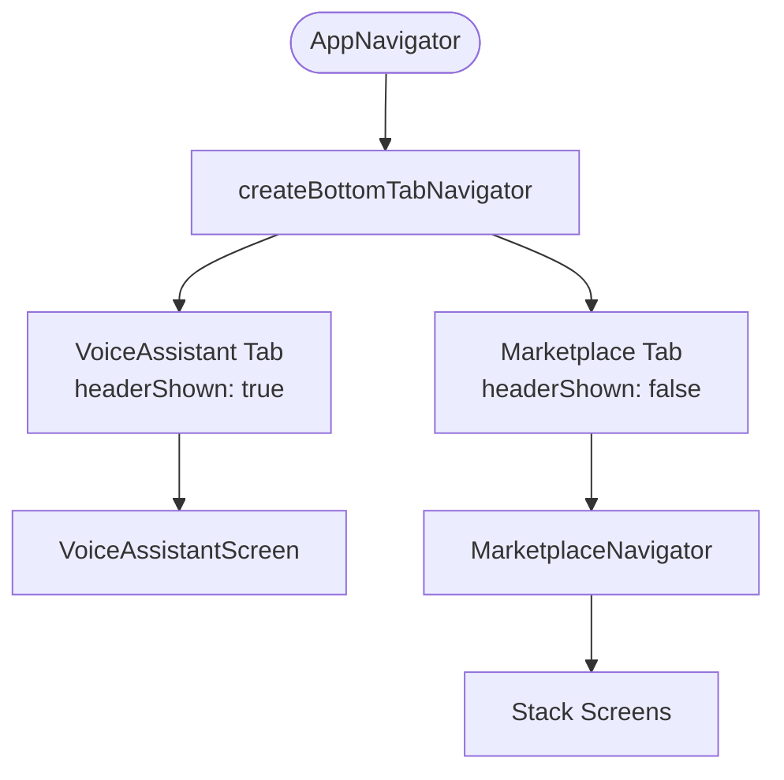
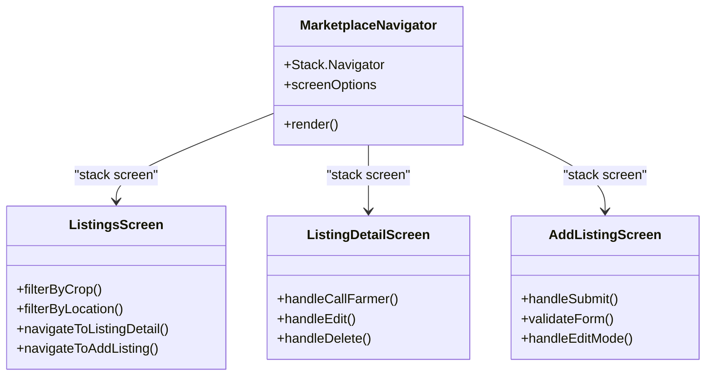
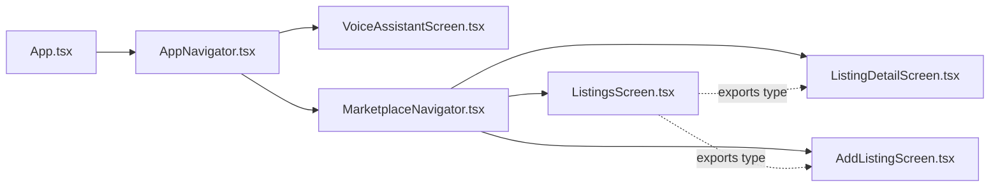

# Marketplace Navigation

<cite>
**Referenced Files in This Document**
- [App.tsx](file://frontend/App.tsx)
- [AppNavigator.tsx](file://frontend/navigation/AppNavigator.tsx)
- [MarketplaceNavigator.tsx](file://frontend/navigation/MarketplaceNavigator.tsx)
- [ListingsScreen.tsx](file://frontend/screens/ListingsScreen.tsx)
- [AddListingScreen.tsx](file://frontend/screens/AddListingScreen.tsx)
- [ListingDetailScreen.tsx](file://frontend/screens/ListingDetailScreen.tsx)
- [VoiceAssistantScreen.tsx](file://frontend/screens/VoiceAssistantScreen.tsx)
</cite>

## Update Summary
**Changes Made**
- Updated bottom tab navigation structure with Voice Assistant and Marketplace tabs
- Enhanced marketplace stack navigation with three screens including listing details
- Added comprehensive parameter passing for deep linking support
- Integrated fully functional VoiceAssistantScreen as a primary tab
- Updated TypeScript types for navigation parameters across all screens

## Table of Contents
1. [Introduction](#introduction)
2. [Project Structure](#project-structure)
3. [Core Components](#core-components)
4. [Architecture Overview](#architecture-overview)
5. [Detailed Component Analysis](#detailed-component-analysis)
6. [Dependency Analysis](#dependency-analysis)
7. [Performance Considerations](#performance-considerations)
8. [Troubleshooting Guide](#troubleshooting-guide)
9. [Conclusion](#conclusion)
10. [Appendices](#appendices)

## Introduction
This document explains the marketplace navigation setup within a bottom tab-based application architecture. The app features two main tabs: Voice Assistant and Marketplace. The marketplace section contains a nested native stack navigator with three screens for browsing listings, viewing details, and creating new listings. It covers route definitions, parameter passing patterns for deep linking, screen configurations, TypeScript types for navigation parameters, and best practices for navigation state management.

## Project Structure
The navigation architecture implements a bottom tab navigator at the root level with two primary tabs, where the Marketplace tab contains a nested native stack navigator for marketplace-specific flows. The key files are:
- App entrypoint that wraps the app in NavigationContainer with FarmerProvider context
- Root tab navigator defining Voice Assistant and Marketplace tabs
- Marketplace stack navigator defining listings, listing details, and add listing routes
- Fully functional VoiceAssistantScreen with audio recording and playback capabilities
- Screen components for marketplace operations with proper parameter handling

**Diagram sources**
- [App.tsx:28-36](file://frontend/App.tsx#L28-L36)
- [AppNavigator.tsx:14-60](file://frontend/navigation/AppNavigator.tsx#L14-L60)
- [MarketplaceNavigator.tsx:10-36](file://frontend/navigation/MarketplaceNavigator.tsx#L10-L36)
- [VoiceAssistantScreen.tsx:19-199](file://frontend/screens/VoiceAssistantScreen.tsx#L19-L199)
- [ListingsScreen.tsx:52-243](file://frontend/screens/ListingsScreen.tsx#L52-L243)
- [ListingDetailScreen.tsx:38-196](file://frontend/screens/ListingDetailScreen.tsx#L38-L196)
- [AddListingScreen.tsx:35-244](file://frontend/screens/AddListingScreen.tsx#L35-L244)

**Section sources**
- [App.tsx:28-36](file://frontend/App.tsx#L28-L36)
- [AppNavigator.tsx:14-60](file://frontend/navigation/AppNavigator.tsx#L14-L60)
- [MarketplaceNavigator.tsx:10-36](file://frontend/navigation/MarketplaceNavigator.tsx#L10-L36)

## Core Components
- **Root Tab Navigator (AppNavigator)**: Defines two tabs—Voice Assistant and Marketplace—with custom styling, icons, and header configurations. The Marketplace tab hides its tab-level header to allow the stack navigator's header to take over.
- **VoiceAssistantScreen**: Fully functional voice interaction screen with audio recording, AI response processing, text-to-speech playback, and multiple state handling (idle, sending, error, response).
- **Marketplace Stack Navigator (MarketplaceNavigator)**: Creates a native stack with three screens: ListingsScreen, ListingDetailScreen, and AddListingScreen. Configures consistent green header theme across marketplace screens.
- **ListingsScreen**: Displays marketplace listings with filtering by crop type and location, supports deletion, and navigates to detail and add screens with proper parameter passing.
- **ListingDetailScreen**: Shows detailed listing information with call functionality, edit/delete actions, and relative date formatting.
- **AddListingScreen**: Comprehensive form for creating/editing listings with validation, error handling, and support for editing existing listings through parameter passing.

Key configuration highlights:
- Bottom tab styling with green active colors (#2e7d32), custom tab bar height (60px), and font sizing
- Consistent header styling across all screens with green background, white tint color, and bold titles
- Parameter passing between screens for deep linking support (listingId, editing data, etc.)

**Section sources**
- [AppNavigator.tsx:14-60](file://frontend/navigation/AppNavigator.tsx#L14-L60)
- [VoiceAssistantScreen.tsx:19-199](file://frontend/screens/VoiceAssistantScreen.tsx#L19-L199)
- [MarketplaceNavigator.tsx:10-36](file://frontend/navigation/MarketplaceNavigator.tsx#L10-L36)
- [ListingsScreen.tsx:52-243](file://frontend/screens/ListingsScreen.tsx#L52-L243)
- [ListingDetailScreen.tsx:38-196](file://frontend/screens/ListingDetailScreen.tsx#L38-L196)
- [AddListingScreen.tsx:35-244](file://frontend/screens/AddListingScreen.tsx#L35-L244)

## Architecture Overview
The navigation architecture follows a layered approach with bottom tabs organizing top-level features and nested stacks managing feature-specific flows:
- Application root uses NavigationContainer with FarmerProvider context for farmer identity management
- Bottom tabs organize Voice Assistant and Marketplace as primary app sections
- Inside Marketplace, a native stack manages screen transitions for browsing, viewing details, and creating listings
- Parameter passing enables deep linking and data flow between screens

**Diagram sources**
- [AppNavigator.tsx:14-60](file://frontend/navigation/AppNavigator.tsx#L14-L60)
- [MarketplaceNavigator.tsx:10-36](file://frontend/navigation/MarketplaceNavigator.tsx#L10-L36)
- [ListingsScreen.tsx:123-126](file://frontend/screens/ListingsScreen.tsx#L123-L126)
- [ListingDetailScreen.tsx:72-84](file://frontend/screens/ListingDetailScreen.tsx#L72-L84)
- [AddListingScreen.tsx:116-118](file://frontend/screens/AddListingScreen.tsx#L116-L118)

## Detailed Component Analysis

### Root Tab Navigator Configuration
The root tab navigator provides the main navigation structure with two primary tabs:

- **VoiceAssistant Tab**: Renders the VoiceAssistantScreen with visible header, custom microphone icon, and full-screen voice interaction interface
- **Marketplace Tab**: Renders the MarketplaceNavigator with hidden tab-level header to allow stack headers to take precedence

**Updated** Enhanced tab configuration with custom styling, icons, and proper header management for each tab type.

**Diagram sources**
- [AppNavigator.tsx:12-60](file://frontend/navigation/AppNavigator.tsx#L12-L60)

**Section sources**
- [AppNavigator.tsx:12-60](file://frontend/navigation/AppNavigator.tsx#L12-L60)

### VoiceAssistantScreen Implementation
The VoiceAssistantScreen provides a complete voice interaction experience:

- **Audio Recording**: Integrates with VoiceRecorder component for capturing user queries
- **AI Processing**: Sends recorded audio to backend API and processes responses
- **Text-to-Speech**: Converts AI responses to audio using expo-audio for playback
- **State Management**: Handles idle, sending, error, unrecognized language, and success states
- **Farmer Context**: Uses FarmerContext for farmer identification in API calls

Key features include responsive UI with loading indicators, error handling, replay functionality, and clean state reset capabilities.

**Section sources**
- [VoiceAssistantScreen.tsx:19-199](file://frontend/screens/VoiceAssistantScreen.tsx#L19-L199)

### Marketplace Stack Navigator
The marketplace stack navigator manages three core screens with consistent styling:

- **Route Definitions**:
  - ListingsScreen: Initial screen for browsing marketplace items with filtering
  - ListingDetailScreen: Detailed view of individual listings with actions
  - AddListingScreen: Form for creating new listings or editing existing ones
- **Screen Options**: Custom header style with green background, white text, and bold titles
- **Integration**: Mounted under the Marketplace tab with proper header hierarchy

**Diagram sources**
- [MarketplaceNavigator.tsx:10-36](file://frontend/navigation/MarketplaceNavigator.tsx#L10-L36)
- [ListingsScreen.tsx:52-243](file://frontend/screens/ListingsScreen.tsx#L52-L243)
- [ListingDetailScreen.tsx:38-196](file://frontend/screens/ListingDetailScreen.tsx#L38-L196)
- [AddListingScreen.tsx:35-244](file://frontend/screens/AddListingScreen.tsx#L35-L244)

**Section sources**
- [MarketplaceNavigator.tsx:10-36](file://frontend/navigation/MarketplaceNavigator.tsx#L10-L36)

### ListingsScreen with Advanced Filtering
The ListingsScreen provides comprehensive marketplace browsing capabilities:

- **Filtering System**: Crop type filtering via dropdown picker and location search via text input
- **Data Management**: Fetches listings with filters, handles loading states, and supports pull-to-refresh
- **Interactive Cards**: Each listing card shows crop badge, quantity, price, location, and phone number
- **Actions**: Delete functionality with confirmation dialogs and navigation to detail/add screens
- **Empty States**: Handles no listings scenarios with appropriate messaging based on filter state

Navigation patterns include navigating to ListingDetailScreen with listingId parameter and AddListingScreen for creating new listings.

**Section sources**
- [ListingsScreen.tsx:52-243](file://frontend/screens/ListingsScreen.tsx#L52-L243)

### ListingDetailScreen with Rich Interactions
The ListingDetailScreen offers detailed listing views with multiple action capabilities:

- **Data Display**: Shows complete listing information including crop details, pricing, location, and contact information
- **Relative Dates**: Formats creation dates into human-readable relative time strings
- **Action Buttons**: Call farmer (via system dialer), edit listing, and delete listing with confirmations
- **Error Handling**: Graceful handling of missing or deleted listings with back navigation
- **Edit Flow**: Navigates to AddListingScreen with pre-populated data for editing existing listings

**Section sources**
- [ListingDetailScreen.tsx:38-196](file://frontend/screens/ListingDetailScreen.tsx#L38-L196)

### AddListingScreen with Validation and Edit Mode
The AddListingScreen provides comprehensive form handling for both creating and editing listings:

- **Dual Mode Support**: Handles both new listing creation and editing existing listings through parameter detection
- **Form Validation**: Client-side validation for quantity, price, location, and phone number formats
- **API Integration**: Creates new listings or deletes old ones when editing (creating new entries)
- **Error Handling**: Maps API errors to specific fields and displays user-friendly error messages
- **Keyboard Handling**: Proper keyboard avoidance and focus management for better mobile UX

Parameter passing includes optional editingListingId and initialData for edit mode functionality.

**Section sources**
- [AddListingScreen.tsx:35-244](file://frontend/screens/AddListingScreen.tsx#L35-L244)

## Dependency Analysis
The navigation dependencies follow a clear hierarchical structure:

- **App.tsx** depends on AppNavigator and FarmerProvider for context management
- **AppNavigator** depends on VoiceAssistantScreen and MarketplaceNavigator for tab content
- **MarketplaceNavigator** depends on ListingsScreen, ListingDetailScreen, and AddListingScreen
- **ListingsScreen** exports MarketplaceStackParamList type used by other marketplace screens
- **Other screens** import MarketplaceStackParamList from ListingsScreen for type safety

**Diagram sources**
- [App.tsx:28-36](file://frontend/App.tsx#L28-L36)
- [AppNavigator.tsx:1-12](file://frontend/navigation/AppNavigator.tsx#L1-L12)
- [MarketplaceNavigator.tsx:1-8](file://frontend/navigation/MarketplaceNavigator.tsx#L1-L8)
- [ListingsScreen.tsx:25-39](file://frontend/screens/ListingsScreen.tsx#L25-L39)
- [ListingDetailScreen.tsx:14](file://frontend/screens/ListingDetailScreen.tsx#L14)
- [AddListingScreen.tsx:16](file://frontend/screens/AddListingScreen.tsx#L16)

**Section sources**
- [App.tsx:28-36](file://frontend/App.tsx#L28-L36)
- [AppNavigator.tsx:1-12](file://frontend/navigation/AppNavigator.tsx#L1-L12)
- [MarketplaceNavigator.tsx:1-8](file://frontend/navigation/MarketplaceNavigator.tsx#L1-L8)
- [ListingsScreen.tsx:25-39](file://frontend/screens/ListingsScreen.tsx#L25-L39)

## Performance Considerations
- Use createNativeStackNavigator for optimal performance on iOS and Android platforms
- Implement lazy loading for heavy screens if the marketplace grows significantly
- Optimize image loading for crop icons and any future media assets
- Use React.memo for expensive list items in the listings flatlist
- Implement proper cleanup of audio players and temporary files in VoiceAssistantScreen
- Avoid unnecessary re-renders by using proper dependency arrays in useEffect hooks
- Consider code splitting for large screen components to improve initial load time

## Troubleshooting Guide
- **Header visibility issues**: If Marketplace tab shows duplicate headers, ensure headerShown is false at tab level so stack headers are used
- **Type errors when navigating**: Ensure MarketplaceStackParamList includes all route names and their corresponding parameter types
- **Back navigation not working**: Verify that screens use goBack or that the stack has more than one screen before attempting to go back
- **Voice recording issues**: Check microphone permissions and ensure proper cleanup of audio players in VoiceAssistantScreen
- **Parameter passing errors**: Ensure route.params are properly typed and handle undefined cases gracefully
- **Deep linking failures**: Verify route names match exactly with stack/screen names configured in navigation

**Section sources**
- [AppNavigator.tsx:46-58](file://frontend/navigation/AppNavigator.tsx#L46-L58)
- [MarketplaceNavigator.tsx:19-33](file://frontend/navigation/MarketplaceNavigator.tsx#L19-L33)
- [VoiceAssistantScreen.tsx:29-48](file://frontend/screens/VoiceAssistantScreen.tsx#L29-L48)

## Conclusion
The marketplace navigation is structured with a bottom tab navigator providing access to Voice Assistant and Marketplace features, with the marketplace containing a nested native stack for comprehensive listing management. All screens are properly typed with TypeScript and integrated with proper parameter passing for deep linking support. The VoiceAssistantScreen provides a complete voice interaction experience while the marketplace screens offer robust CRUD operations with filtering and detailed views. The current implementation supports seamless navigation between all screens with proper state management and error handling.

## Appendices

### TypeScript Types for Navigation Parameters and Routes
- **Root tab parameters**:
  - VoiceAssistant: undefined
  - Marketplace: undefined
- **Marketplace stack parameters**:
  - ListingsScreen: undefined
  - ListingDetailScreen: { listingId: string }
  - AddListingScreen: { editingListingId?: string; initialData?: { crop: Crop; quantity: number; price: number; location: string; phone: string } }

These types ensure compile-time safety for navigation calls and props throughout the marketplace navigation flow.

**Section sources**
- [AppNavigator.tsx:7-10](file://frontend/navigation/AppNavigator.tsx#L7-L10)
- [ListingsScreen.tsx:25-39](file://frontend/screens/ListingsScreen.tsx#L25-L39)

### Best Practices for Marketplace-Specific Navigation Patterns
- Centralize route names and types in a single place (MarketplaceStackParamList) to avoid drift
- Use stack headers for contextual titles and actions within the marketplace
- Keep tab-level headers hidden for feature tabs that manage their own headers
- Prefer explicit navigation methods (navigate, goBack, popToTop) with typed params to prevent runtime errors
- Implement proper parameter validation and error handling in all screens
- Use context providers (like FarmerContext) for shared state across navigation flows

### Deep Linking Support
- Configure linking in NavigationContainer with prefixes matching your route structure
- Define route names consistently with stack/screen names to map URLs to screens
- Handle parameter parsing for deep links (e.g., /marketplace/listings/:id)
- Test deep links for each marketplace route to ensure correct navigation behavior
- Implement fallback handling for invalid or missing parameters in deep links

### Navigation State Management
- For simple flows, rely on React Navigation's built-in state management
- For complex marketplace state (filters, search results, selected items), consider lifting state to providers
- Use FarmerContext for farmer identity and authentication state across the app
- Persist critical navigation state (active tab, marketplace filters) using persistence strategies
- Implement proper cleanup of navigation-related resources (audio players, timers, subscriptions)

### Future Enhancements
- **Search Results Screen**: Add a dedicated search screen with advanced query parameters passed from ListingsScreen
- **Category Filtering Modal**: Implement modal-based filtering with persistent filter state across navigation
- **Share Functionality**: Add share buttons to pass listing information to other apps via deep links
- **Offline Support**: Cache listings and navigation state for offline browsing capabilities
- **Analytics Integration**: Track navigation patterns and user interactions for insights
- **Accessibility Improvements**: Add proper accessibility labels and navigation hints for screen readers