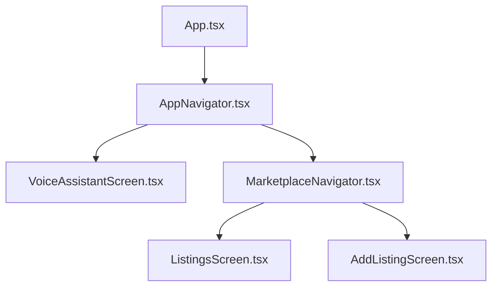
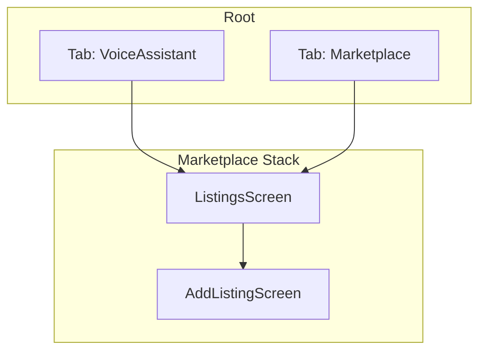
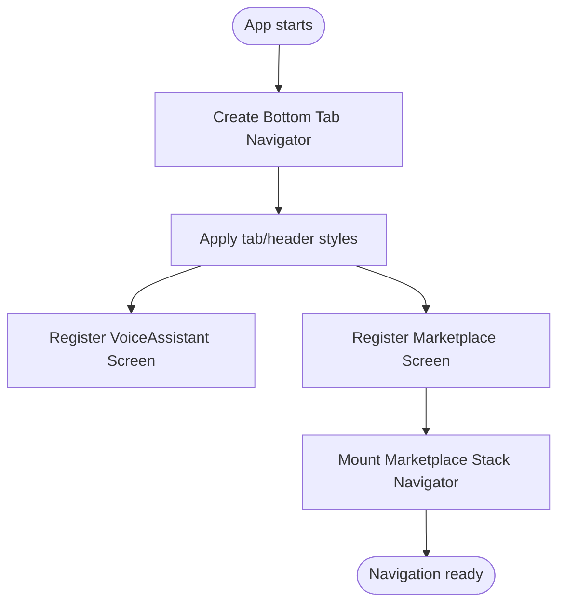
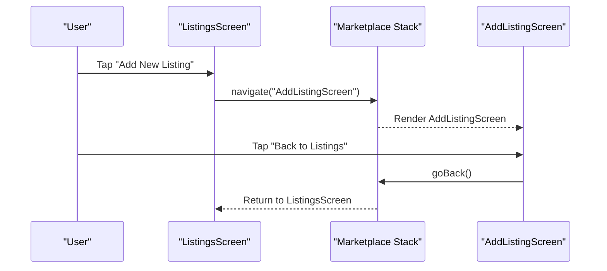
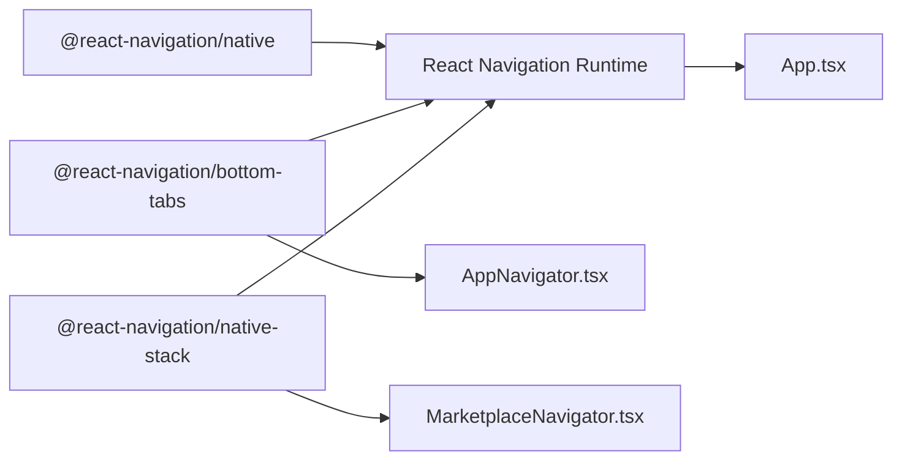

# Navigation System

<cite>
**Referenced Files in This Document**
- [App.tsx](file://frontend/App.tsx)
- [AppNavigator.tsx](file://frontend/navigation/AppNavigator.tsx)
- [MarketplaceNavigator.tsx](file://frontend/navigation/MarketplaceNavigator.tsx)
- [ListingsScreen.tsx](file://frontend/screens/ListingsScreen.tsx)
- [AddListingScreen.tsx](file://frontend/screens/AddListingScreen.tsx)
- [VoiceAssistantScreen.tsx](file://frontend/screens/VoiceAssistantScreen.tsx)
- [package.json](file://frontend/package.json)
</cite>

## Table of Contents
1. [Introduction](#introduction)
2. [Project Structure](#project-structure)
3. [Core Components](#core-components)
4. [Architecture Overview](#architecture-overview)
5. [Detailed Component Analysis](#detailed-component-analysis)
6. [Dependency Analysis](#dependency-analysis)
7. [Performance Considerations](#performance-considerations)
8. [Troubleshooting Guide](#troubleshooting-guide)
9. [Conclusion](#conclusion)
10. [Appendices](#appendices)

## Introduction
This document explains the navigation system implemented with React Navigation for the KisaanDost AI frontend. It covers the bottom tab navigation structure, nested stack navigation within the Marketplace section, navigation flow between tabs and screens, programmatic navigation patterns, route parameters, navigation state management, hooks and utilities available to screen components, best practices, performance optimization, debugging techniques, and guidance for adding new screens and tabs.

## Project Structure
The navigation is organized into dedicated modules:
- App entry wraps the app with a navigation container and mounts the root navigator.
- Root navigator defines two bottom tabs: Voice Assistant and Marketplace.
- Marketplace tab contains a native stack navigator for marketplace-specific screens.
- Screens are colocated under a screens directory and import navigation types from their respective navigators.

**Diagram sources**
- [App.tsx:1-14](file://frontend/App.tsx#L1-L14)
- [AppNavigator.tsx:1-67](file://frontend/navigation/AppNavigator.tsx#L1-L67)
- [MarketplaceNavigator.tsx:1-31](file://frontend/navigation/MarketplaceNavigator.tsx#L1-L31)
- [VoiceAssistantScreen.tsx:1-52](file://frontend/screens/VoiceAssistantScreen.tsx#L1-L52)
- [ListingsScreen.tsx:1-64](file://frontend/screens/ListingsScreen.tsx#L1-L64)
- [AddListingScreen.tsx:1-44](file://frontend/screens/AddListingScreen.tsx#L1-L44)

**Section sources**
- [App.tsx:1-14](file://frontend/App.tsx#L1-L14)
- [AppNavigator.tsx:1-67](file://frontend/navigation/AppNavigator.tsx#L1-L67)
- [MarketplaceNavigator.tsx:1-31](file://frontend/navigation/MarketplaceNavigator.tsx#L1-L31)

## Core Components
- Root Tab Navigator: Defines two tabs (Voice Assistant and Marketplace) with consistent styling and labels. The Marketplace tab hides its own header so the inner stack can manage headers.
- Marketplace Stack Navigator: Provides a native stack for Listings and Add Listing screens with a shared header style.
- Screens:
  - VoiceAssistantScreen: UI for voice recording and playback; no direct navigation usage here.
  - ListingsScreen: Demonstrates programmatic navigation to AddListingScreen using the navigation prop.
  - AddListingScreen: Navigates back to Listings using goBack.

Key implementation highlights:
- Bottom tab configuration includes active/inactive colors, label styles, and header theme.
- Nested stack uses a typed param list exported from the Listings screen to ensure type safety across screens.
- Programmatic navigation uses the navigation prop provided by React Navigation’s stack context.

**Section sources**
- [AppNavigator.tsx:7-67](file://frontend/navigation/AppNavigator.tsx#L7-L67)
- [MarketplaceNavigator.tsx:5-31](file://frontend/navigation/MarketplaceNavigator.tsx#L5-L31)
- [ListingsScreen.tsx:5-28](file://frontend/screens/ListingsScreen.tsx#L5-L28)
- [AddListingScreen.tsx:1-19](file://frontend/screens/AddListingScreen.tsx#L1-L19)

## Architecture Overview
The application uses a layered navigation architecture:
- Container layer: NavigationContainer provides the navigation context.
- Root layer: Bottom tab navigator manages top-level tabs.
- Feature layer: Marketplace tab hosts a native stack navigator for feature-specific screens.

**Diagram sources**
- [AppNavigator.tsx:12-60](file://frontend/navigation/AppNavigator.tsx#L12-L60)
- [MarketplaceNavigator.tsx:7-30](file://frontend/navigation/MarketplaceNavigator.tsx#L7-L30)
- [ListingsScreen.tsx:12-28](file://frontend/screens/ListingsScreen.tsx#L12-L28)
- [AddListingScreen.tsx:8-19](file://frontend/screens/AddListingScreen.tsx#L8-L19)

## Detailed Component Analysis

### Root Bottom Tab Navigator (AppNavigator)
- Creates a typed bottom tab navigator with two routes: VoiceAssistant and Marketplace.
- Configures global tab options such as colors, label font size, and header theme.
- Hides the Marketplace tab header to delegate header control to the nested stack.

**Diagram sources**
- [AppNavigator.tsx:12-60](file://frontend/navigation/AppNavigator.tsx#L12-L60)

**Section sources**
- [AppNavigator.tsx:7-67](file://frontend/navigation/AppNavigator.tsx#L7-L67)

### Marketplace Stack Navigator
- Creates a typed native stack navigator with two screens: ListingsScreen and AddListingScreen.
- Applies consistent header styling across marketplace screens.
- Uses a shared param list type exported from ListingsScreen for type safety.

**Diagram sources**
- [MarketplaceNavigator.tsx:7-30](file://frontend/navigation/MarketplaceNavigator.tsx#L7-L30)
- [ListingsScreen.tsx:21-26](file://frontend/screens/ListingsScreen.tsx#L21-L26)
- [AddListingScreen.tsx:17-18](file://frontend/screens/AddListingScreen.tsx#L17-L18)

**Section sources**
- [MarketplaceNavigator.tsx:1-31](file://frontend/navigation/MarketplaceNavigator.tsx#L1-L31)
- [ListingsScreen.tsx:5-28](file://frontend/screens/ListingsScreen.tsx#L5-L28)
- [AddListingScreen.tsx:1-19](file://frontend/screens/AddListingScreen.tsx#L1-L19)

### Voice Assistant Tab
- Displays a simple UI with a voice recorder component.
- Does not perform navigation actions directly but serves as a destination tab.

**Section sources**
- [VoiceAssistantScreen.tsx:1-52](file://frontend/screens/VoiceAssistantScreen.tsx#L1-L52)

### Programmatic Navigation Examples
- Navigate forward: From ListingsScreen to AddListingScreen using the navigation prop.
- Navigate back: From AddListingScreen to ListingsScreen using goBack.

These examples demonstrate basic navigation flows without parameters. For passing data, see the Route Parameters section below.

**Section sources**
- [ListingsScreen.tsx:21-26](file://frontend/screens/ListingsScreen.tsx#L21-L26)
- [AddListingScreen.tsx:17-18](file://frontend/screens/AddListingScreen.tsx#L17-L18)

### Route Parameters
- The current setup uses undefined params for simplicity. To pass data:
  - Define the parameter shape in the relevant param list type (e.g., MarketplaceStackParamList).
  - Use navigation.navigate with an object containing the route name and params.
  - Access params via the screen props or use the useRoute hook inside the target screen.

Example pattern (conceptual):
- In source screen: navigation.navigate("AddListingScreen", { listingId: "123" })
- In target screen: const { listingId } = route.params;

Note: Ensure TypeScript types reflect the updated param shapes to maintain type safety.

[No sources needed since this section provides conceptual guidance]

### Navigation State Management
- Current state is managed entirely by React Navigation’s built-in state.
- For advanced scenarios (persisting navigation state, deep linking), consider:
  - Persisting state with AsyncStorage or a similar storage solution.
  - Using the getInitialState and onStateChange callbacks of NavigationContainer.
  - Enabling deep linking if you need URL-based navigation.

[No sources needed since this section provides general guidance]

### Navigation Hooks and Utilities
- navigation prop: Available in all screens registered with a navigator; used for navigate, goBack, push, replace, etc.
- useRoute hook: Access route name and params in functional components.
- useFocusEffect: Run side effects when a screen gains focus.
- Common utilities:
  - navigation.goBack()
  - navigation.navigate(routeName, params?)
  - navigation.push(routeName, params?)
  - navigation.replace(routeName, params?)
  - navigation.reset(...)

[No sources needed since this section provides general guidance]

## Dependency Analysis
The navigation depends on the following packages:
- @react-navigation/native: Core navigation primitives and context.
- @react-navigation/bottom-tabs: Bottom tab navigator.
- @react-navigation/native-stack: Native stack navigator.
- react-native-screens and react-native-safe-area-context: Required for optimal performance and safe area handling.

**Diagram sources**
- [package.json:5-15](file://frontend/package.json#L5-L15)
- [App.tsx:1-14](file://frontend/App.tsx#L1-L14)
- [AppNavigator.tsx:1-12](file://frontend/navigation/AppNavigator.tsx#L1-L12)
- [MarketplaceNavigator.tsx:1-7](file://frontend/navigation/MarketplaceNavigator.tsx#L1-L7)

**Section sources**
- [package.json:5-15](file://frontend/package.json#L5-L15)

## Performance Considerations
- Prefer native stack over JS stack for better transitions and memory usage.
- Keep tab screens lightweight; defer heavy work until the screen is focused using useFocusEffect.
- Avoid unnecessary re-renders by memoizing components and avoiding inline objects/functions in render where possible.
- Use lazy loading for large screens if needed.
- Ensure safe area insets are handled properly to avoid layout shifts on devices with notches or dynamic islands.

[No sources needed since this section provides general guidance]

## Troubleshooting Guide
Common issues and resolutions:
- Navigation not working:
  - Verify that NavigationContainer wraps the root navigator.
  - Ensure screens are registered with correct names and components.
- Type errors with navigation:
  - Confirm param lists are correctly defined and imported.
  - Use TypeScript-aware navigation helpers to catch mismatches at compile time.
- Header conflicts:
  - Hide tab-level header when delegating to nested stack headers.
- Deep linking or state persistence:
  - Configure deep linking URLs and persist navigation state if required.

[No sources needed since this section provides general guidance]

## Conclusion
The navigation system uses a clean separation between root tabs and feature-specific stacks. The Marketplace tab demonstrates a typical nested stack pattern with programmatic navigation between screens. By following the outlined best practices and leveraging React Navigation’s hooks and utilities, you can extend the navigation structure safely and efficiently.

[No sources needed since this section summarizes without analyzing specific files]

## Appendices

### Adding a New Tab
Steps:
- Create a new screen component under screens/.
- Import it into AppNavigator.tsx.
- Add a new Tab.Screen with appropriate title, label, and icon.
- Optionally configure screenOptions per tab.

[No sources needed since this section provides procedural guidance]

### Adding a New Screen to Marketplace
Steps:
- Create a new screen component under screens/.
- Update MarketplaceStackParamList in ListingsScreen.tsx to include the new screen and its params.
- Register the screen in MarketplaceNavigator.tsx with a name and options.
- Navigate to the screen from other marketplace screens using navigation.navigate.

[No sources needed since this section provides procedural guidance]

### Passing Route Parameters
Steps:
- Extend the relevant param list type with the new parameter(s).
- Pass params via navigation.navigate("RouteName", { key: value }).
- Read params in the target screen using route.params or destructuring from props.

[No sources needed since this section provides procedural guidance]

### Debugging Navigation
- Log navigation events using onStateChange in NavigationContainer during development.
- Use React DevTools to inspect navigation state.
- Temporarily add console logs in navigation calls to verify execution paths.

[No sources needed since this section provides procedural guidance]