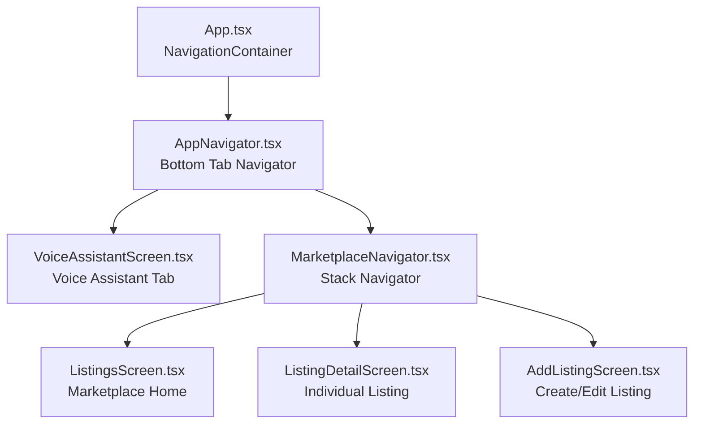
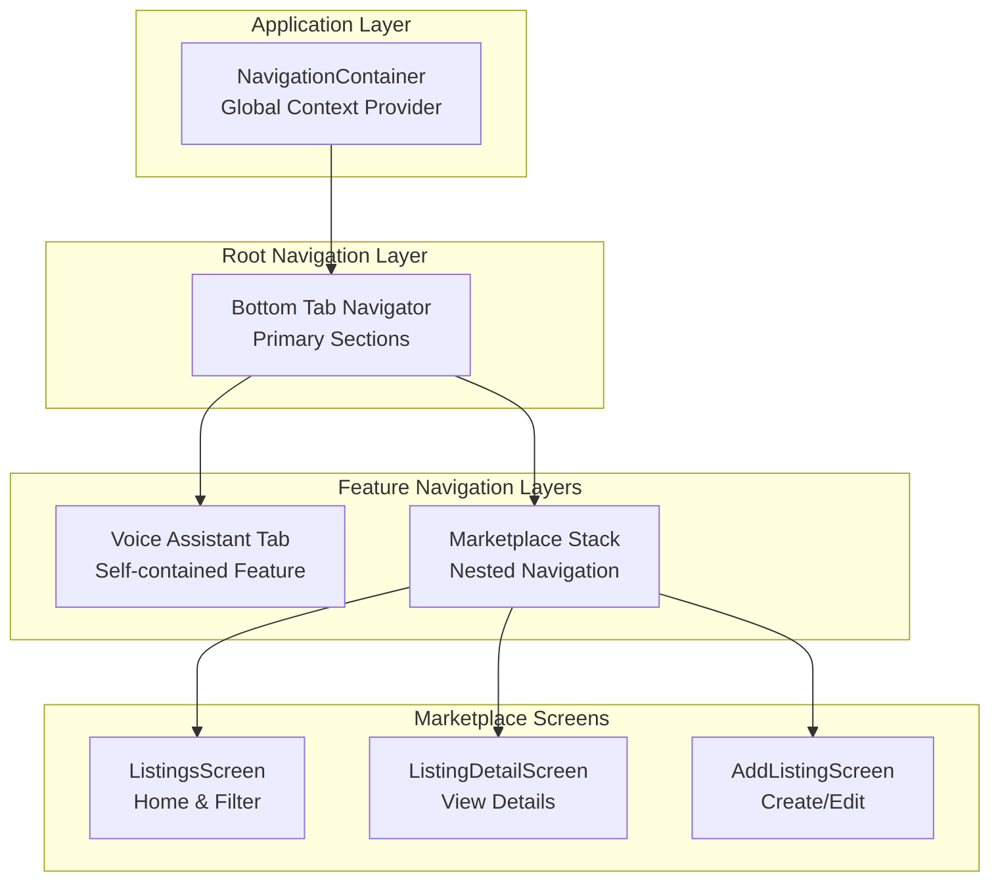
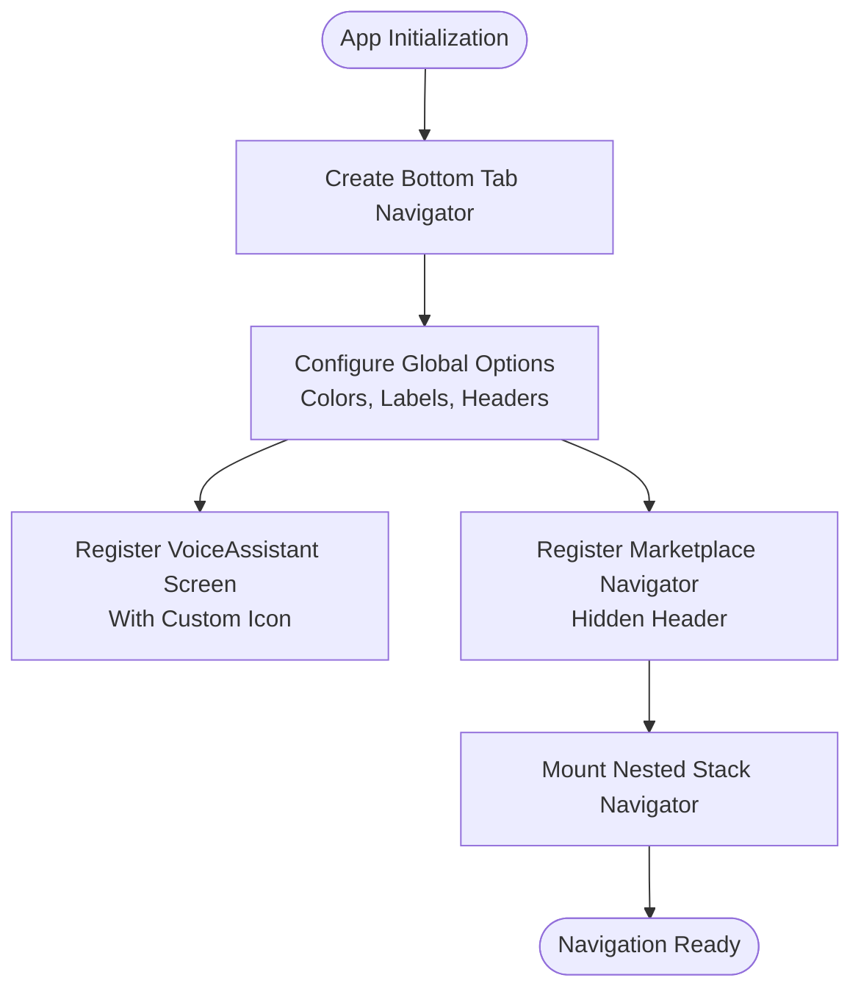
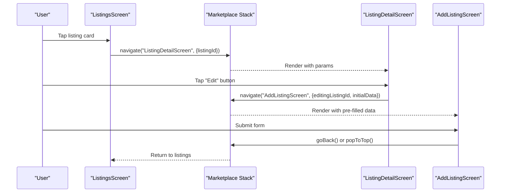
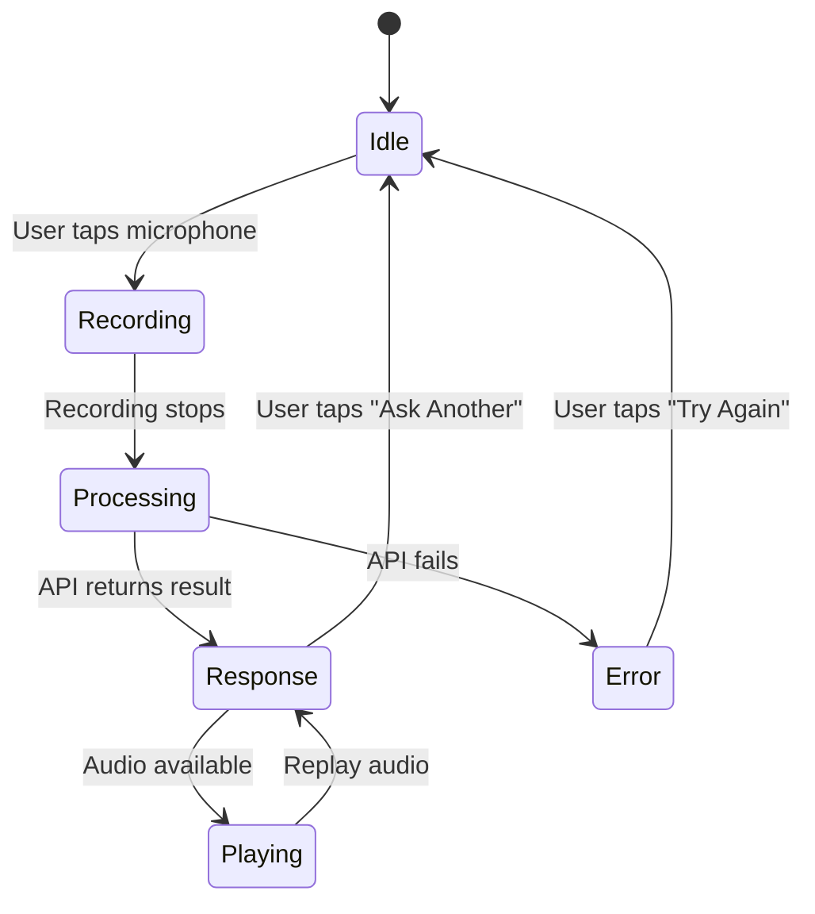

# Navigation System

<cite>
**Referenced Files in This Document**
- [App.tsx](file://frontend/App.tsx)
- [AppNavigator.tsx](file://frontend/navigation/AppNavigator.tsx)
- [MarketplaceNavigator.tsx](file://frontend/navigation/MarketplaceNavigator.tsx)
- [ListingsScreen.tsx](file://frontend/screens/ListingsScreen.tsx)
- [AddListingScreen.tsx](file://frontend/screens/AddListingScreen.tsx)
- [ListingDetailScreen.tsx](file://frontend/screens/ListingDetailScreen.tsx)
- [VoiceAssistantScreen.tsx](file://frontend/screens/VoiceAssistantScreen.tsx)
- [package.json](file://frontend/package.json)
- [app.json](file://frontend/app.json)
</cite>

## Update Summary
**Changes Made**
- Updated navigation architecture documentation to reflect complete React Navigation implementation
- Added detailed documentation for bottom tab navigation structure
- Enhanced marketplace stack navigator documentation with three-screen flow
- Updated programmatic navigation examples with real implementation patterns
- Added comprehensive route parameter handling documentation
- Included performance considerations specific to the implemented navigation structure

## Table of Contents
1. [Introduction](#introduction)
2. [Project Structure](#project-structure)
3. [Core Components](#core-components)
4. [Architecture Overview](#architecture-overview)
5. [Detailed Component Analysis](#detailed-component-analysis)
6. [Navigation Flow Between Tabs](#navigation-flow-between-tabs)
7. [Route Parameters and Data Passing](#route-parameters-and-data-passing)
8. [Programmatic Navigation Examples](#programmatic-navigation-examples)
9. [Navigation State Management](#navigation-state-management)
10. [Performance Considerations](#performance-considerations)
11. [Troubleshooting Guide](#troubleshooting-guide)
12. [Conclusion](#conclusion)
13. [Appendices](#appendices)

## Introduction
This document explains the complete navigation system implemented with React Navigation for the KisaanDost AI frontend. The application features a sophisticated navigation architecture with bottom tab navigation for primary sections (Voice Assistant and Marketplace) and nested stack navigation within the Marketplace section for managing multiple related screens. The system provides type-safe navigation with comprehensive parameter passing capabilities and follows React Navigation best practices for optimal performance and user experience.

## Project Structure
The navigation is organized into dedicated modules following a clear separation of concerns:
- **App entry point**: Wraps the entire application with NavigationContainer and manages loading states
- **Root navigator**: Defines two bottom tabs with consistent styling and branding
- **Feature-specific navigators**: Marketplace tab contains a native stack navigator for marketplace-related screens
- **Screen components**: Colocated under screens directory with proper TypeScript typing for navigation props



**Diagram sources**
- [App.tsx:28-36](file://frontend/App.tsx#L28-L36)
- [AppNavigator.tsx:14-61](file://frontend/navigation/AppNavigator.tsx#L14-L61)
- [MarketplaceNavigator.tsx:10-36](file://frontend/navigation/MarketplaceNavigator.tsx#L10-L36)

**Section sources**
- [App.tsx:1-46](file://frontend/App.tsx#L1-L46)
- [AppNavigator.tsx:1-67](file://frontend/navigation/AppNavigator.tsx#L1-L67)
- [MarketplaceNavigator.tsx:1-37](file://frontend/navigation/MarketplaceNavigator.tsx#L1-L37)

## Core Components
The navigation system consists of several key components working together:

### Root Bottom Tab Navigator
- Creates a typed bottom tab navigator with two primary routes: VoiceAssistant and Marketplace
- Configures global tab options including active/inactive colors, label styling, and header theme
- Implements custom tab icons using emoji characters as placeholders for future icon integration
- Hides the Marketplace tab header to delegate header control to the nested stack navigator

### Marketplace Stack Navigator  
- Provides a native stack navigator for marketplace-specific screens with smooth transitions
- Manages three screens: ListingsScreen, ListingDetailScreen, and AddListingScreen
- Applies consistent header styling across all marketplace screens with brand colors
- Uses shared param list types for type safety across all marketplace screens

### Screen Components
- **VoiceAssistantScreen**: Self-contained voice recording and playback interface with no direct navigation dependencies
- **ListingsScreen**: Demonstrates programmatic navigation to detail and creation screens with parameter passing
- **ListingDetailScreen**: Shows individual listing details with edit/delete functionality and navigation back to listings
- **AddListingScreen**: Handles both new listing creation and editing with form validation and navigation state management

**Section sources**
- [AppNavigator.tsx:14-61](file://frontend/navigation/AppNavigator.tsx#L14-L61)
- [MarketplaceNavigator.tsx:10-36](file://frontend/navigation/MarketplaceNavigator.tsx#L10-L36)
- [ListingsScreen.tsx:52-243](file://frontend/screens/ListingsScreen.tsx#L52-L243)
- [ListingDetailScreen.tsx:38-196](file://frontend/screens/ListingDetailScreen.tsx#L38-L196)
- [AddListingScreen.tsx:35-244](file://frontend/screens/AddListingScreen.tsx#L35-L244)

## Architecture Overview
The application implements a layered navigation architecture that separates concerns effectively:



**Diagram sources**
- [App.tsx:28-36](file://frontend/App.tsx#L28-L36)
- [AppNavigator.tsx:14-61](file://frontend/navigation/AppNavigator.tsx#L14-L61)
- [MarketplaceNavigator.tsx:10-36](file://frontend/navigation/MarketplaceNavigator.tsx#L10-L36)

The architecture provides several benefits:
- **Separation of Concerns**: Each feature area has its own navigation context
- **Type Safety**: Comprehensive TypeScript definitions prevent navigation errors at compile time
- **Scalability**: New screens can be added to appropriate navigators without affecting other areas
- **Performance**: Native stack navigation ensures smooth transitions and optimal memory usage

## Detailed Component Analysis

### Root Bottom Tab Navigator Implementation
The root navigator establishes the primary navigation structure with two main tabs:



**Diagram sources**
- [AppNavigator.tsx:14-61](file://frontend/navigation/AppNavigator.tsx#L14-L61)

Key implementation details:
- Uses `createBottomTabNavigator` with TypeScript generic for type safety
- Configures brand-consistent styling with green color scheme (#2e7d32)
- Implements responsive tab bar with appropriate height and padding
- Hides Marketplace tab header to allow nested stack to manage headers

**Section sources**
- [AppNavigator.tsx:14-61](file://frontend/navigation/AppNavigator.tsx#L14-L61)

### Marketplace Stack Navigator Architecture
The marketplace section uses a native stack navigator to manage related screens:



**Diagram sources**
- [MarketplaceNavigator.tsx:10-36](file://frontend/navigation/MarketplaceNavigator.tsx#L10-L36)
- [ListingsScreen.tsx:123-126](file://frontend/screens/ListingsScreen.tsx#L123-L126)
- [ListingDetailScreen.tsx:72-84](file://frontend/screens/ListingDetailScreen.tsx#L72-L84)
- [AddListingScreen.tsx:106-118](file://frontend/screens/AddListingScreen.tsx#L106-L118)

The stack navigator provides:
- Native platform optimizations for smooth transitions
- Consistent header styling across all marketplace screens
- Type-safe parameter passing between screens
- Proper navigation history management

**Section sources**
- [MarketplaceNavigator.tsx:10-36](file://frontend/navigation/MarketplaceNavigator.tsx#L10-L36)

### Voice Assistant Tab Implementation
The Voice Assistant tab serves as a self-contained feature with minimal navigation dependencies:



**Diagram sources**
- [VoiceAssistantScreen.tsx:19-199](file://frontend/screens/VoiceAssistantScreen.tsx#L19-L199)

Key characteristics:
- No direct navigation actions required - operates independently within its tab
- Focuses on voice recording, processing, and response display
- Integrates with external services for AI-powered farming advice
- Maintains clean state management for different UI states

**Section sources**
- [VoiceAssistantScreen.tsx:19-199](file://frontend/screens/VoiceAssistantScreen.tsx#L19-L199)

## Navigation Flow Between Tabs
The application supports seamless navigation between the two primary tabs:

### Tab Switching Behavior
- Users can switch between Voice Assistant and Marketplace tabs using the bottom tab bar
- Each tab maintains its own navigation state independently
- Tab switching triggers screen focus/unfocus events for proper lifecycle management
- The Marketplace tab hides its header to delegate to the nested stack navigator

### Cross-Tab Navigation Patterns
While the current implementation focuses on intra-tab navigation, the architecture supports cross-tab navigation through:
- Programmatic tab switching using `navigation.navigate('TabName')`
- Deep linking to specific tabs and screens
- Shared state management through context providers

**Section sources**
- [AppNavigator.tsx:33-58](file://frontend/navigation/AppNavigator.tsx#L33-L58)

## Route Parameters and Data Passing
The navigation system implements comprehensive parameter passing with full TypeScript support:

### Parameter Type Definitions
The marketplace screens share a common parameter list definition:

```typescript
export type MarketplaceStackParamList = {
  ListingsScreen: undefined;
  ListingDetailScreen: { listingId: string };
  AddListingScreen: {
    editingListingId?: string;
    initialData?: {
      crop: Crop;
      quantity: number;
      price: number;
      location: string;
      phone: string;
    };
  };
};
```

### Parameter Usage Patterns
- **Simple parameters**: ListingDetailScreen receives listingId for data fetching
- **Complex objects**: AddListingScreen receives editing context and pre-filled data
- **Optional parameters**: Editing mode detection through optional properties
- **Type safety**: All parameters are validated at compile time

**Section sources**
- [ListingsScreen.tsx:26-39](file://frontend/screens/ListingsScreen.tsx#L26-L39)
- [ListingDetailScreen.tsx:38-40](file://frontend/screens/ListingDetailScreen.tsx#L38-L40)
- [AddListingScreen.tsx:35-40](file://frontend/screens/AddListingScreen.tsx#L35-L40)

## Programmatic Navigation Examples
The implementation demonstrates various navigation patterns:

### Basic Navigation
```typescript
// Navigate to listing details
navigation.navigate('ListingDetailScreen', { listingId: item._id })

// Navigate to add/edit screen
navigation.navigate('AddListingScreen', {})
```

### Advanced Navigation
```typescript
// Navigate with complex data
navigation.navigate('AddListingScreen', {
  editingListingId: listing._id,
  initialData: {
    crop: listing.crop,
    quantity: listing.quantity,
    price: listing.price,
    location: listing.location,
    phone: listing.phone,
  }
})

// Navigate back with different behaviors
navigation.goBack()           // Simple back navigation
navigation.popToTop()       // Reset to top of stack
```

### Navigation with Side Effects
```typescript
// Handle navigation after async operations
const handleSubmit = async () => {
  const result = await createListing(listingData)
  if (result.success) {
    navigation.goBack()  // Navigate back on success
  } else {
    setErrors(mapApiError(result.error))  // Show errors
  }
}
```

**Section sources**
- [ListingsScreen.tsx:123-126](file://frontend/screens/ListingsScreen.tsx#L123-L126)
- [ListingsScreen.tsx:234-240](file://frontend/screens/ListingsScreen.tsx#L234-L240)
- [ListingDetailScreen.tsx:72-84](file://frontend/screens/ListingDetailScreen.tsx#L72-L84)
- [AddListingScreen.tsx:106-118](file://frontend/screens/AddListingScreen.tsx#L106-L118)

## Navigation State Management
The navigation system leverages React Navigation's built-in state management with additional enhancements:

### Built-in State Features
- **Navigation History**: Automatic stack management for back navigation
- **Tab State Persistence**: Each tab maintains its own state when switched
- **Focus Events**: Integration with useIsFocused hook for data refresh
- **Parameter Preservation**: Route parameters persist across navigation

### Custom State Enhancements
- **Loading States**: Screen-specific loading indicators during data fetch
- **Error Handling**: Centralized error state management with user feedback
- **Form State**: Complex form handling with validation and error display
- **Async Operations**: Proper state management for API calls and side effects

**Section sources**
- [ListingsScreen.tsx:52-86](file://frontend/screens/ListingsScreen.tsx#L52-L86)
- [ListingDetailScreen.tsx:38-61](file://frontend/screens/ListingDetailScreen.tsx#L38-L61)
- [AddListingScreen.tsx:35-129](file://frontend/screens/AddListingScreen.tsx#L35-L129)

## Performance Considerations
The navigation implementation includes several performance optimizations:

### Navigation-Specific Optimizations
- **Native Stack Navigation**: Uses native stack for smooth transitions and better memory management
- **Lazy Loading**: Screens are only loaded when needed, reducing initial bundle size
- **Component Memoization**: Prevents unnecessary re-renders during navigation
- **Efficient State Updates**: Minimizes re-renders through proper state management

### Memory Management
- **Audio Resource Cleanup**: Proper cleanup of audio players and temporary files
- **Event Listener Management**: Efficient handling of focus/blur events
- **Network Request Optimization**: Debounced API calls and proper error handling
- **Memory Leak Prevention**: Cleanup of subscriptions and timers in useEffect hooks

### Platform Optimizations
- **Safe Area Handling**: Proper handling of device notches and dynamic islands
- **Platform-Specific Behaviors**: iOS and Android-specific optimizations where needed
- **Touch Responsiveness**: Optimized touch targets and gesture handling
- **Animation Performance**: Smooth animations without jank or frame drops

**Section sources**
- [VoiceAssistantScreen.tsx:29-36](file://frontend/screens/VoiceAssistantScreen.tsx#L29-L36)
- [ListingsScreen.tsx:81-86](file://frontend/screens/ListingsScreen.tsx#L81-L86)
- [AddListingScreen.tsx:132-135](file://frontend/screens/AddListingScreen.tsx#L132-L135)

## Troubleshooting Guide
Common navigation issues and their solutions:

### Navigation Not Working
**Problem**: Navigation calls have no effect
**Solution**: 
- Verify NavigationContainer wraps the root component
- Check that screens are registered with correct names
- Ensure proper import paths and module resolution

### Type Errors with Navigation
**Problem**: TypeScript compilation errors for navigation
**Solution**:
- Verify param list types match actual navigation calls
- Use proper TypeScript generics for navigator types
- Import param lists from correct source files

### Header Conflicts
**Problem**: Multiple headers appearing or missing headers
**Solution**:
- Hide tab-level headers when delegating to nested stacks
- Configure header options consistently across screens
- Use proper nesting hierarchy for header management

### Performance Issues
**Problem**: Slow navigation or memory leaks
**Solution**:
- Implement proper cleanup in useEffect hooks
- Use memoization for expensive computations
- Optimize network requests and data fetching
- Monitor memory usage during development

**Section sources**
- [App.tsx:28-36](file://frontend/App.tsx#L28-L36)
- [AppNavigator.tsx:14-61](file://frontend/navigation/AppNavigator.tsx#L14-L61)

## Conclusion
The navigation system provides a robust, scalable foundation for the KisaanDost AI application. The combination of bottom tab navigation for primary sections and nested stack navigation for feature-specific screens creates an intuitive user experience while maintaining code organization and type safety. The implementation follows React Navigation best practices and includes comprehensive error handling, performance optimizations, and developer-friendly TypeScript support.

The architecture supports easy extension with new screens and features while maintaining consistency across the application. The separation of concerns between navigation configuration and screen logic makes the codebase maintainable and testable.

## Appendices

### Adding a New Tab
To add a new primary tab to the application:

1. **Create the screen component** in the screens directory
2. **Update AppNavigator.tsx**:
   - Import the new screen component
   - Add a new Tab.Screen with appropriate configuration
   - Define any necessary parameters in RootTabParamList
3. **Configure tab options**:
   - Set title, label, and icon
   - Configure header visibility and styling
   - Add any screen-specific options

### Adding a New Screen to Marketplace
To add a new screen within the marketplace section:

1. **Create the screen component** with proper TypeScript typing
2. **Update MarketplaceStackParamList** in ListingsScreen.tsx
3. **Register the screen** in MarketplaceNavigator.tsx
4. **Implement navigation** from existing screens using navigation.navigate()
5. **Handle parameters** appropriately in the new screen

### Implementing Deep Linking
To enable deep linking for navigation:

1. **Configure deep linking** in NavigationContainer options
2. **Define URL schemes** for different screens and tabs
3. **Handle incoming links** in screen components
4. **Test thoroughly** across platforms (iOS, Android, Web)

### Debugging Navigation Issues
Use these debugging techniques:

1. **Enable debug logging** in NavigationContainer
2. **Use React DevTools** to inspect navigation state
3. **Log navigation events** with console statements
4. **Test navigation flows** manually and with automated tests
5. **Monitor performance** with React Native profiler

**Section sources**
- [AppNavigator.tsx:14-61](file://frontend/navigation/AppNavigator.tsx#L14-L61)
- [MarketplaceNavigator.tsx:10-36](file://frontend/navigation/MarketplaceNavigator.tsx#L10-L36)
- [ListingsScreen.tsx:26-39](file://frontend/screens/ListingsScreen.tsx#L26-L39)