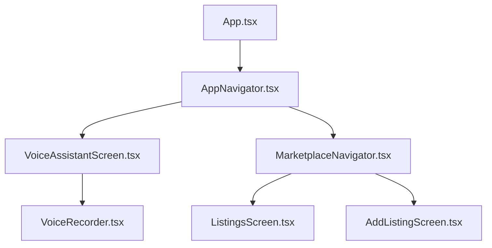
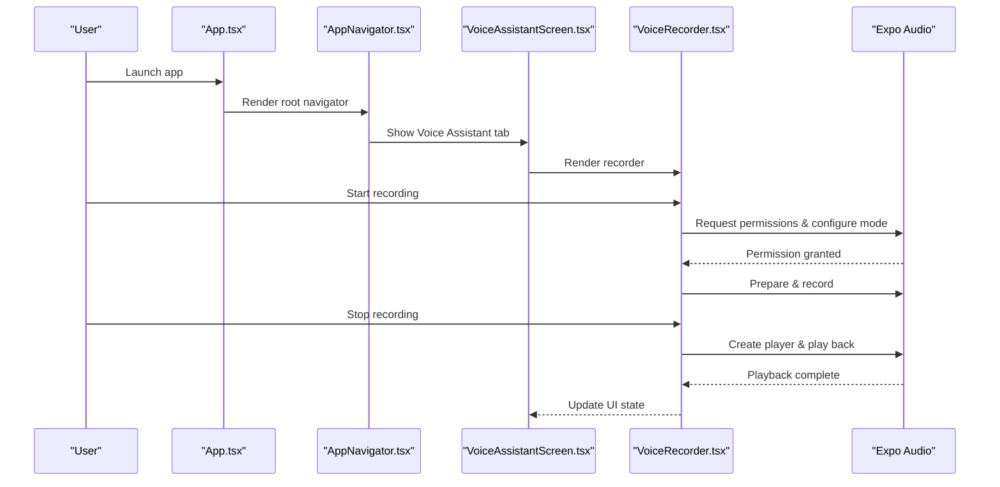
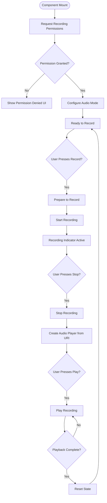
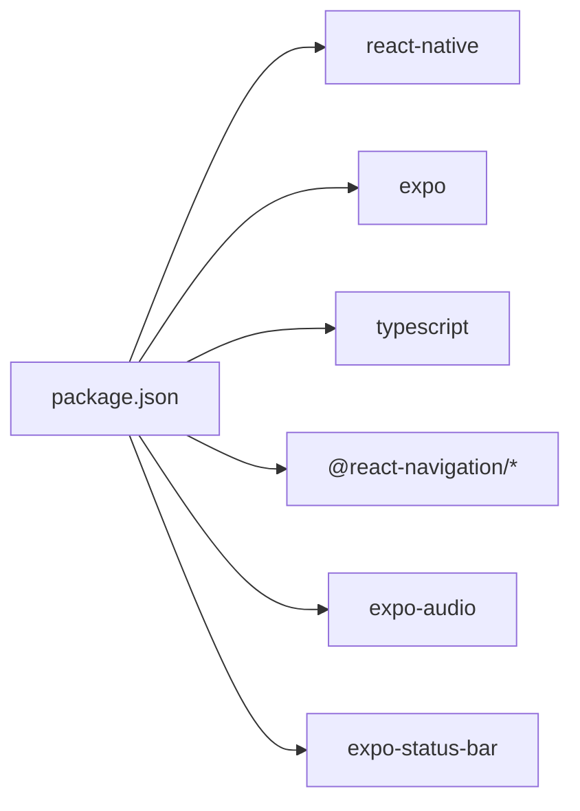

# Project Overview

<cite>
**Referenced Files in This Document**
- [README.md](file://README.md)
- [frontend/package.json](file://frontend/package.json)
- [frontend/App.tsx](file://frontend/App.tsx)
- [frontend/navigation/AppNavigator.tsx](file://frontend/navigation/AppNavigator.tsx)
- [frontend/navigation/MarketplaceNavigator.tsx](file://frontend/navigation/MarketplaceNavigator.tsx)
- [frontend/screens/VoiceAssistantScreen.tsx](file://frontend/screens/VoiceAssistantScreen.tsx)
- [frontend/components/VoiceRecorder.tsx](file://frontend/components/VoiceRecorder.tsx)
- [frontend/screens/ListingsScreen.tsx](file://frontend/screens/ListingsScreen.tsx)
- [frontend/screens/AddListingScreen.tsx](file://frontend/screens/AddListingScreen.tsx)
</cite>

## Table of Contents
1. [Introduction](#introduction)
2. [Project Structure](#project-structure)
3. [Core Components](#core-components)
4. [Architecture Overview](#architecture-overview)
5. [Detailed Component Analysis](#detailed-component-analysis)
6. [Dependency Analysis](#dependency-analysis)
7. [Performance Considerations](#performance-considerations)
8. [Troubleshooting Guide](#troubleshooting-guide)
9. [Conclusion](#conclusion)

## Introduction
KisaanDost is an AI-powered agricultural assistant designed for Pakistan’s farming community. It was created as part of Pakistan’s first AI Hackathon by the Alkhidmat Foundation in collaboration with Alibaba Cloud. The project’s primary goal is to provide a voice-first, accessible mobile experience that helps rural farmers and agricultural stakeholders get timely guidance, discover relevant resources, and engage with marketplace features tailored to agriculture.

The hackathon environment emphasizes rapid prototyping, accessibility, and real-world impact. KisaanDost focuses on delivering a functional prototype with core capabilities: voice recording and playback, a marketplace navigation shell, and a foundation ready for future AI integrations.

**Section sources**
- [README.md:1-3](file://README.md#L1-L3)

## Project Structure
The application is a React Native app built with Expo and TypeScript. It uses a bottom-tab navigation structure with two main sections: Voice Assistant and Marketplace. The codebase is organized into screens, components, and navigation modules for clarity and scalability.

**Diagram sources**
- [frontend/App.tsx:1-14](file://frontend/App.tsx#L1-L14)
- [frontend/navigation/AppNavigator.tsx:1-67](file://frontend/navigation/AppNavigator.tsx#L1-L67)
- [frontend/navigation/MarketplaceNavigator.tsx:1-31](file://frontend/navigation/MarketplaceNavigator.tsx#L1-L31)
- [frontend/screens/VoiceAssistantScreen.tsx:1-52](file://frontend/screens/VoiceAssistantScreen.tsx#L1-L52)
- [frontend/components/VoiceRecorder.tsx:1-270](file://frontend/components/VoiceRecorder.tsx#L1-L270)
- [frontend/screens/ListingsScreen.tsx:1-64](file://frontend/screens/ListingsScreen.tsx#L1-L64)
- [frontend/screens/AddListingScreen.tsx:1-44](file://frontend/screens/AddListingScreen.tsx#L1-L44)

**Section sources**
- [frontend/package.json:1-29](file://frontend/package.json#L1-L29)
- [frontend/App.tsx:1-14](file://frontend/App.tsx#L1-L14)
- [frontend/navigation/AppNavigator.tsx:1-67](file://frontend/navigation/AppNavigator.tsx#L1-L67)
- [frontend/navigation/MarketplaceNavigator.tsx:1-31](file://frontend/navigation/MarketplaceNavigator.tsx#L1-L31)

## Core Components
- Voice Recorder: A self-contained component that handles microphone permissions, audio mode configuration, recording, and local playback using Expo Audio APIs. It provides clear UI feedback for recording state and permission errors.
- Voice Assistant Screen: Presents the voice-first interface with instructions and integrates the recorder component.
- Marketplace Screens: Provide a navigable shell for browsing and adding listings, with placeholders indicating upcoming functionality.

Key implementation highlights:
- Permission handling and audio mode setup ensure reliable recording on devices.
- Local playback uses dynamically created audio players with lifecycle cleanup.
- Navigation is structured with bottom tabs and nested stacks for clean UX.

**Section sources**
- [frontend/components/VoiceRecorder.tsx:1-270](file://frontend/components/VoiceRecorder.tsx#L1-L270)
- [frontend/screens/VoiceAssistantScreen.tsx:1-52](file://frontend/screens/VoiceAssistantScreen.tsx#L1-L52)
- [frontend/screens/ListingsScreen.tsx:1-64](file://frontend/screens/ListingsScreen.tsx#L1-L64)
- [frontend/screens/AddListingScreen.tsx:1-44](file://frontend/screens/AddListingScreen.tsx#L1-L44)

## Architecture Overview
The app follows a layered architecture:
- Entry point initializes navigation container and root navigator.
- Root tab navigator separates Voice Assistant and Marketplace experiences.
- Marketplace stack manages listing views and add flows.
- Voice Assistant delegates audio operations to a dedicated recorder component.

**Diagram sources**
- [frontend/App.tsx:1-14](file://frontend/App.tsx#L1-L14)
- [frontend/navigation/AppNavigator.tsx:1-67](file://frontend/navigation/AppNavigator.tsx#L1-L67)
- [frontend/screens/VoiceAssistantScreen.tsx:1-52](file://frontend/screens/VoiceAssistantScreen.tsx#L1-L52)
- [frontend/components/VoiceRecorder.tsx:1-270](file://frontend/components/VoiceRecorder.tsx#L1-L270)

## Detailed Component Analysis

### Voice Recorder Component
The recorder encapsulates all audio logic:
- Requests microphone permissions and configures audio mode for recording.
- Prepares and starts/stops recording using high-quality presets.
- Creates a dynamic audio player for playback and tracks playback state.
- Provides user-friendly error messaging when permissions are denied.

**Diagram sources**
- [frontend/components/VoiceRecorder.tsx:1-270](file://frontend/components/VoiceRecorder.tsx#L1-L270)

**Section sources**
- [frontend/components/VoiceRecorder.tsx:1-270](file://frontend/components/VoiceRecorder.tsx#L1-L270)

### Voice Assistant Screen
- Displays title, subtitle, and integrates the recorder component.
- Communicates current capability status (local recording/playback; API integration pending).

**Section sources**
- [frontend/screens/VoiceAssistantScreen.tsx:1-52](file://frontend/screens/VoiceAssistantScreen.tsx#L1-L52)

### Marketplace Screens
- Listings screen introduces marketplace functionality and navigates to add listing flow.
- Add listing screen provides a placeholder form entry point and navigation back to listings.

**Section sources**
- [frontend/screens/ListingsScreen.tsx:1-64](file://frontend/screens/ListingsScreen.tsx#L1-L64)
- [frontend/screens/AddListingScreen.tsx:1-44](file://frontend/screens/AddListingScreen.tsx#L1-L44)

### Navigation Structure
- Bottom tabs separate core experiences: Voice Assistant and Marketplace.
- Marketplace uses a native stack to manage sub-screens with consistent headers.

**Section sources**
- [frontend/navigation/AppNavigator.tsx:1-67](file://frontend/navigation/AppNavigator.tsx#L1-L67)
- [frontend/navigation/MarketplaceNavigator.tsx:1-31](file://frontend/navigation/MarketplaceNavigator.tsx#L1-L31)

## Dependency Analysis
The app relies on Expo and React Native with TypeScript for type safety. Key dependencies include navigation libraries, Expo Audio for voice features, and status bar management.

**Diagram sources**
- [frontend/package.json:1-29](file://frontend/package.json#L1-L29)

**Section sources**
- [frontend/package.json:1-29](file://frontend/package.json#L1-L29)

## Performance Considerations
- Audio recording and playback are handled locally to minimize network overhead during the hackathon phase.
- Dynamic audio player creation ensures proper resource cleanup on unmount to prevent memory leaks.
- High-quality recording preset may increase storage usage; consider adaptive quality based on device constraints.
- Navigation uses native stacks and bottom tabs for smooth transitions and reduced re-renders.

[No sources needed since this section provides general guidance]

## Troubleshooting Guide
Common issues and resolutions:
- Microphone permission denied: The app shows a clear message instructing users to enable microphone access in device settings and restart the app.
- Recording fails to start: Ensure audio mode is configured correctly and permissions are granted before attempting to prepare or record.
- Playback not stopping: The component polls playback state and resets UI when duration is reached; verify player lifecycle and event polling intervals.

**Section sources**
- [frontend/components/VoiceRecorder.tsx:110-122](file://frontend/components/VoiceRecorder.tsx#L110-L122)
- [frontend/components/VoiceRecorder.tsx:37-55](file://frontend/components/VoiceRecorder.tsx#L37-L55)
- [frontend/components/VoiceRecorder.tsx:87-108](file://frontend/components/VoiceRecorder.tsx#L87-L108)

## Conclusion
KisaanDost establishes a strong foundation for an AI-powered agricultural assistant tailored to Pakistan’s farming community. With a voice-first interface, accessible design, and a scalable navigation structure, the project is well-positioned to integrate advanced AI capabilities in future iterations. The hackathon scope delivered a functional prototype emphasizing local recording/playback and a marketplace shell, setting the stage for broader feature expansion and backend integration.

[No sources needed since this section summarizes without analyzing specific files]