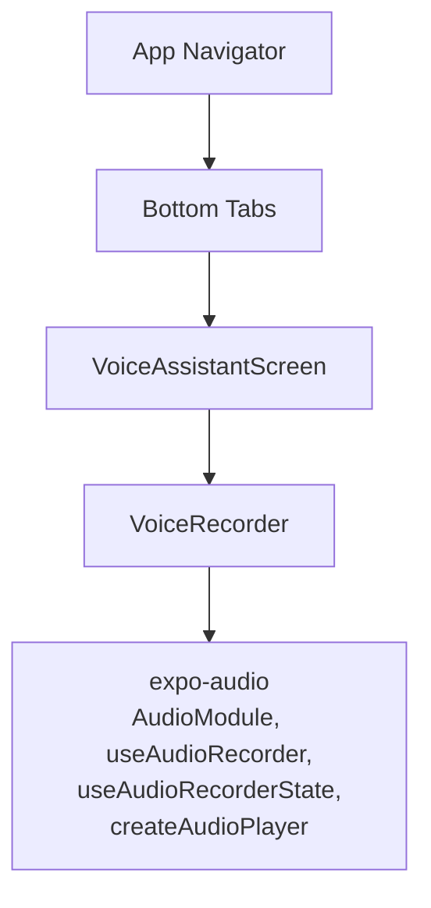
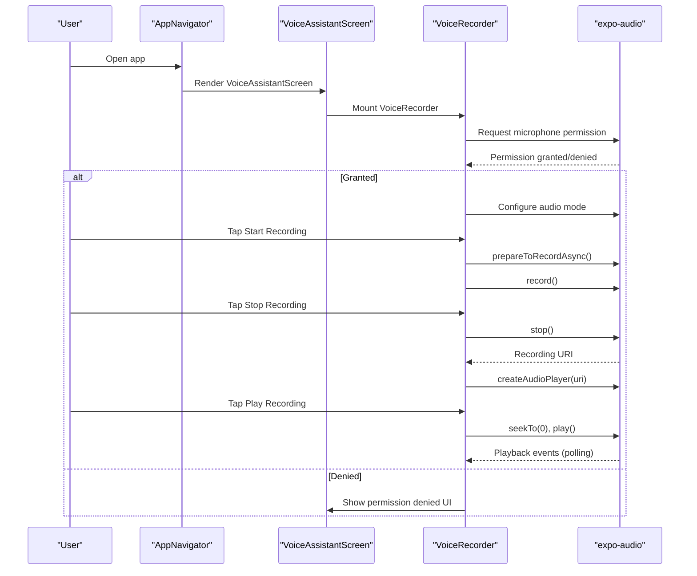
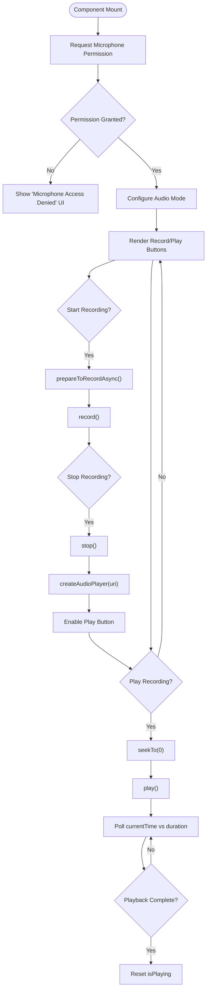
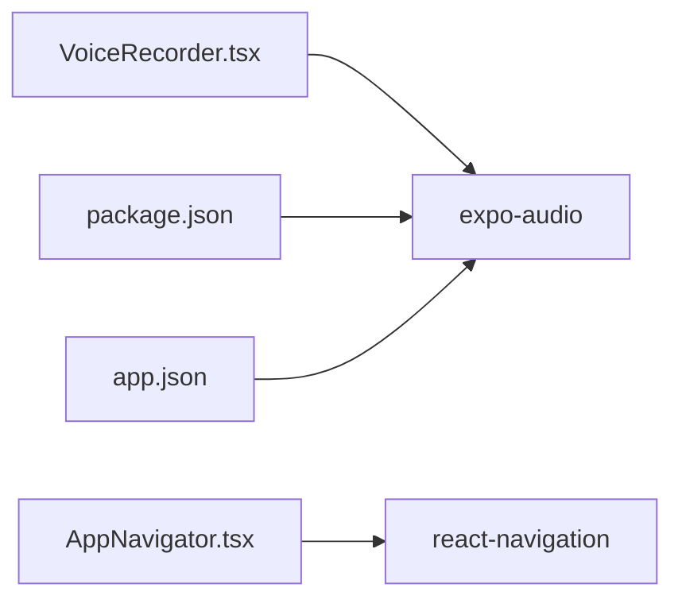

# Voice Assistant Feature

<cite>
**Referenced Files in This Document**
- [VoiceRecorder.tsx](file://frontend/components/VoiceRecorder.tsx)
- [VoiceAssistantScreen.tsx](file://frontend/screens/VoiceAssistantScreen.tsx)
- [AppNavigator.tsx](file://frontend/navigation/AppNavigator.tsx)
- [package.json](file://frontend/package.json)
- [app.json](file://frontend/app.json)
</cite>

## Table of Contents
1. [Introduction](#introduction)
2. [Project Structure](#project-structure)
3. [Core Components](#core-components)
4. [Architecture Overview](#architecture-overview)
5. [Detailed Component Analysis](#detailed-component-analysis)
6. [Dependency Analysis](#dependency-analysis)
7. [Performance Considerations](#performance-considerations)
8. [Troubleshooting Guide](#troubleshooting-guide)
9. [Conclusion](#conclusion)
10. [Appendices](#appendices)

## Introduction
This document explains the Voice Assistant feature implementation, focusing on audio recording using expo-audio, microphone permission handling, recording state management, and playback controls. It details the VoiceRecorder component’s behavior, event handling, and integration with the VoiceAssistantScreen. It also covers mobile-specific considerations such as background recording limitations and audio format handling, along with error handling strategies for permission denied scenarios and audio processing failures.

## Project Structure
The Voice Assistant feature is implemented within a React Native/Expo app:
- The navigation layer registers the Voice Assistant tab screen.
- The VoiceAssistantScreen hosts the UI and embeds the VoiceRecorder component.
- The VoiceRecorder component encapsulates all audio recording and playback logic using expo-audio.

**Diagram sources**
- [AppNavigator.tsx:14-60](file://frontend/navigation/AppNavigator.tsx#L14-L60)
- [VoiceAssistantScreen.tsx:5-20](file://frontend/screens/VoiceAssistantScreen.tsx#L5-L20)
- [VoiceRecorder.tsx:9-16](file://frontend/components/VoiceRecorder.tsx#L9-L16)

**Section sources**
- [AppNavigator.tsx:14-60](file://frontend/navigation/AppNavigator.tsx#L14-L60)
- [VoiceAssistantScreen.tsx:5-20](file://frontend/screens/VoiceAssistantScreen.tsx#L5-L20)
- [VoiceRecorder.tsx:9-16](file://frontend/components/VoiceRecorder.tsx#L9-L16)

## Core Components
- VoiceRecorder: A self-contained component that handles microphone permissions, starts/stops recording, manages recording state, and plays back the last recorded audio locally.
- VoiceAssistantScreen: A simple screen that presents the voice assistant context and embeds the VoiceRecorder component.
- AppNavigator: Registers the Voice Assistant tab and navigates to the VoiceAssistantScreen.

Key responsibilities:
- Permission handling: Requests microphone permission at mount time and configures audio mode.
- Recording lifecycle: Prepares and records audio, stops recording, and exposes the recording URI.
- Playback: Creates an audio player instance for the recorded file and manages play state.
- Error handling: Logs errors during start/stop and shows a user-friendly message when permission is denied.

**Section sources**
- [VoiceRecorder.tsx:23-173](file://frontend/components/VoiceRecorder.tsx#L23-L173)
- [VoiceAssistantScreen.tsx:5-20](file://frontend/screens/VoiceAssistantScreen.tsx#L5-L20)
- [AppNavigator.tsx:14-60](file://frontend/navigation/AppNavigator.tsx#L14-L60)

## Architecture Overview
The feature uses a layered approach:
- Navigation layer routes users to the Voice Assistant tab.
- Screen layer composes the UI and includes the recorder component.
- Recorder layer encapsulates audio operations via expo-audio.

**Diagram sources**
- [AppNavigator.tsx:14-60](file://frontend/navigation/AppNavigator.tsx#L14-L60)
- [VoiceAssistantScreen.tsx:5-20](file://frontend/screens/VoiceAssistantScreen.tsx#L5-L20)
- [VoiceRecorder.tsx:38-108](file://frontend/components/VoiceRecorder.tsx#L38-L108)

## Detailed Component Analysis

### VoiceRecorder Component
Responsibilities:
- Initialize audio recording with high-quality preset.
- Track recording state and UI feedback.
- Manage local playback using a dynamically created audio player.
- Handle permission requests and configure audio mode.

Props:
- None required; the component is self-contained and renders its own UI.

State and Refs:
- recordingUri: Stores the path to the most recent recording.
- isPlaying: Tracks whether playback is active.
- permissionGranted: Indicates whether microphone permission was granted.
- isPreparing: Indicates preparation phase before recording starts.
- playerRef: Holds the current audio player instance for cleanup and control.

Key Methods:
- startRecording: Prepares the recorder and begins recording.
- stopRecording: Stops recording, creates a new audio player for the resulting URI, and updates state.
- playRecording: Seeks to the beginning and plays the recording; polls until completion to reset UI state.

Event Handling:
- Button press toggles between start and stop based on recording state.
- Playback button triggers play and disables while playing.

Error Handling:
- Permission denied: Displays a dedicated UI explaining how to enable microphone access.
- Start/Stop failures: Logs warnings to console for debugging.

Mobile-Specific Considerations:
- Background recording: Not supported by this implementation; recording requires the app to be foregrounded.
- Audio format: Records in .m4a using expo-audio presets; playback uses the same format.
- Audio mode: Configured to allow recording and play in silent mode.

**Diagram sources**
- [VoiceRecorder.tsx:38-108](file://frontend/components/VoiceRecorder.tsx#L38-L108)
- [VoiceRecorder.tsx:111-173](file://frontend/components/VoiceRecorder.tsx#L111-L173)

**Section sources**
- [VoiceRecorder.tsx:23-173](file://frontend/components/VoiceRecorder.tsx#L23-L173)

### VoiceAssistantScreen Integration
- Renders a title, subtitle, and hint text.
- Embeds the VoiceRecorder component directly without additional props.
- Provides a scrollable container for better layout on small screens.

Integration points:
- No direct data binding; relies on VoiceRecorder’s internal state and UI.
- Future API integration can be added here or within VoiceRecorder to send recordings to a backend.

**Section sources**
- [VoiceAssistantScreen.tsx:5-20](file://frontend/screens/VoiceAssistantScreen.tsx#L5-L20)

### Navigation Integration
- The bottom tab navigator includes a “Voice Assistant” tab that mounts the VoiceAssistantScreen.
- Header styling and tab icons are configured for consistent UX.

**Section sources**
- [AppNavigator.tsx:14-60](file://frontend/navigation/AppNavigator.tsx#L14-L60)

## Dependency Analysis
External dependencies relevant to the Voice Assistant:
- expo-audio: Provides audio recording and playback APIs used by VoiceRecorder.
- react-navigation: Used by AppNavigator to structure tabs and screens.

Configuration:
- Expo plugin for expo-audio declares the microphone permission prompt text.
- Package versions ensure compatibility with the Expo SDK.

**Diagram sources**
- [VoiceRecorder.tsx:9-16](file://frontend/components/VoiceRecorder.tsx#L9-L16)
- [AppNavigator.tsx:1-5](file://frontend/navigation/AppNavigator.tsx#L1-L5)
- [package.json:5-16](file://frontend/package.json#L5-L16)
- [app.json:24-31](file://frontend/app.json#L24-L31)

**Section sources**
- [package.json:5-16](file://frontend/package.json#L5-L16)
- [app.json:24-31](file://frontend/app.json#L24-L31)
- [VoiceRecorder.tsx:9-16](file://frontend/components/VoiceRecorder.tsx#L9-L16)
- [AppNavigator.tsx:1-5](file://frontend/navigation/AppNavigator.tsx#L1-L5)

## Performance Considerations
- Recording quality: Uses a high-quality preset which may increase file size; consider adjusting if storage or bandwidth is constrained.
- Player lifecycle: Each stop creates a new player instance; previous players are removed to avoid memory leaks.
- Playback polling: Uses interval-based polling to detect playback completion; consider using native events if available for efficiency.
- UI responsiveness: Preparation and recording calls are wrapped in try/catch to prevent blocking the UI thread.

[No sources needed since this section provides general guidance]

## Troubleshooting Guide
Common issues and resolutions:
- Microphone permission denied:
  - Symptom: Permission denied UI appears; recording cannot start.
  - Resolution: Instruct users to enable microphone access in device settings and restart the app.
- Recording fails to start:
  - Symptom: Console warning about failed preparation or recording.
  - Resolution: Ensure audio mode is configured and permissions are granted; verify device supports requested preset.
- Playback does not stop:
  - Symptom: Play button remains active after playback ends.
  - Resolution: Confirm polling logic detects end-of-file; check player instance availability and timing thresholds.

Operational tips:
- Use the debug URI text to verify the recorded file path during development.
- Log detailed errors around prepareToRecordAsync, record, stop, and createAudioPlayer to diagnose platform-specific issues.

**Section sources**
- [VoiceRecorder.tsx:38-108](file://frontend/components/VoiceRecorder.tsx#L38-L108)
- [VoiceRecorder.tsx:111-173](file://frontend/components/VoiceRecorder.tsx#L111-L173)

## Conclusion
The Voice Assistant feature provides a focused, self-contained audio recording and playback experience using expo-audio. The VoiceRecorder component encapsulates permission handling, recording lifecycle, and local playback, while the VoiceAssistantScreen offers a clean entry point. The current implementation is optimized for foreground usage and local playback, with clear error handling and user feedback. Future enhancements can include backend integration, advanced playback controls, and customizable recording presets.

[No sources needed since this section summarizes without analyzing specific files]

## Appendices

### Mobile-Specific Considerations
- Background recording: Not supported by this implementation; recording requires the app to remain in the foreground.
- Audio formats: Records in .m4a using expo-audio presets; playback uses the same format.
- Platform permissions: Microphone permission is requested at runtime; ensure the app manifest includes the appropriate permission prompt text.

[No sources needed since this section provides general guidance]

### Usage Patterns and Customization
- Basic usage:
  - Navigate to the Voice Assistant tab and use the provided buttons to record and play back audio.
- Customization options:
  - Adjust recording preset quality by changing the preset passed to the audio recorder.
  - Modify UI styles to match app branding.
  - Extend playback controls by adding pause, resume, and progress indicators.
- Integration points:
  - Add API calls after stopRecording to upload the recording URI to a backend service.
  - Integrate speech-to-text services by passing the recording URI to a transcription endpoint.

[No sources needed since this section provides general guidance]