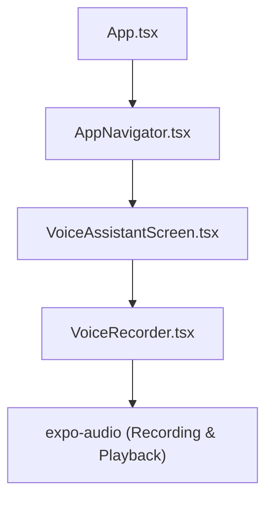
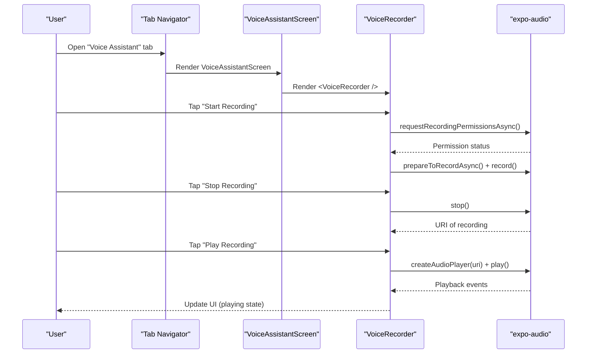
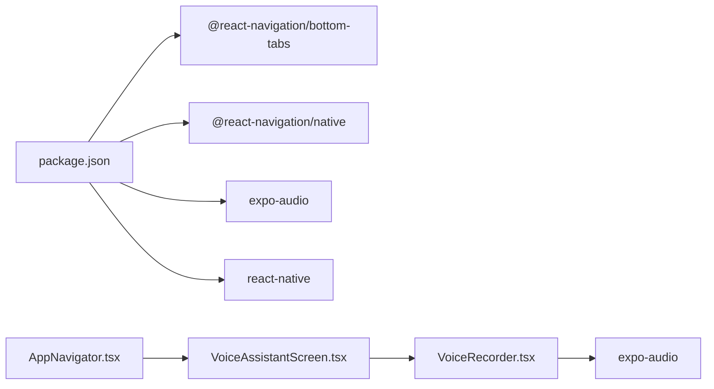

# Voice Assistant Screen Component

<cite>
**Referenced Files in This Document**
- [VoiceAssistantScreen.tsx](file://frontend/screens/VoiceAssistantScreen.tsx)
- [VoiceRecorder.tsx](file://frontend/components/VoiceRecorder.tsx)
- [AppNavigator.tsx](file://frontend/navigation/AppNavigator.tsx)
- [App.tsx](file://frontend/App.tsx)
- [package.json](file://frontend/package.json)
</cite>

## Table of Contents
1. [Introduction](#introduction)
2. [Project Structure](#project-structure)
3. [Core Components](#core-components)
4. [Architecture Overview](#architecture-overview)
5. [Detailed Component Analysis](#detailed-component-analysis)
6. [Dependency Analysis](#dependency-analysis)
7. [Performance Considerations](#performance-considerations)
8. [Troubleshooting Guide](#troubleshooting-guide)
9. [Conclusion](#conclusion)
10. [Appendices](#appendices)

## Introduction
This document provides comprehensive documentation for the VoiceAssistantScreen component, which serves as the main UI container for the voice assistant feature. It explains the screen’s layout structure, styling approach using React Native StyleSheet, and how it composes with the VoiceRecorder component to deliver a complete recording and playback experience. The guide also covers state management within the recorder, integration points, mobile-specific UI patterns, accessibility considerations, and customization strategies.

## Project Structure
The voice assistant feature is implemented as a screen that integrates with the app’s navigation and a self-contained audio recording component:
- VoiceAssistantScreen renders a scrollable layout with title, subtitle, hint text, and the VoiceRecorder component.
- VoiceRecorder encapsulates microphone permissions, recording lifecycle, and local playback.
- AppNavigator registers VoiceAssistantScreen as a tab screen and configures header/tab styles.
- App.tsx wraps everything in NavigationContainer and StatusBar.

**Diagram sources**
- [App.tsx:6-13](file://frontend/App.tsx#L6-L13)
- [AppNavigator.tsx:14-60](file://frontend/navigation/AppNavigator.tsx#L14-L60)
- [VoiceAssistantScreen.tsx:5-21](file://frontend/screens/VoiceAssistantScreen.tsx#L5-L21)
- [VoiceRecorder.tsx:23-174](file://frontend/components/VoiceRecorder.tsx#L23-L174)

**Section sources**
- [App.tsx:6-13](file://frontend/App.tsx#L6-L13)
- [AppNavigator.tsx:14-60](file://frontend/navigation/AppNavigator.tsx#L14-L60)
- [VoiceAssistantScreen.tsx:5-21](file://frontend/screens/VoiceAssistantScreen.tsx#L5-L21)
- [VoiceRecorder.tsx:23-174](file://frontend/components/VoiceRecorder.tsx#L23-L174)

## Core Components
- VoiceAssistantScreen: A presentational screen that composes the user-facing elements (title, subtitle, hint) and embeds the VoiceRecorder component inside a scrollable container.
- VoiceRecorder: A self-contained component handling microphone permissions, recording start/stop, and local playback using expo-audio.

Key responsibilities:
- VoiceAssistantScreen focuses on layout and presentation; it does not manage complex state.
- VoiceRecorder manages all audio-related state and side effects, exposing a simple UI for record/playback.

**Section sources**
- [VoiceAssistantScreen.tsx:5-21](file://frontend/screens/VoiceAssistantScreen.tsx#L5-L21)
- [VoiceRecorder.tsx:23-174](file://frontend/components/VoiceRecorder.tsx#L23-L174)

## Architecture Overview
The screen integrates into a bottom-tab navigation setup. The navigator defines a “VoiceAssistant” tab that renders the VoiceAssistantScreen. Inside the screen, VoiceRecorder handles audio operations independently, keeping the screen lightweight and focused on layout.

**Diagram sources**
- [AppNavigator.tsx:33-45](file://frontend/navigation/AppNavigator.tsx#L33-L45)
- [VoiceAssistantScreen.tsx:5-21](file://frontend/screens/VoiceAssistantScreen.tsx#L5-L21)
- [VoiceRecorder.tsx:37-108](file://frontend/components/VoiceRecorder.tsx#L37-L108)

## Detailed Component Analysis

### VoiceAssistantScreen
Role:
- Serves as the main UI container for the voice assistant feature.
- Provides a scrollable content area with a title, subtitle, embedded VoiceRecorder, and hint text.

Layout structure:
- ScrollView with centered content and padding.
- Title and subtitle are prominent and centered for clarity.
- Hint text appears below the recorder to guide users.

Styling approach:
- Uses React Native StyleSheet for consistent typography and spacing.
- Employs a light background color and brand-aligned accent colors for headings.

Props and state:
- No props or internal state; purely presentational.
- Delegates all interactive behavior to VoiceRecorder.

Accessibility and mobile patterns:
- Clear hierarchy with large title and readable subtitle improves readability on small screens.
- Centered layout and generous padding enhance touch targets and visual balance.
- Scrollable container ensures content remains accessible across device sizes.

Customization examples:
- Adjust colors, font sizes, and spacing via StyleSheet to match branding.
- Add additional informational text or help links above/below the recorder.
- Replace or wrap VoiceRecorder to inject analytics or logging around interactions.

**Section sources**
- [VoiceAssistantScreen.tsx:5-21](file://frontend/screens/VoiceAssistantScreen.tsx#L5-L21)
- [VoiceAssistantScreen.tsx:23-51](file://frontend/screens/VoiceAssistantScreen.tsx#L23-L51)

### VoiceRecorder
Role:
- Encapsulates microphone permission handling, recording lifecycle, and local playback.
- Presents a minimal UI with a record/stop toggle and a play button when a recording exists.

State management:
- Tracks whether recording is active, if a recording URI exists, playback state, permission status, and preparation state.
- Uses hooks from expo-audio to access recorder instance and its state.

Integration with expo-audio:
- Requests recording permissions and sets audio mode on mount.
- Prepares and starts recording, stops recording to obtain a URI, creates an audio player for playback, and polls playback progress to update UI.

Error handling and edge cases:
- Handles permission denied by showing a clear message instructing users to enable microphone access in device settings.
- Logs warnings for failures during start/stop recording.
- Cleans up the audio player on unmount to prevent leaks.

Mobile-specific UI patterns:
- Prominent record/stop button with visual feedback (color change while recording).
- Inline indicator showing “Recording...” with a red dot for immediate recognition.
- Play button disabled while playing to prevent overlapping playback.

Accessibility considerations:
- Buttons are tappable and visually distinct; consider adding accessibility labels for screen readers in future iterations.
- Error messages are concise and actionable.

Customization examples:
- Modify button styles, colors, and sizes to align with design system.
- Extend UI to show recording duration, waveform visualization, or file metadata.
- Integrate backend APIs after recording to upload or process audio.

**Section sources**
- [VoiceRecorder.tsx:23-174](file://frontend/components/VoiceRecorder.tsx#L23-L174)
- [VoiceRecorder.tsx:177-270](file://frontend/components/VoiceRecorder.tsx#L177-L270)

### Navigation Integration
- AppNavigator registers VoiceAssistantScreen under a bottom tab named “VoiceAssistant”.
- Header and tab bar styles are configured centrally for consistency across tabs.

Navigation flow:
- Users open the “Voice Assistant” tab to access the screen.
- The screen renders immediately with the recorder ready to use.

**Section sources**
- [AppNavigator.tsx:33-45](file://frontend/navigation/AppNavigator.tsx#L33-L45)
- [AppNavigator.tsx:14-31](file://frontend/navigation/AppNavigator.tsx#L14-L31)

## Dependency Analysis
External dependencies relevant to this feature:
- expo-audio: Provides audio recording and playback primitives used by VoiceRecorder.
- @react-navigation/*: Powers the tab-based navigation that includes VoiceAssistantScreen.
- react-native: Core UI primitives and styling used throughout.

**Diagram sources**
- [package.json:5-15](file://frontend/package.json#L5-L15)
- [VoiceAssistantScreen.tsx:1-4](file://frontend/screens/VoiceAssistantScreen.tsx#L1-L4)
- [VoiceRecorder.tsx:1-16](file://frontend/components/VoiceRecorder.tsx#L1-L16)
- [AppNavigator.tsx:1-5](file://frontend/navigation/AppNavigator.tsx#L1-L5)

**Section sources**
- [package.json:5-15](file://frontend/package.json#L5-L15)
- [VoiceAssistantScreen.tsx:1-4](file://frontend/screens/VoiceAssistantScreen.tsx#L1-L4)
- [VoiceRecorder.tsx:1-16](file://frontend/components/VoiceRecorder.tsx#L1-L16)
- [AppNavigator.tsx:1-5](file://frontend/navigation/AppNavigator.tsx#L1-L5)

## Performance Considerations
- Keep VoiceAssistantScreen lightweight; avoid heavy computations or network calls in render.
- VoiceRecorder uses polling to detect playback completion; ensure polling interval is reasonable to balance responsiveness and battery usage.
- Clean up audio players on unmount to prevent memory leaks.
- Use high-quality presets judiciously; they may increase storage and processing overhead.

[No sources needed since this section provides general guidance]

## Troubleshooting Guide
Common issues and resolutions:
- Microphone permission denied:
  - The component displays a clear message directing users to enable microphone access in device settings and restart the app.
- Recording fails to start:
  - Check console warnings for errors during preparation or recording start. Ensure permissions are granted and audio mode is set correctly.
- Playback does not stop:
  - Verify that playback detection logic runs and clears intervals when the player is removed or finished.

Action steps:
- Confirm device permissions for microphone are enabled.
- Reopen the app after changing system permissions.
- Inspect logs for error messages related to audio module initialization.

**Section sources**
- [VoiceRecorder.tsx:37-55](file://frontend/components/VoiceRecorder.tsx#L37-L55)
- [VoiceRecorder.tsx:57-85](file://frontend/components/VoiceRecorder.tsx#L57-L85)
- [VoiceRecorder.tsx:87-108](file://frontend/components/VoiceRecorder.tsx#L87-L108)
- [VoiceRecorder.tsx:111-122](file://frontend/components/VoiceRecorder.tsx#L111-L122)

## Conclusion
VoiceAssistantScreen acts as a clean, scrollable container that presents essential information and delegates audio functionality to VoiceRecorder. The separation of concerns keeps the screen simple and maintainable while enabling rich audio features through expo-audio. With thoughtful styling, responsive layout, and robust error handling, the implementation delivers a solid foundation for future enhancements such as API integration, advanced playback controls, and enhanced accessibility.

[No sources needed since this section summarizes without analyzing specific files]

## Appendices

### Styling Approach and Responsive Design
- StyleSheet.create is used to define reusable style objects for container, typography, and buttons.
- Centered layout and padding ensure consistent appearance across devices.
- Colors and typography are chosen for readability and brand alignment.

**Section sources**
- [VoiceAssistantScreen.tsx:23-51](file://frontend/screens/VoiceAssistantScreen.tsx#L23-L51)
- [VoiceRecorder.tsx:177-270](file://frontend/components/VoiceRecorder.tsx#L177-L270)

### Extending Functionality
- Add props to VoiceAssistantScreen to pass theme tokens or localization strings.
- Wrap VoiceRecorder with higher-order components to add telemetry or analytics.
- Integrate backend APIs after recording to transcribe or analyze audio content.

[No sources needed since this section provides general guidance]