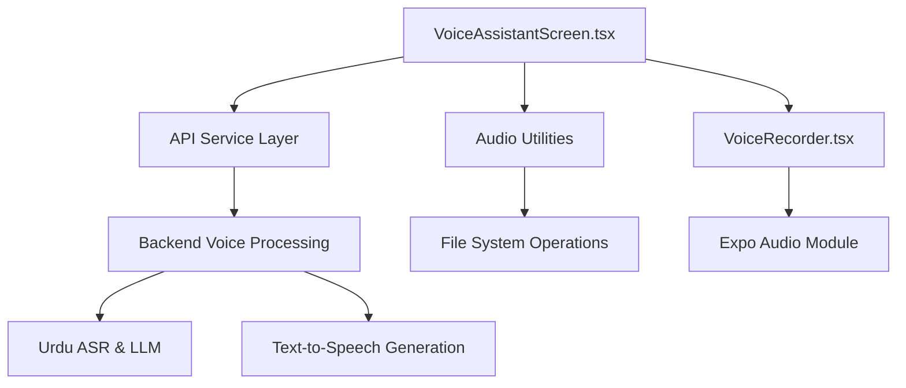
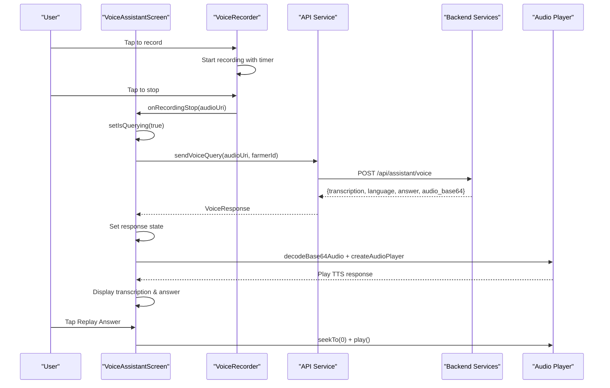
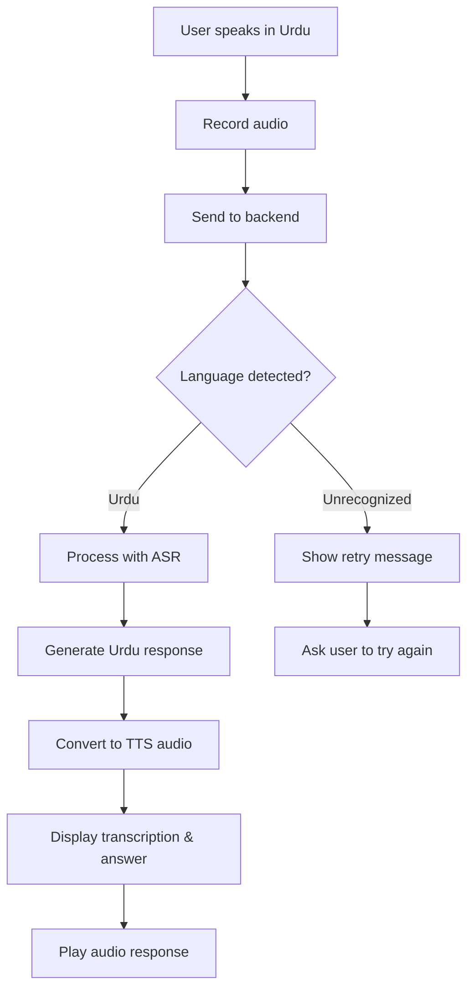
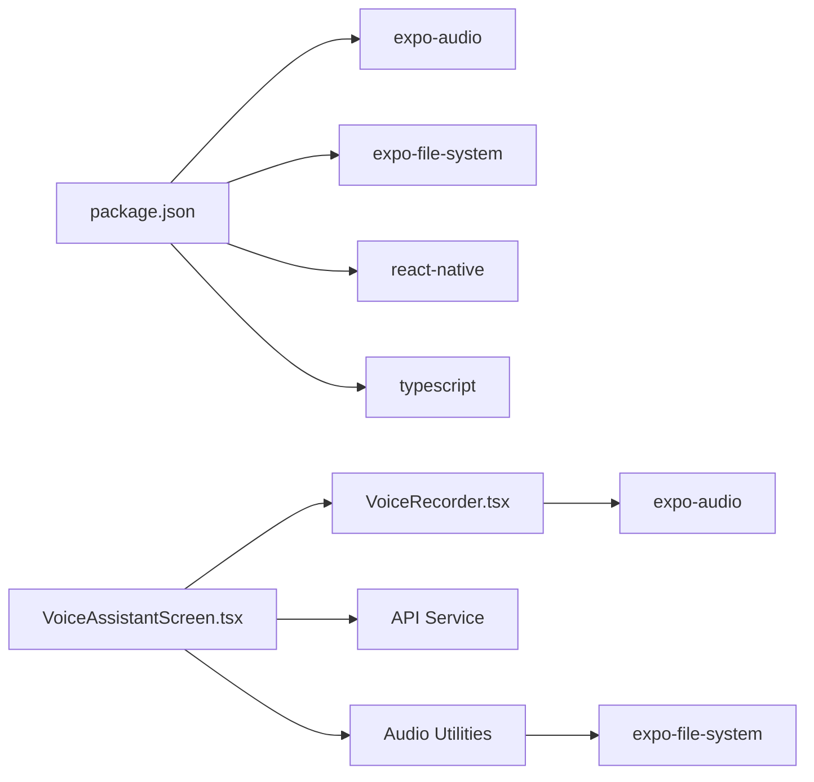

# Voice Assistant Screen Component

<cite>
**Referenced Files in This Document**
- [VoiceAssistantScreen.tsx](file://frontend/screens/VoiceAssistantScreen.tsx)
- [VoiceRecorder.tsx](file://frontend/components/VoiceRecorder.tsx)
- [api.ts](file://frontend/services/api.ts)
- [audio.ts](file://frontend/utils/audio.ts)
- [StateCard.tsx](file://frontend/components/ui/StateCard.tsx)
- [PrimaryButton.tsx](file://frontend/components/ui/PrimaryButton.tsx)
- [FarmerContext.tsx](file://frontend/contexts/FarmerContext.tsx)
- [colors.ts](file://frontend/theme/colors.ts)
</cite>

## Update Summary
**Changes Made**
- Updated VoiceAssistantScreen implementation with complete Urdu language query processing workflow
- Added comprehensive audio transcription and text-to-speech response capabilities
- Integrated backend API communication for voice queries with mock service layer
- Enhanced state management for recording, querying, and playback states
- Implemented responsive UI with multiple states (idle, sending, error, unrecognized, success)
- Added TTS audio playback functionality with file management and cleanup

## Table of Contents
1. [Introduction](#introduction)
2. [Project Structure](#project-structure)
3. [Core Components](#core-components)
4. [Architecture Overview](#architecture-overview)
5. [Detailed Component Analysis](#detailed-component-analysis)
6. [Urdu Language Processing Workflow](#urdu-language-processing-workflow)
7. [Audio Transcription and Text-to-Speech](#audio-transcription-and-text-to-speech)
8. [Dependency Analysis](#dependency-analysis)
9. [Performance Considerations](#performance-considerations)
10. [Troubleshooting Guide](#troubleshooting-guide)
11. [Conclusion](#conclusion)
12. [Appendices](#appendices)

## Introduction
This document provides comprehensive documentation for the VoiceAssistantScreen component, which serves as the main UI container for the KisaanDost voice assistant feature. The screen enables farmers to ask farming questions in Urdu through voice input, processes the audio through transcription services, and delivers responses both as text and audio using text-to-speech technology. It explains the screen's layout structure, styling approach using React Native StyleSheet, and how it composes with the VoiceRecorder component to deliver a complete voice interaction experience.

## Project Structure
The voice assistant feature is implemented as a sophisticated screen that integrates with the app's navigation system and manages complex audio workflows:
- VoiceAssistantScreen orchestrates the entire voice query process from recording to response display
- VoiceRecorder handles microphone permissions, recording lifecycle, and local playback
- API service layer manages communication with backend voice processing services
- Audio utilities provide base64 decoding and temporary file management for TTS responses
- State management components handle various UI states (idle, sending, error, success)

**Diagram sources**
- [VoiceAssistantScreen.tsx:19-93](file://frontend/screens/VoiceAssistantScreen.tsx#L19-L93)
- [VoiceRecorder.tsx:33-189](file://frontend/components/VoiceRecorder.tsx#L33-L189)
- [api.ts:164-200](file://frontend/services/api.ts#L164-L200)
- [audio.ts:21-32](file://frontend/utils/audio.ts#L21-L32)

**Section sources**
- [VoiceAssistantScreen.tsx:19-93](file://frontend/screens/VoiceAssistantScreen.tsx#L19-L93)
- [VoiceRecorder.tsx:33-189](file://frontend/components/VoiceRecorder.tsx#L33-L189)
- [api.ts:164-200](file://frontend/services/api.ts#L164-L200)
- [audio.ts:21-32](file://frontend/utils/audio.ts#L21-L32)

## Core Components
- **VoiceAssistantScreen**: Main orchestrator managing voice query workflow, state transitions, and response handling
- **VoiceRecorder**: Self-contained audio recording component with permission management and playback
- **API Service Layer**: Mock backend interface for voice query processing with Urdu language support
- **Audio Utilities**: File system operations for TTS audio file management
- **UI Components**: Reusable components for consistent user experience across different states

Key responsibilities:
- VoiceAssistantScreen focuses on workflow orchestration and state management
- VoiceRecorder encapsulates all audio recording and playback functionality
- API service provides abstraction between frontend and backend voice processing
- Audio utilities handle temporary file creation and cleanup for TTS responses

**Section sources**
- [VoiceAssistantScreen.tsx:19-93](file://frontend/screens/VoiceAssistantScreen.tsx#L19-L93)
- [VoiceRecorder.tsx:33-189](file://frontend/components/VoiceRecorder.tsx#L33-L189)
- [api.ts:164-200](file://frontend/services/api.ts#L164-L200)
- [audio.ts:21-32](file://frontend/utils/audio.ts#L21-L32)

## Architecture Overview
The screen implements a complete voice interaction pipeline with robust error handling and state management:

**Diagram sources**
- [VoiceAssistantScreen.tsx:60-93](file://frontend/screens/VoiceAssistantScreen.tsx#L60-L93)
- [VoiceRecorder.tsx:69-95](file://frontend/components/VoiceRecorder.tsx#L69-L95)
- [api.ts:164-200](file://frontend/services/api.ts#L164-L200)
- [audio.ts:21-32](file://frontend/utils/audio.ts#L21-L32)

## Detailed Component Analysis

### VoiceAssistantScreen
Role:
- Orchestrates the complete voice query workflow from recording to response display
- Manages complex state transitions between idle, sending, error, and success states
- Handles Urdu language detection and appropriate response rendering
- Integrates text-to-speech playback with proper resource cleanup

Layout structure:
- ScrollView with centered content and responsive padding
- Dynamic state-based rendering showing appropriate UI for each phase
- Professional card-based design with clear visual hierarchy
- Consistent spacing and typography using theme tokens

State management:
- Tracks query status (`isQuerying`), response data, errors, and audio playback state
- Uses refs for audio player instances and temporary file URIs
- Implements proper cleanup in useEffect hooks to prevent memory leaks

Error handling:
- Comprehensive error state management with user-friendly messages
- Graceful handling of network failures and audio processing errors
- Clear feedback for unrecognized language scenarios

Accessibility and mobile patterns:
- Clear visual indicators for loading states with ActivityIndicator
- Large touch targets for primary actions
- Descriptive labels and icons for better understanding
- Responsive layout that adapts to different screen sizes

Customization examples:
- Modify state card variants to match branding requirements
- Adjust colors and typography through theme configuration
- Extend response display with additional metadata or formatting options

**Updated** Enhanced with complete Urdu language processing workflow, audio transcription display, and text-to-speech playback capabilities

**Section sources**
- [VoiceAssistantScreen.tsx:19-93](file://frontend/screens/VoiceAssistantScreen.tsx#L19-L93)
- [VoiceAssistantScreen.tsx:101-197](file://frontend/screens/VoiceAssistantScreen.tsx#L101-L197)
- [VoiceAssistantScreen.tsx:201-301](file://frontend/screens/VoiceAssistantScreen.tsx#L201-L301)

### VoiceRecorder
Role:
- Encapsulates microphone permission handling, recording lifecycle, and local playback
- Provides intuitive recording interface with real-time feedback
- Manages audio file creation and temporary storage during recording

State management:
- Tracks recording status, playback state, and permission grants
- Implements timer functionality for recording duration display
- Manages audio player instances with proper cleanup

Integration with expo-audio:
- Uses high-quality recording presets for optimal audio capture
- Implements proper permission requests and audio mode configuration
- Handles recording start/stop with comprehensive error handling

Mobile-specific UI patterns:
- Prominent recording button with visual feedback (color changes during recording)
- Real-time recording indicator with red dot and timer
- Intuitive cancel and play functionality with clear visual states

Accessibility considerations:
- Clear visual feedback for all user interactions
- Descriptive labels and status updates
- Proper disabled states to prevent invalid interactions

**Section sources**
- [VoiceRecorder.tsx:33-189](file://frontend/components/VoiceRecorder.tsx#L33-L189)
- [VoiceRecorder.tsx:191-304](file://frontend/components/VoiceRecorder.tsx#L191-L304)

### API Service Layer
Role:
- Provides abstraction layer for voice query processing with mock backend support
- Defines TypeScript interfaces for type-safe API communication
- Simulates realistic backend behavior with 70% success rate and 30% fallback scenarios

Urdu language processing:
- Returns Urdu transcriptions and responses in mock implementation
- Supports language detection with 'urdu' and 'unrecognized' states
- Provides placeholder audio for text-to-speech functionality

Error handling:
- Consistent error response format with success/failure indicators
- Graceful degradation when backend is not available
- Type-safe error handling throughout the application

**Section sources**
- [api.ts:45-77](file://frontend/services/api.ts#L45-L77)
- [api.ts:164-200](file://frontend/services/api.ts#L164-L200)

### Audio Utilities
Role:
- Provides file system operations for temporary audio file management
- Handles base64 audio decoding and file creation for TTS playback
- Implements safe file deletion with error handling

TTS audio management:
- Creates unique temporary files to avoid naming conflicts
- Supports multiple audio formats with configurable extensions
- Ensures proper cleanup of temporary files to prevent storage bloat

**Section sources**
- [audio.ts:21-32](file://frontend/utils/audio.ts#L21-L32)
- [audio.ts:40-49](file://frontend/utils/audio.ts#L40-L49)

## Urdu Language Processing Workflow
The voice assistant implements a complete Urdu language processing pipeline:

1. **Voice Recording**: Users speak their farming questions in Urdu using the microphone
2. **Audio Transmission**: Recorded audio is sent to the backend via multipart form data
3. **Language Detection**: Backend identifies the spoken language (Urdu vs. unrecognized)
4. **Transcription**: Audio is converted to Urdu text using Automatic Speech Recognition (ASR)
5. **Response Generation**: AI model generates relevant farming advice in Urdu
6. **TTS Conversion**: Response text is converted back to Urdu audio for playback
7. **Response Display**: Both transcription and answer are displayed with audio playback option

**Diagram sources**
- [VoiceAssistantScreen.tsx:60-93](file://frontend/screens/VoiceAssistantScreen.tsx#L60-L93)
- [api.ts:182-199](file://frontend/services/api.ts#L182-L199)

## Audio Transcription and Text-to-Speech
The system provides comprehensive audio processing capabilities:

**Audio Recording**:
- High-quality recording using expo-audio presets
- Real-time recording timer and visual feedback
- Permission management with clear user guidance

**Transcription Display**:
- Shows user's recorded speech as Urdu text
- Styled transcription cards with distinct visual appearance
- Clear separation between user input and system response

**Text-to-Speech Playback**:
- Decodes base64 audio responses into playable .m4a files
- Creates temporary files with unique names to prevent conflicts
- Provides replay functionality with proper resource cleanup
- Handles audio player lifecycle with automatic cleanup on unmount

**Resource Management**:
- Proper cleanup of temporary audio files to prevent storage issues
- Safe deletion of files even if they no longer exist
- Memory leak prevention through proper ref management

**Section sources**
- [VoiceAssistantScreen.tsx:75-86](file://frontend/screens/VoiceAssistantScreen.tsx#L75-L86)
- [VoiceAssistantScreen.tsx:29-36](file://frontend/screens/VoiceAssistantScreen.tsx#L29-L36)
- [audio.ts:21-32](file://frontend/utils/audio.ts#L21-L32)

## Dependency Analysis
External dependencies relevant to this feature:
- **expo-audio**: Provides audio recording, playback, and permission management
- **expo-file-system**: Handles temporary file creation and management for TTS audio
- **react-native**: Core UI primitives and styling used throughout
- **TypeScript**: Type safety for API responses and component props

**Diagram sources**
- [VoiceAssistantScreen.tsx:1-17](file://frontend/screens/VoiceAssistantScreen.tsx#L1-L17)
- [VoiceRecorder.tsx:1-19](file://frontend/components/VoiceRecorder.tsx#L1-L19)
- [audio.ts:8-8](file://frontend/utils/audio.ts#L8-L8)

**Section sources**
- [VoiceAssistantScreen.tsx:1-17](file://frontend/screens/VoiceAssistantScreen.tsx#L1-L17)
- [VoiceRecorder.tsx:1-19](file://frontend/components/VoiceRecorder.tsx#L1-L19)
- [audio.ts:8-8](file://frontend/utils/audio.ts#L8-L8)

## Performance Considerations
- Keep VoiceAssistantScreen lightweight; avoid heavy computations in render methods
- Use refs for audio player instances to prevent unnecessary re-renders
- Implement proper cleanup in useEffect hooks to prevent memory leaks
- Use high-quality recording presets judiciously; they may increase storage usage
- Clean up temporary audio files promptly to prevent storage accumulation
- Optimize polling intervals for playback detection to balance responsiveness and battery usage

## Troubleshooting Guide
Common issues and resolutions:
- **Microphone permission denied**: Component displays clear instructions for enabling microphone access in device settings
- **Recording fails to start**: Check console warnings for preparation errors; ensure permissions are granted
- **TTS audio doesn't play**: Verify base64 audio decoding succeeds and temporary file creation works
- **Memory leaks**: Ensure audio players are properly removed and temporary files are deleted on unmount
- **Network errors**: Handle API failures gracefully with user-friendly error messages

Action steps:
- Confirm device permissions for microphone are enabled in system settings
- Restart the app after changing system permissions
- Inspect console logs for detailed error information
- Verify network connectivity when using real backend instead of mock

**Section sources**
- [VoiceRecorder.tsx:49-58](file://frontend/components/VoiceRecorder.tsx#L49-L58)
- [VoiceAssistantScreen.tsx:87-92](file://frontend/screens/VoiceAssistantScreen.tsx#L87-L92)
- [VoiceAssistantScreen.tsx:29-36](file://frontend/screens/VoiceAssistantScreen.tsx#L29-L36)

## Conclusion
VoiceAssistantScreen acts as a sophisticated orchestrator for the complete voice assistant experience, seamlessly integrating audio recording, Urdu language processing, transcription display, and text-to-speech playback. The component demonstrates advanced state management, robust error handling, and proper resource management while providing an intuitive user interface for farmers to interact with agricultural advice in their native language. With its modular architecture and comprehensive feature set, it serves as a solid foundation for future enhancements such as improved language detection, enhanced audio quality, and expanded farming knowledge bases.

## Appendices

### Styling Approach and Responsive Design
- StyleSheet.create is used extensively for consistent styling across all components
- Theme-based color system ensures brand consistency throughout the application
- Responsive layouts adapt to different screen sizes and orientations
- Professional card-based design with clear visual hierarchy and spacing

**Section sources**
- [VoiceAssistantScreen.tsx:201-301](file://frontend/screens/VoiceAssistantScreen.tsx#L201-L301)
- [colors.ts:8-52](file://frontend/theme/colors.ts#L8-L52)

### Extending Functionality
- Add new language support by extending the API service layer
- Implement custom audio processing pipelines for specialized use cases
- Integrate with external APIs for enhanced farming knowledge databases
- Add analytics tracking for user interaction patterns and query types
- Implement offline caching for frequently accessed farming advice

### Accessibility Features
- Clear visual indicators for all interactive elements
- Descriptive labels and status updates for screen readers
- High contrast colors and readable typography
- Proper focus management and keyboard navigation support

**Section sources**
- [StateCard.tsx:53-77](file://frontend/components/ui/StateCard.tsx#L53-L77)
- [PrimaryButton.tsx:34-68](file://frontend/components/ui/PrimaryButton.tsx#L34-L68)