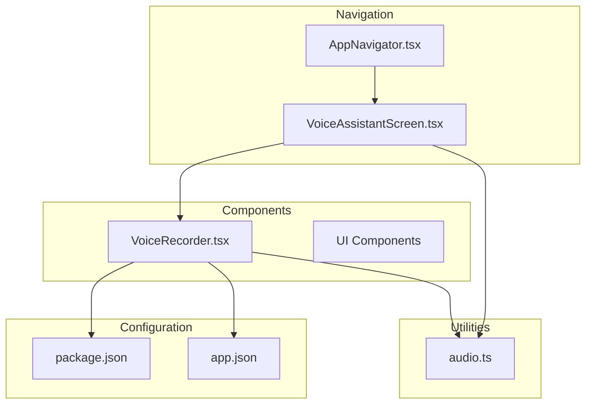
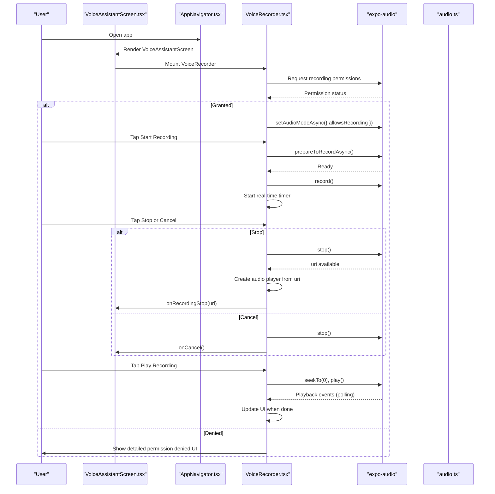
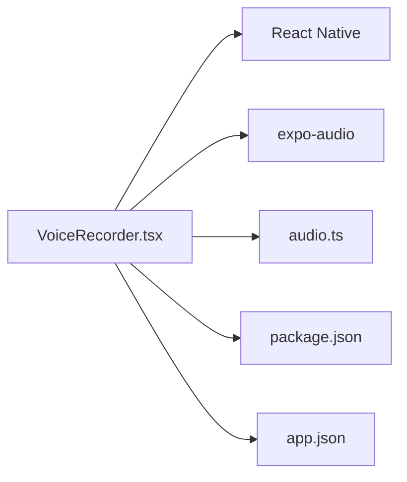
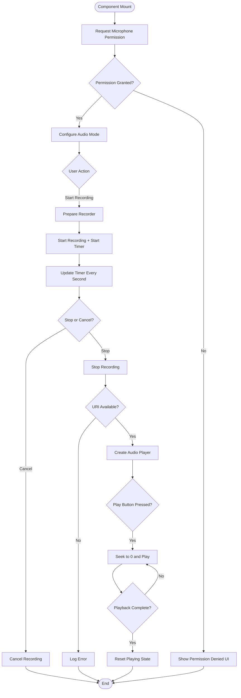
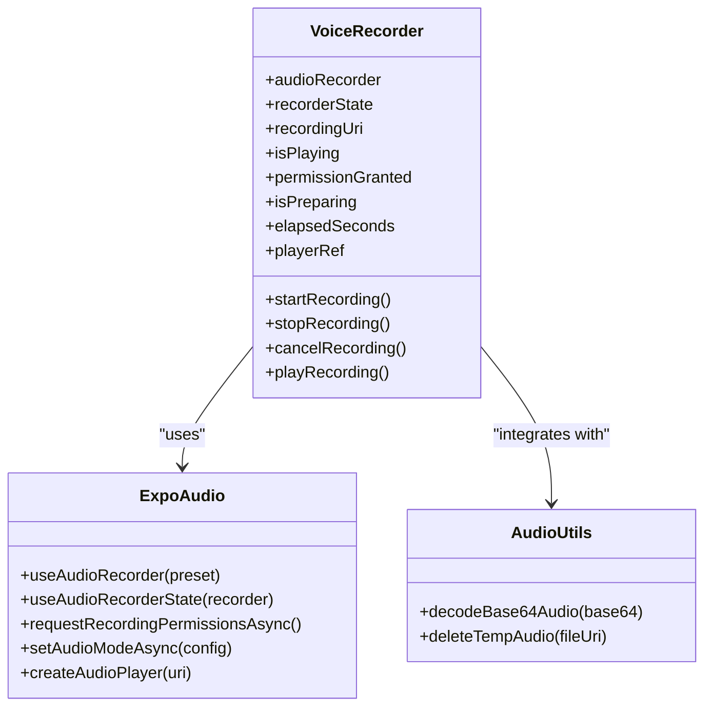
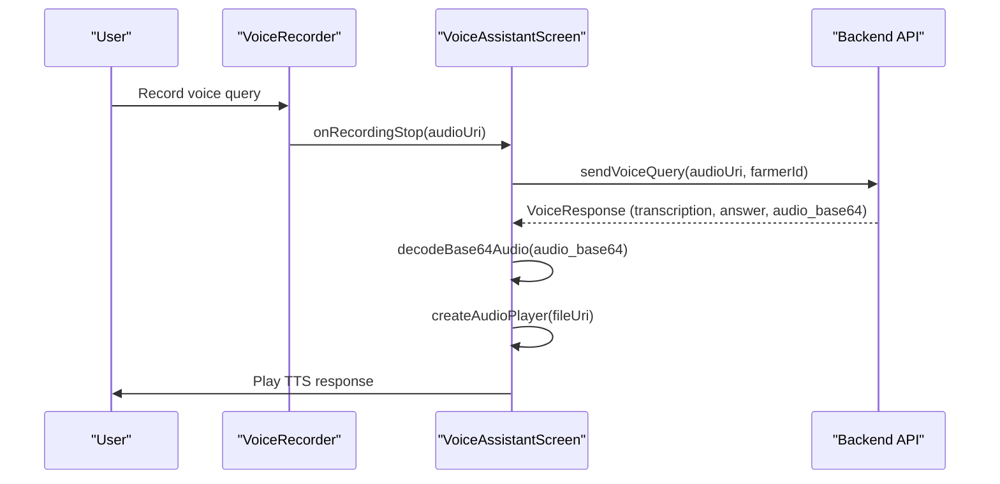

# Voice Recorder Component

<cite>
**Referenced Files in This Document**
- [VoiceRecorder.tsx](file://frontend/components/VoiceRecorder.tsx)
- [VoiceAssistantScreen.tsx](file://frontend/screens/VoiceAssistantScreen.tsx)
- [AppNavigator.tsx](file://frontend/navigation/AppNavigator.tsx)
- [audio.ts](file://frontend/utils/audio.ts)
- [package.json](file://frontend/package.json)
- [app.json](file://frontend/app.json)
</cite>

## Update Summary
**Changes Made**
- Updated VoiceRecorder component implementation with real-time recording timer functionality
- Enhanced microphone permission handling with detailed error messaging
- Added high-quality audio capture using RecordingPresets.HIGH_QUALITY
- Implemented proper resource cleanup for audio players and temporary files
- Added cancel recording functionality with callback support
- Improved UI with recording indicators, timers, and better visual feedback
- Enhanced integration with VoiceAssistantScreen for complete voice workflow

## Table of Contents
1. [Introduction](#introduction)
2. [Project Structure](#project-structure)
3. [Core Components](#core-components)
4. [Architecture Overview](#architecture-overview)
5. [Detailed Component Analysis](#detailed-component-analysis)
6. [Dependency Analysis](#dependency-analysis)
7. [Performance Considerations](#performance-considerations)
8. [Troubleshooting Guide](#troubleshooting-guide)
9. [Conclusion](#conclusion)
10. [Appendices](#appendices)

## Introduction
This document provides comprehensive documentation for the VoiceRecorder component, which implements advanced audio recording and playback functionality using expo-audio within the KisaanDost React Native application. The component features real-time recording timers, high-quality audio capture, comprehensive permission handling, and seamless integration with the voice assistant workflow. It explains microphone permission management, recording state management, playback controls, error handling, and mobile-specific considerations.

## Project Structure
The VoiceRecorder is a self-contained component that records audio locally with real-time feedback and plays it back, integrating seamlessly with the VoiceAssistantScreen for complete voice query processing.

**Diagram sources**
- [AppNavigator.tsx:1-67](file://frontend/navigation/AppNavigator.tsx#L1-L67)
- [VoiceAssistantScreen.tsx:1-301](file://frontend/screens/VoiceAssistantScreen.tsx#L1-L301)
- [VoiceRecorder.tsx:1-304](file://frontend/components/VoiceRecorder.tsx#L1-L304)
- [audio.ts:1-50](file://frontend/utils/audio.ts#L1-L50)
- [package.json:1-34](file://frontend/package.json#L1-L34)
- [app.json:1-34](file://frontend/app.json#L1-L34)

**Section sources**
- [AppNavigator.tsx:1-67](file://frontend/navigation/AppNavigator.tsx#L1-L67)
- [VoiceAssistantScreen.tsx:1-301](file://frontend/screens/VoiceAssistantScreen.tsx#L1-L301)
- [VoiceRecorder.tsx:1-304](file://frontend/components/VoiceRecorder.tsx#L1-L304)
- [audio.ts:1-50](file://frontend/utils/audio.ts#L1-L50)
- [package.json:1-34](file://frontend/package.json#L1-L34)
- [app.json:1-34](file://frontend/app.json#L1-L34)

## Core Components
- **VoiceRecorder**: A sophisticated functional React component that encapsulates:
  - Advanced microphone permission request and configuration with detailed error handling
  - Real-time recording lifecycle with live timer display (prepare, start, stop, cancel)
  - High-quality audio capture using RecordingPresets.HIGH_QUALITY
  - Local playback using managed audio player instances with proper cleanup
  - Comprehensive UI states for recording, playing, preparing, cancelling, and permission denied scenarios

Key responsibilities:
- Initialize audio mode and request permissions on mount with graceful error handling
- Manage internal state for recording URI, playback status, preparation phase, and elapsed time
- Provide user actions to start/stop/cancel recording and play back recordings
- Handle errors gracefully with console warnings and user-facing feedback
- Implement proper resource cleanup for audio players and temporary files

**Updated** Enhanced with real-time recording timer, cancel functionality, and improved error handling

**Section sources**
- [VoiceRecorder.tsx:21-189](file://frontend/components/VoiceRecorder.tsx#L21-L189)

## Architecture Overview
The component uses expo-audio hooks and modules to manage recording and playback with real-time feedback. The flow includes permission checks, audio mode setup, recording lifecycle with timer, local playback, and proper resource cleanup.

**Diagram sources**
- [VoiceRecorder.tsx:49-120](file://frontend/components/VoiceRecorder.tsx#L49-L120)
- [VoiceAssistantScreen.tsx:60-93](file://frontend/screens/VoiceAssistantScreen.tsx#L60-L93)
- [AppNavigator.tsx:14-67](file://frontend/navigation/AppNavigator.tsx#L14-L67)

## Detailed Component Analysis

### Permissions and Audio Mode
- On mount, the component requests microphone permissions via `AudioModule.requestRecordingPermissionsAsync()` and sets audio mode to allow recording and silent mode playback.
- If permissions are denied, a dedicated UI with clear instructions informs the user to enable microphone access in device settings.

Implementation highlights:
- Permission request via expo-audio module API with status tracking
- Audio mode configuration for recording and silent playback
- Conditional rendering based on permission status with user-friendly messaging
- Proper cleanup of audio players on component unmount

**Updated** Enhanced permission handling with detailed error messages and proper cleanup

**Section sources**
- [VoiceRecorder.tsx:49-58](file://frontend/components/VoiceRecorder.tsx#L49-L58)
- [VoiceRecorder.tsx:122-133](file://frontend/components/VoiceRecorder.tsx#L122-L133)
- [app.json:24-31](file://frontend/app.json#L24-L31)

### Recording Lifecycle with Real-Time Timer
- **Prepare**: Ensures the recorder is ready before starting with preparation state management.
- **Start**: Begins recording after preparation with real-time timer initialization.
- **Stop**: Stops recording and retrieves the file URI; creates an audio player instance for playback and triggers callback.
- **Cancel**: Cancels current recording without saving and triggers cancellation callback.

Real-time timer functionality:
- Uses `setInterval` to increment elapsed seconds every second during recording
- Displays formatted time (MM:SS) in the recording indicator
- Automatically resets timer when recording stops

Error handling:
- Catches and logs errors during all phases (start, stop, cancel)
- Uses preparation flag to disable UI interactions while preparing
- Graceful degradation with user feedback

**Updated** Added real-time recording timer, cancel functionality, and enhanced error handling

**Section sources**
- [VoiceRecorder.tsx:60-105](file://frontend/components/VoiceRecorder.tsx#L60-L105)

### Playback Controls with Resource Management
- Creates an audio player instance bound to the recorded URI using `createAudioPlayer`.
- Plays the recording from the beginning and polls playback progress to detect completion.
- Updates UI state to reflect playing status and disables the button during playback.

Resource cleanup:
- Removes previous player instances before creating new ones to prevent memory leaks
- Cleans up player instances on component unmount using cleanup function
- Proper interval cleanup for both timer and playback polling

**Updated** Enhanced resource cleanup and player management

**Section sources**
- [VoiceRecorder.tsx:82-120](file://frontend/components/VoiceRecorder.tsx#L82-L120)
- [VoiceRecorder.tsx:47-58](file://frontend/components/VoiceRecorder.tsx#L47-L58)

### Internal State Management
- **recordingUri**: Stores the last recorded file URI for playback
- **isPlaying**: Tracks whether playback is active
- **permissionGranted**: Tracks microphone permission result (null | true | false)
- **isPreparing**: Indicates preparation phase to disable interactions
- **elapsedSeconds**: Tracks recording duration for real-time display
- **playerRef**: Manages audio player instance lifecycle

State transitions:
- Permission check updates permissionGranted and configures audio mode
- Recording starts/stops update UI via recorderState and internal flags
- Playback toggles isPlaying and resets position on play
- Timer increments during recording and resets when stopped

**Updated** Added elapsedSeconds state for real-time timer functionality

**Section sources**
- [VoiceRecorder.tsx:38-47](file://frontend/components/VoiceRecorder.tsx#L38-L47)
- [VoiceRecorder.tsx:60-67](file://frontend/components/VoiceRecorder.tsx#L60-L67)
- [VoiceRecorder.tsx:135-189](file://frontend/components/VoiceRecorder.tsx#L135-L189)

### UI and Styling with Enhanced Feedback
- Displays a recording indicator with red dot, "Recording" text, and live timer when actively recording
- Provides a single toggle button to start or stop recording with visual state changes
- Shows a play button only when a recording exists and is not currently recording
- Includes cancel button during recording for aborting current session
- Shows detailed permission denied UI with clear instructions
- Uses consistent styling with theme colors, spacing, and typography

Visual feedback:
- Button changes color between primary (ready) and error (recording) states
- Loading indicator during preparation phase
- Disabled states for various interaction contexts
- Consistent iconography and text labels

**Updated** Added recording indicator with timer, cancel button, and enhanced visual feedback

**Section sources**
- [VoiceRecorder.tsx:135-189](file://frontend/components/VoiceRecorder.tsx#L135-L189)
- [VoiceRecorder.tsx:191-304](file://frontend/components/VoiceRecorder.tsx#L191-L304)

### Integration Points
- **Navigation**: Integrated via a bottom tab screen named "VoiceAssistant" with custom tab icon
- **Screen usage**: The VoiceAssistantScreen renders the VoiceRecorder component with callbacks for recording completion and cancellation
- **Callback system**: Supports `onRecordingStop`, `onCancel`, and `disabled` props for flexible integration

Integration features:
- Seamless integration with VoiceAssistantScreen for complete voice workflow
- Callback-based architecture for flexible parent component control
- Disabled state management for preventing interactions during processing

**Updated** Enhanced integration with callback system and disabled state management

**Section sources**
- [AppNavigator.tsx:33-45](file://frontend/navigation/AppNavigator.tsx#L33-L45)
- [VoiceAssistantScreen.tsx:108-112](file://frontend/screens/VoiceAssistantScreen.tsx#L108-L112)
- [VoiceRecorder.tsx:21-25](file://frontend/components/VoiceRecorder.tsx#L21-L25)

## Dependency Analysis
The component depends on expo-audio for recording and playback, React Native for UI primitives, and utility functions for audio file management. Configuration is declared in app.json for microphone permissions and in package.json for dependencies.

**Diagram sources**
- [VoiceRecorder.tsx:1-20](file://frontend/components/VoiceRecorder.tsx#L1-L20)
- [audio.ts:1-50](file://frontend/utils/audio.ts#L1-L50)
- [package.json:5-21](file://frontend/package.json#L5-L21)
- [app.json:24-31](file://frontend/app.json#L24-L31)

**Section sources**
- [package.json:5-21](file://frontend/package.json#L5-L21)
- [app.json:24-31](file://frontend/app.json#L24-L31)
- [VoiceRecorder.tsx:1-20](file://frontend/components/VoiceRecorder.tsx#L1-L20)
- [audio.ts:1-50](file://frontend/utils/audio.ts#L1-L50)

## Performance Considerations
- **Preparation overhead**: Calling prepare before recording ensures stable start times but adds latency; keep this minimal and reuse where possible.
- **Player lifecycle**: Always remove previous player instances before creating new ones to prevent memory leaks and resource contention.
- **Polling intervals**: Playback completion detection uses 200ms polling; timer uses 1000ms intervals; tune these values to balance responsiveness and CPU usage.
- **Audio format**: The component records using HIGH_QUALITY preset; consider adjusting quality vs. file size based on use case.
- **Background limitations**: Mobile platforms restrict background recording; ensure the app remains in foreground or implement platform-specific background audio strategies if needed.
- **Memory management**: Proper cleanup of intervals, audio players, and temporary files prevents memory leaks in long-running applications.

**Updated** Added specific performance considerations for timer intervals and memory management

[No sources needed since this section provides general guidance]

## Troubleshooting Guide
Common issues and resolutions:
- **Microphone permission denied**:
  - Symptom: Permission denied UI appears with clear instructions; recording cannot start.
  - Resolution: Direct users to device settings to enable microphone access and restart the app.
- **Failed to start recording**:
  - Symptom: Console warning indicates failure during preparation or start.
  - Resolution: Verify permissions, ensure audio mode is configured, and retry after a short delay.
- **Failed to stop recording**:
  - Symptom: Console warning during stop; no URI produced.
  - Resolution: Check device storage permissions and available space; retry stopping.
- **Playback not ending**:
  - Symptom: UI remains in playing state indefinitely.
  - Resolution: Ensure player instance exists and polling logic runs; verify duration and currentTime values.
- **Timer not updating**:
  - Symptom: Recording indicator shows static time instead of incrementing.
  - Resolution: Check interval creation and cleanup; verify recorderState.isRecording updates.

Operational notes:
- Errors are logged to console with descriptive messages; add more detailed logging or user feedback as needed.
- For production, replace console warnings with user-friendly alerts or notifications.
- Test thoroughly across different devices and iOS/Android versions for compatibility.

**Updated** Added troubleshooting for timer-related issues and enhanced error descriptions

**Section sources**
- [VoiceRecorder.tsx:69-105](file://frontend/components/VoiceRecorder.tsx#L69-L105)
- [VoiceRecorder.tsx:122-133](file://frontend/components/VoiceRecorder.tsx#L122-L133)

## Conclusion
The VoiceRecorder component provides a robust, feature-rich solution for local audio recording and playback using expo-audio. With real-time recording timers, high-quality audio capture, comprehensive permission handling, and proper resource cleanup, it integrates seamlessly into the KisaanDost app's voice assistant workflow. The component handles complex state management, provides excellent user feedback, and maintains clean separation of concerns through its callback-based architecture. Future enhancements can include configurable recording presets, advanced playback controls, waveform visualization, and additional backend integration patterns.

[No sources needed since this section summarizes without analyzing specific files]

## Appendices

### Recording Workflow Flowchart

**Diagram sources**
- [VoiceRecorder.tsx:49-120](file://frontend/components/VoiceRecorder.tsx#L49-L120)
- [VoiceRecorder.tsx:60-67](file://frontend/components/VoiceRecorder.tsx#L60-L67)

### Class-like Structure Diagram

**Diagram sources**
- [VoiceRecorder.tsx:38-189](file://frontend/components/VoiceRecorder.tsx#L38-L189)
- [audio.ts:21-49](file://frontend/utils/audio.ts#L21-L49)

### Practical Customization Examples
- **Customize recording behavior**:
  - Adjust recording preset by changing `RecordingPresets.HIGH_QUALITY` to other available presets.
  - Add maximum recording duration limit and auto-stop at threshold.
  - Introduce custom cancel actions with confirmation dialogs.
  - Modify timer formatting or update intervals for different UX requirements.
- **Handle different audio formats**:
  - Select alternative presets or configurations supported by expo-audio to change output format and quality.
  - Validate output format compatibility with downstream services.
  - Implement format conversion utilities for cross-platform compatibility.
- **Integrate with backend services**:
  - After stopRecording, upload the URI to a server endpoint using fetch or a networking library.
  - Handle network errors and retries; provide user feedback for upload success/failure.
  - Store metadata (timestamp, duration, language) alongside the uploaded file.
  - Implement streaming upload for large audio files.

**Updated** Added examples for timer customization and enhanced backend integration patterns

[No sources needed since this section provides general guidance]

### Mobile-Specific Considerations
- **Background recording limitations**:
  - Most platforms do not support background recording out-of-the-box; ensure the app remains in the foreground or implement platform-specific background audio capabilities if required.
- **Audio format compatibility**:
  - Use presets compatible with target devices and services; test across iOS and Android to confirm format support.
  - HIGH_QUALITY preset provides good balance between quality and file size for most use cases.
- **Performance optimization techniques**:
  - Minimize UI re-renders by leveraging existing recorder state and memoization.
  - Reuse player instances where appropriate and always clean up on unmount.
  - Tune polling intervals for playback detection and timer updates to reduce CPU usage.
  - Implement proper memory management for long-running recording sessions.
- **Permission handling**:
  - Provide clear user guidance for enabling microphone permissions in device settings.
  - Handle permission denial gracefully with informative error messages.
  - Consider implementing permission checking before attempting recording operations.

**Updated** Enhanced mobile-specific considerations with performance optimization details

[No sources needed since this section provides general guidance]

### Voice Assistant Integration Pattern
The VoiceRecorder integrates seamlessly with the VoiceAssistantScreen to provide a complete voice query experience:

**Diagram sources**
- [VoiceAssistantScreen.tsx:60-93](file://frontend/screens/VoiceAssistantScreen.tsx#L60-L93)
- [audio.ts:21-32](file://frontend/utils/audio.ts#L21-L32)

**Section sources**
- [VoiceAssistantScreen.tsx:60-93](file://frontend/screens/VoiceAssistantScreen.tsx#L60-L93)
- [audio.ts:21-32](file://frontend/utils/audio.ts#L21-L32)