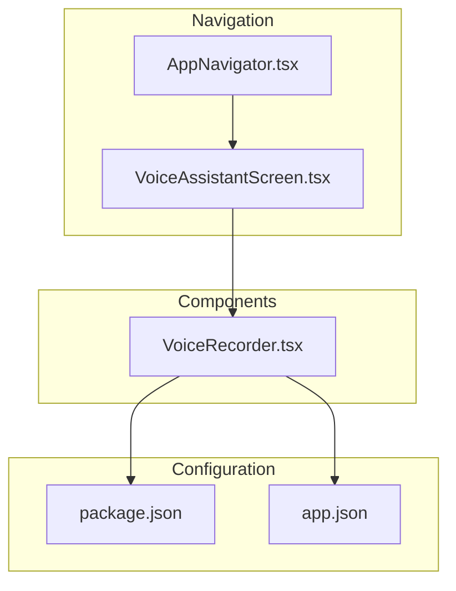
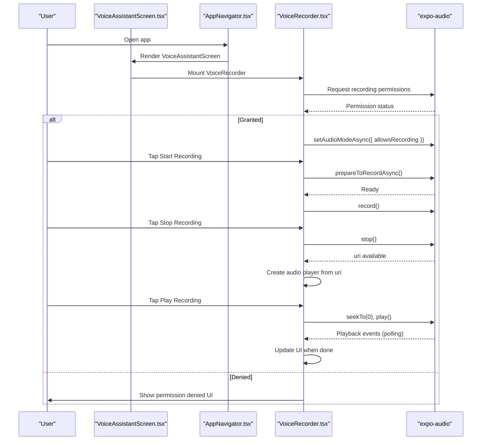
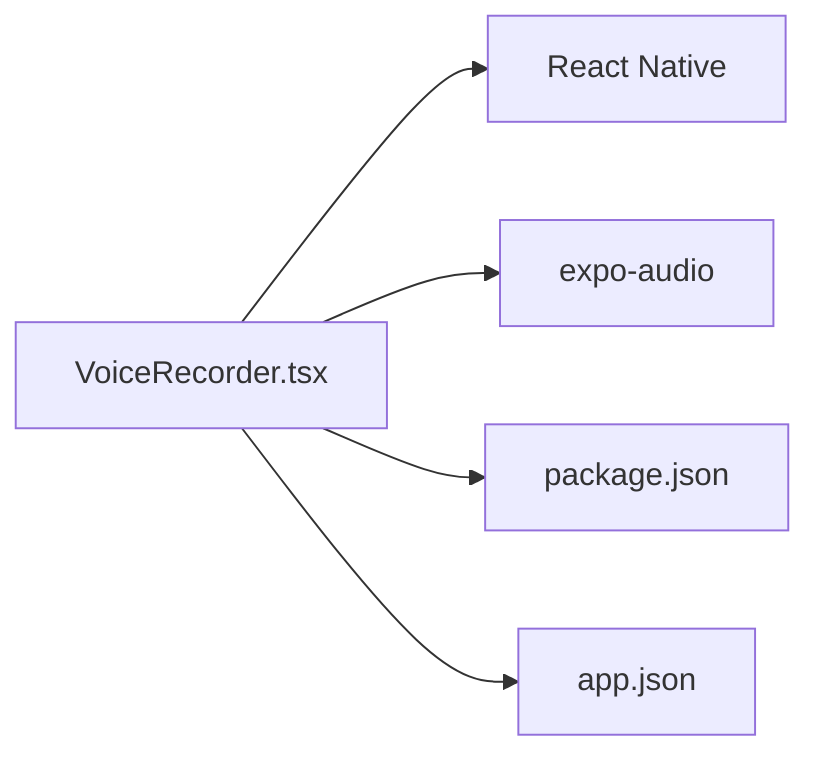
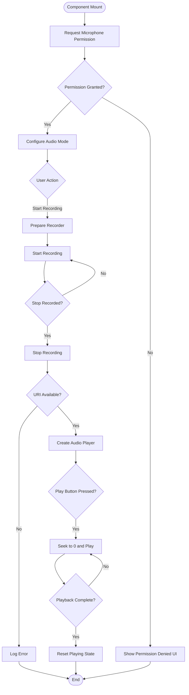
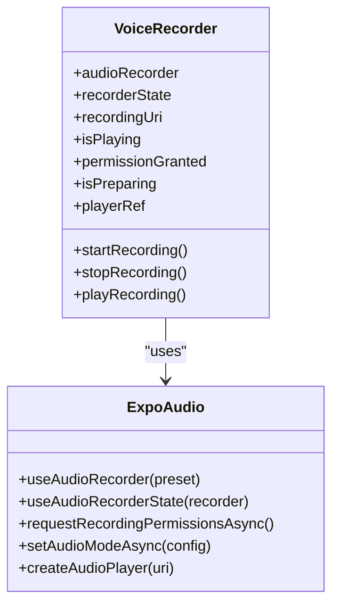

# Voice Recorder Component

<cite>
**Referenced Files in This Document**
- [VoiceRecorder.tsx](file://frontend/components/VoiceRecorder.tsx)
- [VoiceAssistantScreen.tsx](file://frontend/screens/VoiceAssistantScreen.tsx)
- [AppNavigator.tsx](file://frontend/navigation/AppNavigator.tsx)
- [package.json](file://frontend/package.json)
- [app.json](file://frontend/app.json)
</cite>

## Table of Contents
1. [Introduction](#introduction)
2. [Project Structure](#project-structure)
3. [Core Components](#core-components)
4. [Architecture Overview](#architecture-overview)
5. [Detailed Component Analysis](#detailed-component-analysis)
6. [Dependency Analysis](#dependency-analysis)
7. [Performance Considerations](#performance-considerations)
8. [Troubleshooting Guide](#troubleshooting-guide)
9. [Conclusion](#conclusion)
10. [Appendices](#appendices)

## Introduction
This document provides comprehensive documentation for the VoiceRecorder component, which implements audio recording and playback using expo-audio within a React Native application. It explains microphone permission handling, recording state management, playback controls, error handling, and mobile-specific considerations. It also outlines how to integrate the component into screens and navigation, and offers guidance on customizing behavior, formats, and backend integration patterns.

## Project Structure
The VoiceRecorder is a self-contained component that records audio locally and plays it back without backend calls. It is integrated into the app via a screen and navigated through a bottom tab navigator.

**Diagram sources**
- [AppNavigator.tsx:1-46](file://frontend/navigation/AppNavigator.tsx#L1-L46)
- [VoiceAssistantScreen.tsx:1-21](file://frontend/screens/VoiceAssistantScreen.tsx#L1-L21)
- [VoiceRecorder.tsx:1-270](file://frontend/components/VoiceRecorder.tsx#L1-L270)
- [package.json:1-29](file://frontend/package.json#L1-L29)
- [app.json:1-33](file://frontend/app.json#L1-L33)

**Section sources**
- [AppNavigator.tsx:1-46](file://frontend/navigation/AppNavigator.tsx#L1-L46)
- [VoiceAssistantScreen.tsx:1-21](file://frontend/screens/VoiceAssistantScreen.tsx#L1-L21)
- [VoiceRecorder.tsx:1-270](file://frontend/components/VoiceRecorder.tsx#L1-L270)
- [package.json:1-29](file://frontend/package.json#L1-L29)
- [app.json:1-33](file://frontend/app.json#L1-L33)

## Core Components
- VoiceRecorder: A functional React component that encapsulates:
  - Microphone permission request and configuration
  - Recording lifecycle (prepare, start, stop)
  - Local playback using an audio player instance
  - UI states for recording, playing, preparing, and permission denied

Key responsibilities:
- Initialize audio mode and request permissions on mount
- Manage internal state for recording URI, playback status, and preparation
- Provide user actions to start/stop recording and play back recordings
- Handle errors gracefully with console warnings and user-facing feedback

**Section sources**
- [VoiceRecorder.tsx:18-174](file://frontend/components/VoiceRecorder.tsx#L18-L174)

## Architecture Overview
The component uses expo-audio hooks and modules to manage recording and playback. The flow includes permission checks, audio mode setup, recording lifecycle, and local playback.

**Diagram sources**
- [VoiceRecorder.tsx:37-108](file://frontend/components/VoiceRecorder.tsx#L37-L108)
- [VoiceAssistantScreen.tsx:1-21](file://frontend/screens/VoiceAssistantScreen.tsx#L1-L21)
- [AppNavigator.tsx:1-46](file://frontend/navigation/AppNavigator.tsx#L1-L46)

## Detailed Component Analysis

### Permissions and Audio Mode
- On mount, the component requests microphone permissions and sets audio mode to allow recording and silent mode playback.
- If permissions are denied, a dedicated UI informs the user to enable microphone access in device settings.

Implementation highlights:
- Permission request via module API
- Audio mode configuration for recording and silent playback
- Conditional rendering based on permission status

**Section sources**
- [VoiceRecorder.tsx:37-55](file://frontend/components/VoiceRecorder.tsx#L37-L55)
- [VoiceRecorder.tsx:110-122](file://frontend/components/VoiceRecorder.tsx#L110-L122)
- [app.json:24-31](file://frontend/app.json#L24-L31)

### Recording Lifecycle
- Prepare: Ensures the recorder is ready before starting.
- Start: Begins recording after preparation.
- Stop: Stops recording and retrieves the file URI; creates an audio player instance for playback.

Error handling:
- Catches and logs errors during start and stop phases.
- Uses a preparation flag to disable UI interactions while preparing.

**Section sources**
- [VoiceRecorder.tsx:57-85](file://frontend/components/VoiceRecorder.tsx#L57-L85)

### Playback Controls
- Creates an audio player instance bound to the recorded URI.
- Plays the recording from the beginning and polls playback progress to detect completion.
- Updates UI state to reflect playing status and disables the button during playback.

Cleanup:
- Removes previous player instances before creating new ones to avoid leaks.
- Cleans up the player on component unmount.

**Section sources**
- [VoiceRecorder.tsx:70-108](file://frontend/components/VoiceRecorder.tsx#L70-L108)
- [VoiceRecorder.tsx:51-55](file://frontend/components/VoiceRecorder.tsx#L51-L55)

### Internal State Management
- recordingUri: Stores the last recorded file URI for playback.
- isPlaying: Tracks whether playback is active.
- permissionGranted: Tracks microphone permission result.
- isPreparing: Indicates preparation phase to disable interactions.

State transitions:
- Permission check updates permissionGranted.
- Recording starts/stops update UI via recorderState and internal flags.
- Playback toggles isPlaying and resets position on play.

**Section sources**
- [VoiceRecorder.tsx:23-35](file://frontend/components/VoiceRecorder.tsx#L23-L35)
- [VoiceRecorder.tsx:124-174](file://frontend/components/VoiceRecorder.tsx#L124-L174)

### UI and Styling
- Displays a recording indicator when actively recording.
- Provides a single toggle button to start or stop recording.
- Shows a play button only when a recording exists.
- Includes debug text showing the last recording URI.

**Section sources**
- [VoiceRecorder.tsx:124-174](file://frontend/components/VoiceRecorder.tsx#L124-L174)
- [VoiceRecorder.tsx:176-270](file://frontend/components/VoiceRecorder.tsx#L176-L270)

### Integration Points
- Navigation: Integrated via a bottom tab screen named VoiceAssistant.
- Screen usage: The VoiceAssistantScreen renders the VoiceRecorder component directly.

**Section sources**
- [AppNavigator.tsx:1-46](file://frontend/navigation/AppNavigator.tsx#L1-L46)
- [VoiceAssistantScreen.tsx:1-21](file://frontend/screens/VoiceAssistantScreen.tsx#L1-L21)

## Dependency Analysis
The component depends on expo-audio for recording and playback, and React Native for UI primitives. Configuration is declared in app.json for microphone permissions and in package.json for dependencies.

**Diagram sources**
- [VoiceRecorder.tsx:1-16](file://frontend/components/VoiceRecorder.tsx#L1-L16)
- [package.json:5-15](file://frontend/package.json#L5-L15)
- [app.json:24-31](file://frontend/app.json#L24-L31)

**Section sources**
- [package.json:5-15](file://frontend/package.json#L5-L15)
- [app.json:24-31](file://frontend/app.json#L24-L31)
- [VoiceRecorder.tsx:1-16](file://frontend/components/VoiceRecorder.tsx#L1-L16)

## Performance Considerations
- Preparation overhead: Calling prepare before recording ensures stable start times but adds latency; keep this minimal and reuse where possible.
- Player lifecycle: Always remove previous player instances before creating new ones to prevent memory leaks and resource contention.
- Polling interval: Playback completion detection uses polling; tune the interval to balance responsiveness and CPU usage.
- Audio format: The component records using a high-quality preset; consider adjusting quality vs. file size based on use case.
- Background limitations: Mobile platforms restrict background recording; ensure the app remains in foreground or implement platform-specific background audio strategies if needed.

[No sources needed since this section provides general guidance]

## Troubleshooting Guide
Common issues and resolutions:
- Microphone permission denied:
  - Symptom: Permission denied UI appears; recording cannot start.
  - Resolution: Direct users to device settings to enable microphone access and restart the app.
- Failed to start recording:
  - Symptom: Console warning indicates failure during preparation or start.
  - Resolution: Verify permissions, ensure audio mode is configured, and retry after a short delay.
- Failed to stop recording:
  - Symptom: Console warning during stop; no URI produced.
  - Resolution: Check device storage permissions and available space; retry stopping.
- Playback not ending:
  - Symptom: UI remains in playing state indefinitely.
  - Resolution: Ensure player instance exists and polling logic runs; verify duration and currentTime values.

Operational notes:
- Errors are logged to console; add more detailed logging or user feedback as needed.
- For production, replace console warnings with user-friendly alerts or notifications.

**Section sources**
- [VoiceRecorder.tsx:57-85](file://frontend/components/VoiceRecorder.tsx#L57-L85)
- [VoiceRecorder.tsx:110-122](file://frontend/components/VoiceRecorder.tsx#L110-L122)

## Conclusion
The VoiceRecorder component provides a robust, self-contained solution for local audio recording and playback using expo-audio. It handles permissions, manages recording state, and offers clear UI feedback. With proper cleanup and error handling, it integrates seamlessly into the app’s navigation and screens. Future enhancements can include configurable presets, advanced playback controls, and backend integration for uploading recordings.

[No sources needed since this section summarizes without analyzing specific files]

## Appendices

### Recording Workflow Flowchart

**Diagram sources**
- [VoiceRecorder.tsx:37-108](file://frontend/components/VoiceRecorder.tsx#L37-L108)
- [VoiceRecorder.tsx:110-122](file://frontend/components/VoiceRecorder.tsx#L110-L122)

### Class-like Structure Diagram

**Diagram sources**
- [VoiceRecorder.tsx:23-108](file://frontend/components/VoiceRecorder.tsx#L23-L108)

### Practical Customization Examples
- Customize recording behavior:
  - Adjust recording preset by changing the preset passed to the recorder hook.
  - Add a maximum recording duration limit and auto-stop at threshold.
  - Introduce a cancel action to discard current recording.
- Handle different audio formats:
  - Select alternative presets or configurations supported by expo-audio to change output format and quality.
  - Validate output format compatibility with downstream services.
- Integrate with backend services:
  - After stopRecording, upload the URI to a server endpoint using fetch or a networking library.
  - Handle network errors and retries; provide user feedback for upload success/failure.
  - Store metadata (timestamp, duration) alongside the uploaded file.

[No sources needed since this section provides general guidance]

### Mobile-Specific Considerations
- Background recording limitations:
  - Most platforms do not support background recording out-of-the-box; ensure the app remains in the foreground or implement platform-specific background audio capabilities if required.
- Audio format compatibility:
  - Use presets compatible with target devices and services; test across iOS and Android to confirm format support.
- Performance optimization techniques:
  - Minimize UI re-renders by leveraging existing recorder state.
  - Reuse player instances where appropriate and always clean up on unmount.
  - Tune polling intervals for playback detection to reduce CPU usage.

[No sources needed since this section provides general guidance]